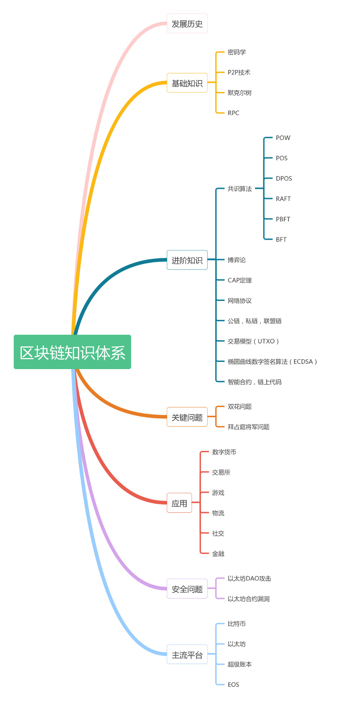

# blockchain

#### 项目介绍
区块链技术  
从区块链1.0的数字货币到区块链2.0的智能合约再到区块链3.0的超级账本，循序渐进学习区块链技术和应用并加以实践。

* simple-demo 200行代码简单示例
* p2p 对等网络简单实现
* proof-of-work 工作量证明
* proof-of-stake 权益证明
* eth 以太坊及其开发环境
* solidity 智能合约案例
* eth-dapp 以太坊智能合约web应用
* btc 比特币
* ipfs 分布式网络存储
* hyperledger-fabric 超级账本
* chaincode 超级账本链上代码案例
* chaincode-app 超级账本fabric-sdk-go app案例 (fabric版本<1.2.0) 
* chaincode-node-app 超级账本fabric-sdk-node app案例 
* fabric-in-action fabric实战案例  
* fabric-sourcecode-debugging fabric源码调试  
* fabric-ledgersdata fabric账本数据初探
* fabric1.4-multi-machine-deployment fabric1.4多机部署网络
* fabric-go-sdk-examples 超级账本fabric-sdk-go 案例

> 本项目内容为区块链技术学习程序样例。如您觉得该项目对您有用，欢迎点击右上方的Star按钮，给予支持！！ 

#### 入门
- [理解区块链](http://blog.csdn.net/csolo/article/details/52858236) 区块链关键技术要点讲解
- [什么是拜占庭将军问题](https://www.imooc.com/article/details/id/28738)
- [常用共识算法](https://blog.csdn.net/s_lisheng/article/details/78022645)

#### 公链项目
- [BTC](https://github.com/bitcoin/bitcoin) 比特币
- [ETH](https://github.com/ethereum/go-ethereum)  以太坊
- [EOS](https://github.com/EOSIO/eos) EOS
- [LITECOIN](https://github.com/litecoin-project/litecoin) 莱特币
- [QTUM](https://github.com/qtumproject/qtum) 量子链
- [BYTOM(BTM)](https://github.com/Bytom/bytom) 比原链
- [NEO](https://github.com/neo-project/neo) 小蚁
- [ZILLIQA](https://github.com/Zilliqa/Zilliqa) 
- [CARDANO(ADA)](https://github.com/input-output-hk/cardano-sl) 艾达币
- [METAVERSE](https://github.com/mvs-org/metaverse) 元界
- [NEBULAS](https://github.com/nebulasio/go-nebulas) 星云

#####  区块链体系

> 后面会陆陆续续写些干货文章, 可以关注下公众号    
   
