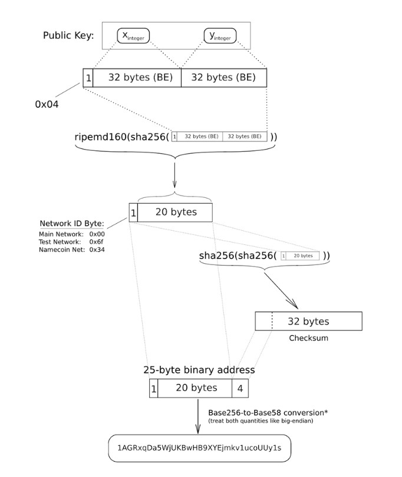
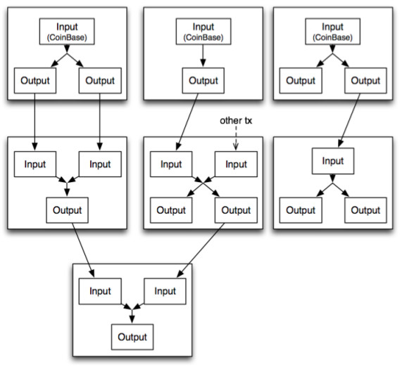
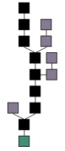
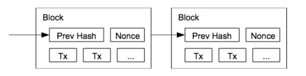
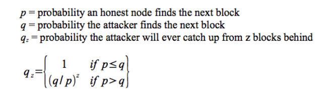
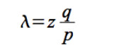
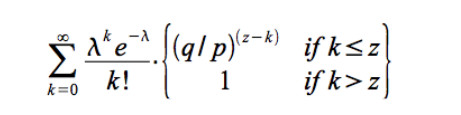
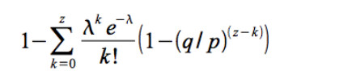
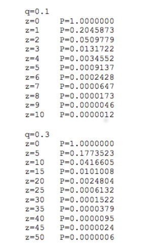

#### 比特币
- [精通比特币](http://book.8btc.com/books/1/master_bitcoin/_book/)

#### 比特币基本概念
* ##### 椭圆曲线数字签名算法
  椭圆曲线数字签名算法(ECDSA)是使用椭圆曲线对数字签名算法(DSA)的模拟,该算法是构成比特币系统的基石。
* ##### 私钥
  非公开,拥有者需安全保管。通常是由随机算法生成的,说白了,就是一个巨大的随机整数,256位、32字节。大小介于1 ~ 0xFFFF FFFF FFFF FFFF FFFF FFFF FFFF FFFE BAAE
DCE6 AF48 A03B BFD2 5E8C D036 4141之间的数,都可以认为是一个合法的私钥。于是,除了随机方法外,采用特定算法由固定的输入,得到32字节输出的算法就可以成为得到私钥的方法。于是,便有了迷你私钥(Mini Privkey),原理很简单,例如,采用SHA256的一种实现:  
private key = SHA256()  
迷你私钥存在安全问题,因为输入集合太小,易被构造常见组合的彩虹表暴力破解,所以通常还是使用系统随机生成的比较好,无安全隐患。
* ##### 公钥
  公钥与私钥是相对应的,一把私钥可以推出唯一的公钥,但公钥却无法推导出私钥。公钥有两种形式:压缩与非压缩。
早期比特币均使用非压缩公钥,现大部分客户端已默认使用压缩公钥。这个貌似是比特币系统一个长得像feature的bug,早期人少活多代码写得不够精细,openssl库的文档又不足够好,导致Satoshi以为必须使用非压缩的完整公钥,后来大家发现其实公钥的左右两个32字节是有关联的,左侧(X)可以推出右侧(Y)的平方值,有左侧(X)就可以了。
现在系统里两种方式共存,应该会一直共存下去。两种公钥的首个字节为标识位,压缩为33字节,非压缩为65字节。以0×04开头为非压缩,0×02/0×03开头为压缩公钥,
0×02/0×03的选取由右侧Y开方后的奇偶决定。  
压缩形式可以减小Tx/Block的体积,每个Tx Input减少32字节。
* ##### 签名
  使用私钥对数据进行签署(Sign)会得到签名(Signature)。通常会将数据先生成Hash值,然后对此Hash值进行签名。签名(signature)有两部分组成: R + S。由签名(signature)与Hash
值,便可以推出一个公钥,验证此公钥,便可知道此签名是否由公钥对应的私钥签名。    
通常,每个签名会有三个长度:73、72、71,符合校验的概率为25%、50%、25%。所以每次签署后,需要找出符合校验的签名长度,再提供给验证方。
* ##### 地址
  地址是为了人们交换方便而弄出来的一个方案,因为公钥太长了(130字符串或66字符串)。地址长度为25字节,转为base58编码后,为34或35个字符。base58是类似base64的编码,但去掉了易引起视觉混淆的字符,又在地址末尾添加了4个字节校验位,保障在人们交换个别字符错误时,也能够因地址校验失败而制止了误操作。
由于存在公钥有两种形式,那么一个公钥便对应两个地址。这两个地址都可由同一私钥签署交易。  
公钥生成地址的算法:  
Version = 1 byte of 0 (zero); on the test network, this is 1 byte of 111  
Key hash = Version concatenated with RIPEMD-160(SHA-256(public key))  
Checksum = 1st 4 bytes of SHA-256(SHA-256(Key hash))  
Bitcoin Address = Base58Encode(Key hash concatenated with Checksum)  
下图是非压缩公钥生成地址的过程:   
  
对于压缩公钥生成地址时,则只取公钥的X部分即可。    
推导关系  
三者推导关系:私钥 >> 公钥 >> 两个地址。过程均不可逆。拥有私钥便拥有一切,但通常为了方便,会把对应的公钥、地址也存储起来。
* ##### 交易
  比特币的交易(Transation,缩写Tx),并不是通常意义的交易,例如一手交钱一手交货,而是转账。交易由N个输入和M个输出两部分组成。交易的每个输入便是前向交易的某个输出,那么追踪到源头,必然出现一个没有输入的交易,此类交易称为CoinBase Tx。CoinBase类交易是奖励挖矿者而产生的交易,该交易总是位于Block块的第一笔。  
    
拥有一个输入与输出的Tx数据:  
Input:  
Previous tx: f5d8ee39a430901c91a5917b9f2dc19d6d1a0e9cea205b009ca73dd04470b9a6  
Index:0  
scriptSig:304502206e21798a42fae0e854281abd38bacd1aeed3ee3738d9e1446618c4571d1090db022100e2ac980643b0b82c0e88ffdfec6b64e3e6ba35e7ba5fdd7d5d6cc8d25c6b241501  
Output:  
Value:5000000000  
scriptPubKey:OP_DUP OP_HASH160 404371705fa9bd789a2fcd52d2c580b65d35549d OP_EQUALVERIFY OP_CHECKSIG  
一旦某个Tx的第N个输出成为另一个Tx的输入,那么该笔比特币即为已花费。每个交易有唯一Hash字符串来标识,通过对交易数据做两次SHA256哈希运算而来:  
Tx Hash ID = SHA256(SHA256(Tx Data)) 
* ##### 矿工费
  矿工费(Transaction Fee)是鼓励矿工将Tx打包进Block的激励报酬。计算一笔交易的矿工费:  
Transaction Fee = SUM(Input’s amount) – SUM(Output’s amount)  
每笔Tx的矿工费必然大于等于零,否则该笔Tx即为非法,不会被网络接收。  
* ##### 数据块
  数据块(Block)是存储Block Meta与Tx的地方。Block的第一笔Tx总是CoinBase Tx,因此Block中的交易数量总是大于等于1,随后是这段时间内网络广播出来的Tx。  
找到合适的Block是一件非常困难的事情,需要通过大量的数学计算才能发现,该计算过程称为“挖矿”。首个发现者,会得到一些比特币作为奖励。
* ##### 数据链
  多个Block连接起来成为数据链(Block Chain)。  
      
为了引入容错与竞争机制,比特币系统允许Block Chain出现分叉,但每个节点总是倾向于选择最高的、难度最大的链,并称之为Best Chain,节点只认可Best Chain上的数据。
首个Block称为Genesis Block,并设定高度为零,后续每新增一个Block,高度则递增一。目前是不允许花费Genesis Block中的比特币的。  
每个Block中的Tx在此Block中均唯一  
一个Tx通常只会在一个Block里,也可能会出现在多个Block中,但只会在Best Chain中的某一个Block出现一次  
* ##### 杜绝多重支付
  传统货币存在多重支付(Double Spending)问题,典型的比如非数字时代的支票诈骗、数字时代的信用卡诈骗等。在比特币系统里,每笔交易的确认均需要得到全网广播,并收录进Block后才能得到真正确认。每笔钱的花销,均需要检测上次输入交易的状态。数据是带时间戳的、公开的,BlockChain由巨大的算力保障其安全性。所以比特币系统将货币的多重支付的风险极大降低,几近于零。通过等待多个Block确认,更是从概率上降低至零。一般得到6个确认后,可认为非常安全。但对于能影响你人生的重大支付,建议等待20~30个确认。
* ##### 匿名性
  任何人均可以轻易生成大量的私钥、公钥、地址。地址本身是匿名的,通过多个地址交易可进一步提高匿名性。但该匿名性并不像媒体宣传的那样,是某种程度上的匿名。因为比特币的交易数据是公开的,所以任何一笔资金的流向均是可以追踪的。  
不了解比特币的人为它的匿名性产生一些担忧,比如担心更利于从事非法业务;了解比特币的人却因为它的伪匿名性而苦恼。传统货币在消费中也是匿名的,且是法律保障的,大部分国家都不允许个人涂画纸币。  
地址本身是匿名的,但你可以通过地址对应的私钥签名消息来向公众证明你拥有某个比特币地址。
* ##### 工作量证明
  工作量证明(Proof Of Work,简称POW),顾名思义,即工作量的证明。通常来说只能从结果证明,因为监测工作过程通常是繁琐与低效的。   
比特币在Block的生成过程中使用了POW机制,一个符合要求的Block Hash由N个前导零构成,零的个数取决于网络的难度值。要得到合理的Block Hash需要经过大量尝试计算,计算时间取决于机器的哈希运算速度。
当某个节点提供出一个合理的Block Hash值,说明该节点确实经过了大量的尝试计算,当然,并不能得出计算次数的绝对值,因为寻找合理hash是一个概率事件。当节点拥有占全网n%的算力时,该节点即有n/100的概率找到Block Hash。  
工作证明机制看似很神秘,其实在社会中的应用非常广泛。例如,毕业证、学位证等证书,就是工作证明,拥有证书即表明你在过去投入了学习与工作。生活大部分事情都是通过结果来判断的。  
* ##### 挖矿  
  挖矿即不断接入新的Block延续Block Chain的过程。  
     
挖矿为整个系统的运转提供原动力,是比特币的发动机,没有挖矿就没有比特币。挖矿有三个重要功能:  
  1. 发行新的货币(总量达到之前)  
  2. 维系货币的支付功能  
  3. 通过算力保障系统安全  
  
金矿消耗资源将黄金注入流通经济,比特币通过“挖矿”完成相同的事情,只不过消耗的是CPU时间与电力。当然,比特币的挖矿意义远大于此。  
* ##### Block Hash算法  
  Block头部信息的构成:  
  ```
  字段名             含义                                   大小(字节)  
  Version           版本号                                   4  
  hashPrevBlock     上一个block hash值                       32  
  hashMerkleRoot    默克尔根hash值                           32  
  Time              Unix时间戳                               4   
  Bits              目标值,即难度                             4   
  Nonce             随机数                                   4   
  ```
    ```
  nHeight+1) % nInterval != 0) {
  // 未达到周期个数,无需调节
  return pindexLast->nBits;
  }
  // Go back by what we want to be 14 days worth of blocks
  const CBlockIndex* pindexFirst = pindexLast;
  for (int i = 0; pindexFirst && i < nInterval-1; i++) pindexFirst = pindexFirst->pprev;
  // 计算本次2016个块的实际产生时间
  // Limit adjustment step
  int64 nActualTimespan = pindexLast->GetBlockTime() – pindexFirst->GetBlockTime();
  // 限定幅度,最低为1/4,最高为4倍
  if (nActualTimespan < nTargetTimespan/4) nActualTimespan = nTargetTimespan/4; if (nActualTimespan > nTargetTimespan*4)
  nActualTimespan = nTargetTimespan*4;
  // 根据最近2016个块的时间,重新计算目标难度
  // Retarget
  CBigNum bnNew;
  bnNew.SetCompact(pindexLast->nBits);
  bnNew *= nActualTimespan;
  bnNew /= nTargetTimespan;
  if (bnNew > bnProofOfWorkLimit)
  bnNew = bnProofOfWorkLimit;
  return bnNew.GetCompact();
  ```
  Block字段详解  
  1. Version,版本号,很少变动,一般用于软件全网升级时做标识  
  2. hashPrevBlock,前向Block Hash值,该字段强制多个Block之间形成链接  
  3. hashMerkleRoot,交易Hash树的根节点Hash值,起校验作用,保障Block在网络传输过程中的数据一致性,有新交易加入即发生变化  
  4. Time,Unix时间戳,每秒自增一,标记Block的生成时间,同时为block hash探寻引入一个频繁的变动因子  
  5. Bits,可以推算出难度值,用于验证block hash难度是否达标  
  6. Nonce,随机数,在上面数个字段都固定的情况下,不停地更换随机数来探寻  
    
  最为关键的字段是hashPrevBlock,该字段使得Block之间链接起来,形成一个巨大的“链条”。Block本是稀松平常的数据结构,但以链式结构组织起来后却使得它们具有非常深远的意义:  
  1. 形成分支博弈,使得算力总是在主分支上角逐  
  2. 算力攻击的概率难度呈指数上升(泊松分布)  
  
  每个block都必须指向前一个block,否则无法验证通过。追溯至源头,便是高度为零的创世纪块(Genesis Block),这里是Block Chain的起点,其前向block hash为零,或者说为空。  
* ##### 新block诞生过程
  下面是一个简单的步骤描述,实际矿池运作会有区别,复杂一些:  
  1. 节点监听全网交易,通过验证的交易进入节点的内存池(Tx Mem Pool),并更新交易数据的Merkle Hash值  
  2. 更新时间戳  
  3. 尝试不同的随机数(Nonce),进行hash计算  
  4. 重复该过程至找到合理的hash  
  5. 打包block:先装入block meta信息,然后是交易数据  
  6. 对外部广播出新block  
  7. 其他节点验证通过后,链接至Block Chain,主链高度加一,然后切换至新block后面挖矿  
  
  由于hashPrevBlock字段的存在,使得大家总是在最新的block后面开挖,稍后会分析原因。
* ##### 主链分叉
  从block hash算法我们知道,合理的block并不是唯一的,同一高度存在多个block的可能性。那么,当同一个高度出现多个时,主链即出现分叉(Fork)。遇到分叉时,网络会根据下列原则选举出Best Chain:  
  1. 不同高度的分支,总是接受最高(即最长)的那条分支  
  2. 相同高度的,接受难度最大的  
  3. 高度相同且难度一致的,接受时间最早的  
  4. 若所有均相同,则按照从网络接受的顺序  
  5. 等待Block Chain高度增一,则重新选择Best Chain  
  
  按照这个规则运作的节点,称为诚实节点(Honest Nodes)。节点可以诚实也可以不诚实。  
* ##### 分支博弈
  我们假设所有的节点:  
  1. 都是理性的,追求收益最大化  
  2. 都是不诚实的,且不惜任何手段获取利益  
  
  所有节点均独自挖矿不理会其他节点,并将所得收益放入自己口袋,现象就是一个节点挖一个分支。由于机器的配置总是有差别的,那么算力最强的节点挖得的分支必然是最长的,如果一个节点的分支不是最长的,意味其收益存在不被认可的风险(即零收益)。为了降低、逃避此风险,一些节点肯定会联合起来一起挖某个分支,试图成为最长的分支或保持最长分支优势。一旦出现有少量的节点联合,那么其他节点必然会效仿,否则他们收益为零的风险会更大。于是,分支迅速合并汇集,所有节点都会选择算力更强的分支,只有这样才能保持收益风险最小。最终,只会存在一个这样的分支,就是主干分支(Best/Main Chain)。  
  对于不诚实节点来说,结局是无奈的:能且只能加入主干挖矿。不加入即意味被抛弃,零收益;加入就是老实干活,按占比分成。  
* ##### 算力攻击的概率
  算力攻击是一个概率问题,这里作简单叙述:  
p = 诚实节点挖出block概率  
q = 攻击者挖出block概率,q = 1 – p  
qz = 攻击者从z个block追上的概率  
  
我们假设p>q,否则攻击者掌握了一半以上的算力,那么概率上永远是赢的。该事件(攻击者胜出)的概率是固定,且N次事件之间是相互独立的,那么这一系列随机过程符合泊松分布(Poisson Distribution)。Z个块时,攻击者胜出的期望为lambda:  
  
攻击者在攻击时已经偷偷的计算了k个块,那么这k个块概率符合泊松分布(下图左侧部分),若k<=z,那么追赶上后续z-k个块的概率为(q/p)z-k,即:  
  
展开为如下形式:   
  
计算该过程的C语言代码如下: 
   ```
   #include double AttackerSuccessProbability(double q, int z)
   {
   double sum = 1.0;
   double p = 1.0 – q;
   double lambda = z * (q / p);
   int i, k;
   for (k = 0; k <= z; k++) {
   double poisson = exp(-lambda);
   for (i = 1; i <= k; i++)
   poisson *= lambda / i;
   sum -= poisson * (1 – pow(q / p, z – k));
   }
   return sum;
   }
  ```  
我们选取几个值,结果如下:  
  
可以看到,由于block的链式形式,随着块数的上升,攻击者赢得的概率呈指数下降。这是很多应用等待六个甚至六个以上确认的原因,一旦超过N个确认,攻击者得逞的可能微乎其微,概率值快速趋近零。  
当攻击者的算力超过50%时,便可以控制Block Chain,俗称51%攻击。  
* ##### 交易构成
  * 交易类型
    交易有三种常见类型:产量交易(Generation),合成地址交易(Script Hash),通用地址交易(Pubkey Hash)。该分类并非严格意义的,只是根据交易的输入输出做的简单区分。  
    Generation TX:每个Block都对应一个产量交易(Generation TX),该类交易是没有输入交易的,挖出的新币是所有币的源头。  
    Script Hash TX：该类交易目前不是很常见,大部分人可能没有听说过,但是非常有意义。未来应该会在某些场合频繁使用。该类交易的接受地址不是通常意义的地址,而是一个合成地址,以3开头(对,以3开头的也是比特币地址!)。三对公私钥,可以生成一个合成地址。在生成过程时指定n of 3中的n,n范围是[1, 3],若n=1,则仅需一个私钥签名即可花费该地址的币,若n=3,则需要三把私钥依次签名才可以。  
    Pubkey Hash TX:该类是最常见的交易类型,由N个输入、M个输出构成。  
  * 数据结构  
    交易中存放的是货币所有权的流转信息,所有权登记在比特币地址上(Public Key)。这些信息是全网公开的,以明文形式存储(比特币系统里的所有数据都是明文的),只有当需要转移货币所有权时,才需要用私钥签名来验证。  
    ```
    字段大小     描述                     数据类型       解释  
    4           version, 版本            uint32_t     交易数据结构的版本号    
    1+          tx_in count, 输入数量     var_int      输入交易的数量  
    41+         tx_in                    tx_in[]      输入交易的数组,每个输入>=41字节  
    1+          tx_out count,输出数量     var_int      输出地址的数量  
    9+          tx_out                   tx_out[]     输入地址的数组,每个输入>=9字节  
    4           lock_time, 锁定时间       uint32_t     lock_time是一个多意字段,表示在某个高度的Block之前或某个时间点之前该交易处于锁定态,无法收录进Block。
    
    lock_time值   含义   
    0             立即生效   
    < 500000000   含义为Block高度,处于该Block之前为锁定(不生效)  
    >= 500000000  含义为Unix时间戳,处于该时刻之前为锁定(不生效)  
    ```
    若该笔交易的所有输入交易的sequence字段,均为INT32最大值(0xffffffff),则忽略lock_time字段。否则,该交易在未达到Block高度或达到某个时刻之前,是不会被收录进Block中的。  
    示例  
    为了演示方便,读取稍早期的块数据,以高度116219 Block为例。  
    `bitcoind getblock 0000000000007c639f2cbb23e4606a1d022fa4206353b9d92e99f5144bd74611 `  
    ```
    {   “hash” : “0000000000007c639f2cbb23e4606a1d022fa4206353b9d92e99f5144bd74611”,
        “confirmations” : 144667,
        “size” : 1536,
        “height” : 116219,
        “version” : 1,
        “merkleroot” : “587fefd748f899f84d0fa1d8a3876fdb406a4bb8f54a31445cb72564701daea6”,
        “tx” : [
        "be8f08d7f519eb863a68cf292ca51dbab7c9b49f50a96d13f2db32e432db363e",
        "a387039eca66297ba51ef2da3dcc8a0fc745bcb511e20ed9505cc6762be037bb",
        "2bd83162e264abf59f9124ca517050065f8c8eed2a21fbf85d454ee4e0e4c267",
        "028cfae228f8a4b0caee9c566bd41aed36bcd237cdc0eb18f0331d1e87111743",
        "3a06b6615756dc3363a8567fbfa8fe978ee0ba06eb33fd844886a0f01149ad62"
        ],
        “time” : 1301705313,
        “nonce” : 1826107553,
        “bits” : “1b00f339′′,
        “difficulty” : 68977.78463021,
        “previousblockhash” : “00000000000010d549135eb39bd3bbb1047df8e1512357216e8a85c57a1efbfb”,
        “nextblockhash” : “000000000000e9fcc59a6850f64a94476a30f5fe35d6d8c4b4ce0b1b04103a77”
    }
    ```
    该Block里面有5笔交易,第一笔为Generation TX,解析出来看一下具体内容:  
    `bitcoind getrawtransaction be8f08d7f519eb863a68cf292ca51dbab7c9b49f50a96d13f2db32e432db363e 1`
    ```
    {
        “hex” : “01000000010000000000000000000000000000000000000000000000000000000000000000ffffffff070439f3001b0134ffffffff014034152a010000004341045b3aaa284d169c5ae2d20d0b0673468ed3506aa8...
        “txid” : “be8f08d7f519eb863a68cf292ca51dbab7c9b49f50a96d13f2db32e432db363e”,
        “version” : 1,
        “locktime” : 0,
        “vin” : [
        {
        "coinbase" : "0439f3001b0134",
        "sequence" : 4294967295
        }
        ],
        “vout” : [
        {
        "value" : 50.01000000,
        "n" : 0,
        "scriptPubKey" : {
        "asm" : "045b3aaa284d169c5ae2d20d0b0673468ed3506aa8fea5976eacaf1ff304456f6522fbce1a646a24005b8b8e771a671f564ca6c03e484a1c394bf96e2a4ad01dce OP_CHECKSIG",
        "hex" : "41045b3aaa284d169c5ae2d20d0b0673468ed3506aa8fea5976eacaf1ff304456f6522fbce1a646a24005b8b8e771a671f564ca6c03e484a1c394bf96e2a4ad01dceac",
        "reqSigs" : 1,
        "type" : "pubkey",
        "addresses" : [
        "1LgZTvoTJ6quJNCURmBUaJJkWWQZXkQnDn"
        ]
        }
        }
        ],
        “blockhash” : “0000000000007c639f2cbb23e4606a1d022fa4206353b9d92e99f5144bd74611”,
        “confirmations” : 145029,
        “time” : 1301705313,
        “blocktime” : 1301705313
    }
    ```
    Generation TX的输入不是一个交易,而带有coinbase字段的结构。该字段的值由挖出此Block的人填写,这是一种“特权”:可以把信息写入货币系统(大家很喜欢用系统中的数据结构字段名来命名站点,例如  
    blockchain、coinbase等,这些词的各种后缀域名都被抢注一空)。  
    中本聪在比特币的第一个交易中的写入的coinbase值是:  
     “coinbase”:”04ffff001d0104455468652054696d65732030332f4a616e2f32303039204368616e63656c6c6f72206f6e206272696e6b206f66207365636f6e64206261696c6f757420666f722062616e6b73”  
    将该段16进制转换为ASCII字符,就是那段著名的创世块留言:  
    The Times 03/Jan/2009 Chancellor on brink of second bailout for banks  
    接下来展示的是一个三个输入、两个输出的普通交易:  
    `bitcoind getrawtransaction 028cfae228f8a4b0caee9c566bd41aed36bcd237cdc0eb18f0331d1e87111743 1`
    ```
    {
        “hex” : “0100000003c9f3b07ebfca68fd1a6339d0808fbb013c90c6095fc93901ea77410103489ab7000000008a473044022055bac1856ecbc377dd5e869b1a84ed1d5228c987b098c095030c12431a4d524902205552...
        “txid” : “028cfae228f8a4b0caee9c566bd41aed36bcd237cdc0eb18f0331d1e87111743",
        “version” : 1,
        “locktime” : 0,
        “vin” : [
        {
        "txid" : "b79a4803014177ea0139c95f09c6903c01bb8f80d039631afd68cabf7eb0f3c9",
        "vout" : 0,
        "scriptSig" : {
        "asm" : "3044022055bac1856ecbc377dd5e869b1a84ed1d5228c987b098c095030c12431a4d5249022055523130a9d0af5fc27828aba43b464ecb1991172ba2a509b5fbd6cac97ff3af01048aefd78bba80e2d1686225b
                 755dacea890c9ca1be10ec98173d7d5f2fefbbf881a6e918f3b051f8aaaa3fcc18bbf65097ce8d30d5a7e5ef8d1005eaafd4b3fbe",
        "hex" : "473044022055bac1856ecbc377dd5e869b1a84ed1d5228c987b098c095030c12431a4d5249022055523130a9d0af5fc27828aba43b464ecb1991172ba2a509b5fbd6cac97ff3af0141048aefd78bba80e2d1686...
        "asm" : "304402206b993231adec55e6085e75f7dc5ca6c19e42e744cd60abaff957b1c352b3ef9a022022a22fec37dfa2c646c78d9a0753d56cb4393e8d0b22dc580ef1aa6cccef208d01042ff65bd6b3ef04253225405
                 ccc3ab2dd926ff2ee48aac210819698440f35d785ec3cec92a51330eb0c76cf49e9e474fb9159ab41653a9c1725c031449d31026a",
        "hex" : "47304402206b993231adec55e6085e75f7dc5ca6c19e42e744cd60abaff957b1c352b3ef9a022022a22fec37dfa2c646c78d9a0753d56cb4393e8d0b22dc580ef1aa6cccef208d0141042ff65bd6b3ef0425322540...
        },
        "sequence" : 4294967295
        },
        {
        "txid" : "da30b272fb73d78108ff80ddd1ac2f76419533af79ad06a5b3c70fc4a62086c9",
        "vout" : 1,
        "scriptSig" : {
        "asm" : "3045022040a5d957e087ed61e80f1110bcaf4901b5317c257711a6cbc54d6b98b6a8563f02210081e3697031fe82774b8f44dd3660901e61ac5a99bff2d0efc83ad261da5b4f1d01
                 04a7d1a57e650613d3414ebd59e3192229dc09d3613e547bdd1f83435cc4ca0a11c679d96456cae75b1f5563728ec7da1c1f42606db15bf554dbe8a829f3a8fe2f",
        "hex" : "483045022040a5d957e087ed61e80f1110bcaf4901b5317c257711a6cbc54d6b98b6a8563f02210081e3697031fe82774b8f44dd3660901e61ac5a99bff2d0efc83ad261da5b4f1d014104a7d1a57e650613d341...
        },
        "sequence" : 4294967295
        }
        ],
        “vout” : [
        {
        "value" : 0.84000000,
        "n" : 0,
        "scriptPubKey" : {
        "asm" : "OP_DUP OP_HASH160 634228c26cf40a02a05db93f2f98b768a8e0e61b OP_EQUALVERIFY OP_CHECKSIG",
        "hex" : "76a914634228c26cf40a02a05db93f2f98b768a8e0e61b88ac",
        "reqSigs" : 1,
        "type" : "pubkeyhash",
        "addresses" : [
        "1A3q9pDtR4h8wpvyb8SVpiNPpT8ZNbHY8h"
        ]
        }
        },
        {
        “value” : 156.83000000,
        “n” : 1,
        “scriptPubKey” : {
        “asm” : “OP_DUP OP_HASH160 7514080ab2fcac0764de3a77d10cb790c71c74c2 OP_EQUALVERIFY OP_CHECKSIG”,
        “hex” : “76a9147514080ab2fcac0764de3a77d10cb790c71c74c288ac”,
        “reqSigs” : 1,
        “type” : “pubkeyhash”,
        “addresses” : [
        "1Bg44FZsoTeYteRykC1XHz8facWYKhGvQ8"
        ]
        }
        }
        ],
        “blockhash” : “0000000000007c639f2cbb23e4606a1d022fa4206353b9d92e99f5144bd74611",
        “confirmations” : 147751,
        “time” : 1301705313,
        “blocktime” : 1301705313
        }
    ```
    字段hex记录了所有相关信息,后面显示的是hex解析出来的各类字段信息。下面把逐个分解hex内容(hex可以从上面的直接看到):
    ```
    01000000    版本号,UINT32
    03          Tx输入数量,变长INT。3个输入。
    /*** 第一组Input Tx ***/
    c9f3b07ebfca68fd1a6339d0808fbb013c90c6095fc93901ea77410103489ab7    Tx Hash,固定32字节
    00000000                                                            消费的Tx位于前向交易输出的第0个,UINT32,固定4字节
    8a                                                                  签名的长度, 0x8A = 138字节,138字节长度的签名,含有两个部分:公钥+签名
    47                                                                  公钥长度,0×47 = 71字节
    3044022055bac1856ecbc377dd5e869b1a84ed1d5228c987b098c095030c12431a4d5249022055523130a9d0af5fc27828aba43b464ecb1991172ba2a509b5fbd6cac97ff3af01
    41                                                                  签名长度,0×41 = 65字节
    048aefd78bba80e2d1686225b755dacea890c9ca1be10ec98173d7d5f2fefbbf881a6e918f3b051f8aaaa3fcc18bbf65097ce8d30d5a7e5ef8d1005eaafd4b3fbe
    ffffffff                                                            sequence,0xffffffff = 4294967295, UINT32, 固定4字节
    /*** 第二组Input Tx。与上同理,省略分解 ***/
    c9f3b07ebfca68fd1a6339d0808fbb013c90c6095fc93901ea77410103489ab7010000008a47304402206b993231adec55e6085e75f7dc5ca6c19e42e744cd60abaff957b1c352b3ef9a022022a22fec37dfa2c646c
    /*** 第三组Input Tx ***/
    c98620a6c40fc7b3a506ad79af339541762facd1dd80ff0881d773fb72b230da010000008b483045022040a5d957e087ed61e80f1110bcaf4901b5317c257711a6cbc54d6b98b6a8563f02210081e3697031fe827
    02                                                                  Tx输出数量,变长INT。两个输出。
    /*** 第一组输出 ***/
    00bd010500000000                                                    输出的币值,UINT64,8个字节。字节序需翻转,~= 0x000000000501bd00 = 84000000 satoshi
    19                                                                  输出目的地址字节数, 0×19 = 25字节,由一些操作码与数值构成
    76                                                                  0×76 -> OP_DUP(stack ops)
    a9                                                                  0xa9 -> OP_HASH160(crypto)
    14                                                                  0×14 -> 长度,0×14 = 20字节
    634228c26cf40a02a05db93f2f98b768a8e0e61b                            地址的HASH160值,20字节
    88                                                                  0×88 -> OP_EQUALVERIFY(bit logic)
    ac                                                                  0xac -> OP_CHECKSIG(crypto)
    /*** 第二组输出 ***/
    c096c7a603000000
    19
    76 
    a9 
    14 
    7514080ab2fcac0764de3a77d10cb790c71c74c2 
    88 
    ac
    00000000                                                            lock_time,UINT32,固定4字节   
    ```
    Tx Hash,俗称交易ID,由hex得出:Tx Hash = SHA256(SHA256(hex))。  
    由于每个交易只能成为下一个的输入,有且仅有一次,那么不存在输入完全相同的交易,那么就不存在相同的Tx Hash(SHA256碰撞概率极小,所以无需考虑Hash碰撞的问题,就像无需考虑地址私钥被别人撞到一样)。  
    即便如此,在系统里依然产生了相同的Tx Hash,是某位矿工兄弟挖出Block后,打包Block时忘记修改Generation Tx coinbase字段的值,币量相同且输出至相同的地址,那么就构造了两个完全一模一样的交易,分别位于两个Block的第一个位置。这个对系统不会产生什么问题,但只要花费其中一笔,另一个也被花费了。相同的Generation Tx相当于覆盖了另一个,白白损失了挖出的币。该交易ID为e3bf3d07d4b0375638d5f1db5255fe07ba2c4cb067cd81b84ee974b6585fb468,第一次出现在#91722,第二次出现在#91880。
  * 交易签名  
    签名是对所有权的验证,节点收到交易广播后,会对交易进行验证,通过后则收录进内存、打包进Block,否则,丢弃之。签名就类似传统纸质合同盖章、签字过程,合法转移所有权的保证手段。  
    签名类型  
    由于一个交易的输入、输出都可能具有多个,那么签名也具有多种类型,目前共三类:SIGHASH_ALL, SIGHASH_NONE, SIGHASH_SINGLE。  
    SIGHASH_ALL: 该签名类型为默认类型,也是目前绝大部分交易采用的,顾名思义即签名整单交易。首先,组织所有输出、输入,就像上文分解Hex过程一样,每个输入都对应一个签名,暂时留空,其他包括sequence等字段均须填写,这样就形成了一个完整的交易Hex(只缺签名字段)。然后,每一个输入均需使用私钥对该段数据进行签名,签名完成后各自填入相应的位置,N个输入N个签名。简单理解就是:对于该笔单子,认可且只认可的这些输入、输出,并同意花费我的那笔输入。  
    SIGHASH_NONE: 该签名类型是最自由松散的,仅对输入签名,不对输出签名,输出可以任意指定。某人对某笔币签名后交给你,你可以在任意时刻填入任意接受地址,广播出去令其生效。简单理解就是:我同意花费我的那笔钱,至于给谁,我不关心。  
    SIGHASH_SINGLE: 该签名类型其次自由松散,仅对自己的输入、输出签名,并留空sequence字段。其输入的次序对应其输出的次序,比如输入是第3个,那么签名的输出也是第三个。简单理解就是:我同意花费我的那笔钱,且只能花费到我认可的输出,至于单子里的其他输入、输出,我不关心。  
  * 交易的构造、签名与广播
    上篇介绍了交易结构、签名等,为了更直观的认识比特币,借助bitcoind演示手动构造并广播交易的完整过程。  
    * 普通交易
      1. 找出未花费的币(unspent output)
        通过命令:listunspent [minconf=1] [maxconf=9999999] ["address",...]  
        列出某个地址未花费的币(交易),minconf/maxconf表示该笔收入交易的确认数范围,如果需要列出还未确认的交易,需将minconf设置为0。  
        执行:bitcoind listunspent 0 100 ‘["1Lab618UuWjLmVA1Q64tHZXcLoc4397ZX3"]‘  
        输出:
            ```
                   [
                   {"txid" : "296ea7bf981b44999d689853d17fe0ceb852a8a34e68fcd19f0a41e589132156",
                   "vout" : 0,
                   "address" : "1Lab618UuWjLmVA1Q64tHZXcLoc4397ZX3",
                   "account" : "",
                   "scriptPubKey" : "76a914d6c492056f3f99692b56967a42b8ad44ce76b67a88ac",
                   "amount" : 0.19900000,
                   "confirmations" : 1
                   }
                   ]              
            ```
            我们找到该地址的一个未花费交易,位于交易296ea7bf981b4499...9f0a41e589132156的第0个位置。
      2. 创建待发送交易  
      创建待发送交易,由命令:createrawtransaction [{"txid":txid,"vout":n},...] {address:amount,...}来完成。我们将 0.1 BTC发送至 1Q8s4qDRbCbFypG5AFNR9tFC57PStkPX1x ,并支付 0.0001 BTC做为矿工费。输入交易的额度为 0.199 ,输出为 0.1 + 0.0001 = 0.1001 ,那么还剩余: 0.199 – 0.1001 = 0.0989 ,将此作为找零发回给自己。  
      执行:bitcoind createrawtransaction ‘[{"txid":"296ea7bf981b44999d689853d17fe0ceb852a8a34e68fcd19f0a41e589132156","vout":0}]‘ ‘{“1Q8s4qDRbCbFypG5AFNR9tFC57PStkPX1x”:0.1, “1Lab618UuWjLmVA1Q64tHZXcLoc4397ZX3′′:0.0989}’  
      输出:010000000156211389e5410a9fd1fc684ea3a852b8cee07fd15398689d99441b98bfa76e290000000000ffffffff0280969800000000001976a914fdc7990956642433ea75cabdcc0a9447c5d2b4ee88acd0e896000  
      通过命令:decoderawtransaction <hex string>,可以将此段十六进制字符串解码。  
      执行:bitcoind decoderawtransaction ’010000000156211389e5410a9fd1fc684ea3a852b8cee07fd15398689d99441b98bfa76e290000000000ffffffff0280969800000000001976a914fdc7990956642433ea75cabdcc0a9447c5d2b4ee88acd0e8960  
      输出:
          ```
          {
          “txid” : “54f773a3fdf7cb3292fc76b46c97e536348b3a0715886dbfd2f60e115fb3a8f0′′,
          “version” : 1,
          “locktime” : 0,
          “vin” : [
          {
          "txid" : "296ea7bf981b44999d689853d17fe0ceb852a8a34e68fcd19f0a41e589132156",
          "vout" : 0,
          "scriptSig" : {
          "asm" : "",
          "hex" : ""
          },
          "sequence" : 4294967295
          }
          ],
          “vout” : [
          {
          "value" : 0.10000000,
          "n" : 0,
          "scriptPubKey" : {
          "asm" : "OP_DUP OP_HASH160 fdc7990956642433ea75cabdcc0a9447c5d2b4ee OP_EQUALVERIFY OP_CHECKSIG",
          "hex" : "76a914fdc7990956642433ea75cabdcc0a9447c5d2b4ee88ac",
          "reqSigs" : 1,
          "type" : "pubkeyhash",
          "addresses" : [
          "1Q8s4qDRbCbFypG5AFNR9tFC57PStkPX1x"
          ]
          }
          },
          {
          “value” : 0.09890000,
          “n” : 1,
          “scriptPubKey” : {
          “asm” : “OP_DUP OP_HASH160 d6c492056f3f99692b56967a42b8ad44ce76b67a OP_EQUALVERIFY OP_CHECKSIG”,
          “hex” : “76a914d6c492056f3f99692b56967a42b8ad44ce76b67a88ac”,
          “reqSigs” : 1,
          “type” : “pubkeyhash”,
          “addresses” : [
          "1Lab618UuWjLmVA1Q64tHZXcLoc4397ZX3"
          ]
          }
          }
          ]
          } 
          ```
          至此,一个“空白交易”就构造好了,尚未使用私钥对交易进行签名,字段scriptSig是留空的,无签名的交易是无效的。此时的Tx ID并不是最终的Tx ID,填入签名后Tx ID会发生变化。在手动创建交易时,务必注意输入、输出的值,非常容易犯错的是忘记构造找零输出(如非必要勿手动构造交易)。曾经有人构造交易时忘记找零,发生了支付 200 BTC 的矿工费的人间惨剧,所幸的是收录该笔交易的Block由著名挖矿团队“烤猫(Friedcat)”挖得,该团队非常厚道的退回了多余费用。 
      3. 签名  
         交易签名使用命令:signrawtransaction <hex string> [{"txid":txid,"vout":n,"scriptPubKey":hex,"redeemScript":hex},...] [<privatekey1>,...] [sighashtype="ALL"]  
         第一个参数是创建的待签名交易的十六进制字符串;  
         第二个参数有点类似创建交易时的参数,不过需要多出一个公钥字段scriptPubKey,其他节点验证交易时是通过公钥和签名来完成的,所以要提供公钥;如果是合成地址,则需要提供redeemScript;  
         第三个参数是即将花费的币所在地址的私钥,用来对交易进行签名,如果该地址私钥已经导入至bitcoind中,则无需显式提供;  
         最后一个参数表示签名类型,在上一篇里,介绍了三种交易签名类型;                                                       
         签名之前需要找到scriptPubKey,提取输入交易信息即可获取(也可以根据其公钥自行计算),由命令:getrawtransaction <txid> [verbose=0]完成。  
         执行:bitcoind getrawtransaction 296ea7bf981b44999d689853d17fe0ceb852a8a34e68fcd19f0a41e589132156 1  
         输出:  
            ```
                    {
                    “hex” :
                    “01000000010511331f639e974283d3909496787a660583dc88f41598d177e225b5f352314a000000006c493046022100be8c796122ec598295e6dfd6664a20a7e20704a17f76d3d925c9ec421ca60bc1022100
                    “txid” : “296ea7bf981b44999d689853d17fe0ceb852a8a34e68fcd19f0a41e589132156′′,
                    “version” : 1,
                    “locktime” : 0,
                    “vin” : [
                    {
                    "txid" : "4a3152f3b525e277d19815f488dc8305667a78969490d38342979e631f331105",
                    "vout" : 0,
                    "scriptSig" : {
                    "asm" : "3046022100be8c796122ec598295e6dfd6664a20a7e20704a17f76d3d925c9ec421ca60bc1022100cf9f2d7b9f24285f7c119c91f24521e5483f6b141de6ee55658fa70116ee04d401
                    03cad07f6de0b181891b5291a5bc82b228fe6509699648b0b53556dc0057eeb5a4",
                    "hex" :
                    "493046022100be8c796122ec598295e6dfd6664a20a7e20704a17f76d3d925c9ec421ca60bc1022100cf9f2d7b9f24285f7c119c91f24521e5483f6b141de6ee55658fa70116ee04d4012103cad07f6de0b181891
                    },
                    "sequence" : 4294967295
                    }
                    ],
                    “vout” : [
                    {
                    "value" : 0.19900000,
                    "n" : 0,
                    "scriptPubKey" : {
                    "asm" : "OP_DUP OP_HASH160 d6c492056f3f99692b56967a42b8ad44ce76b67a OP_EQUALVERIFY OP_CHECKSIG",
                    "hex" : "76a914d6c492056f3f99692b56967a42b8ad44ce76b67a88ac",
                    "reqSigs" : 1,
                    "type" : "pubkeyhash",
                    "addresses" : [
                    "1Lab618UuWjLmVA1Q64tHZXcLoc4397ZX3"
                    ]
                    }
                    }
                    ],
                    “blockhash” : “000000000000000488f18f7659acd85b2bd06a5ed2c4439eea74a8b968d16656′′,
                    “confirmations” : 19,
                    “time” : 1383235737,
                    “blocktime” : 1383235737
                    }
                    ```
                 scriptPubKey位于”vout”[0]–>“scriptPubKey”–>“hex”,即: 76a914d6c492056f3f99692b56967a42b8ad44ce76b67a88ac 。    
                 签名使用ECDSA算法,对其,“空白交易”签名之,  
                 执行:bitcoind signrawtransaction “010000000156211389e5410a9fd1fc684ea3a852b8cee07fd15398689d99441b98bfa76e290000000000ffffffff0280969800000000001976a914fdc7990956642433ea75cabdcc0a9447c5d2b4ee88acd0e8960 ‘[{"txid":"296ea7bf981b44999d689853d17fe0ceb852a8a34e68fcd19f0a41e589132156","vout":0,"scriptPubKey":"76a914d6c492056f3f99692b56967a42b8ad44ce76b67a88ac"}]‘  
                 输出:   
                   ```
                   {
                   “hex” :
                   “010000000156211389e5410a9fd1fc684ea3a852b8cee07fd15398689d99441b98bfa76e29000000008c493046022100f9da4f53a6a4a8317f6e7e9cd9a7b76e0f5e95dcdf70f1b1e2b3548eaa3a697502210085
                   “complete” : true
                   }                      
            ```   
         签名后,签名值会填入上文所述的空字段中,从而得到一个完整的交易。可通过上文介绍的命令decoderawtransaction <hex string>解码查看之。  
         最后一步,就是将其广播出去,等待网络传播至所有节点,约10~60秒广播至全球节点,取决与你的节点的网络连接状况。稍后一些时刻,就会进入Block中。广播由命令sendrawtransaction <hex string>来完成。如果没有运行节点,可以通过公共节点的API进行广播,例如:blockchain.info/pushtx。  
         执行:bitcoind sendrawtransaction “010000000156211389e5410a9fd1fc684ea3a852b8cee07fd15398689d99441b98bfa76e29000000008c493046022100f9da4f53a6a4a8317f6e7e9cd9a7b76e0f5e95dcdf70f1b1e2b3548eaa3a697502210085  
         输出:b5f8da1ea9e02ec3cc0765f9600f49945e94ed4b0c88ed0648896bf3e213205d  
         返回的是Transaction Hash值,即该交易的ID。至此,交易构造、签名、发送的完整过程完成了。   
    * 合成地址交易  
      合成地址以3开头,可以实现多方管理资产,极大提高安全性,也可以轻松实现基于比特币原生的三方交易担保支付。一个M-of-N的模式:  
      m {pubkey}...{pubkey} n OP_CHECKMULTISIG  
      M和N需满足:  
      1<=N<=3  
      1<=M<=N  
      可以是1 of 1,1 of 2,2 of 3等组合,通常选择N=3:  
      1 of 3,最大程度私钥冗余。防丢私钥损失,3把私钥中任意一把即可签名发币,即使丢失2把都可以保障不受损失;  
      2 of 3,提高私钥冗余度的同时解决单点信任问题。3把私钥任意2把私钥可签名发币,三方不完全信任的情形,即中介交易中,非常适用;3 of 3,最大程度解决资金信任问题,无私钥冗余。必须3把私钥全部签名才能发币,适用多方共同管理重要资产,但任何一方遗失私钥均造成严重损失;  
      合成地址的交易构造、签名、发送过程与普通交易类似,这里只介绍如何创建一个合成地址。大神Gavin Andresen已经演示过,下面内容摘自其gist.  
      首先,需要三对公钥、私钥。公钥创建地址、私钥用于签名。  
      - No.1
        0491bba2510912a5bd37da1fb5b1673010e43d2c6d812c514e91bfa9f2eb129e1c183329db55bd868e209aac2fbc02cb33d98fe74bf23f0c235d6126b1d8334f865JaTXbAUmfPYZFRwrYaALK48fN6sFJp4rHqq2QSXs8ucfpE4yQU  
      - No.2
        04865c40293a680cb9c020e7b1e106d8c1916d3cef99aa431a56d253e69256dac09ef122b1a986818a7cb624532f062c1d1f8722084861c5c3291ccffef4ec68745Jb7fCeh1Wtm4yBBg3q3XbT6B525i17kVhy3vMC9AqfR6FH2qGk
      - No.3
        048d2455d2403e08708fc1f556002f1b6cd83f992d085097f9974ab08a28838f07896fbab08f39495e15fa6fad6edbfb1e754e35fa1c7844c41f322a1863d462135JFjmGo5Fww9p8gvx48qBYDJNAzR9pmH5S389axMtDyPT8ddqmw
      使用命令:createmultisig <nrequired> <’["key","key"]‘>来合成,其中key为公钥,创建地址时仅需公钥。创建类型是2 of 3.  
      输入:bitcoind createmultisig 2 ‘["0491bba2510912a5bd37da1fb5b1673010e43d2c6d812c514e91bfa9f2eb129e1c183329db55bd868e209aac2fbc02cb33d98fe74bf23f0c235d6126b1d8334f86","04865c40293a680cb9c020e7b1e106d8c   
      输出:
          ```
                {
                    “address” : “3QJmV3qfvL9SuYo34YihAf3sRCW3qSinyC”,
                    “redeemScript” :
                    “52410491bba2510912a5bd37da1fb5b1673010e43d2c6d812c514e91bfa9f2eb129e1c183329db55bd868e209aac2fbc02cb33d98fe74bf23f0c235d6126b1d8334f864104865c40293a680cb9c020e7b1e106
                }
          ```
      得到的合成地址是:3QJmV3qfvL9SuYo34YihAf3sRCW3qSinyC,该地址没有公钥,仅有redeemScript,作用与公钥相同。后续的构造、签名、发送过程与上文普通地址交易类似,略去。   