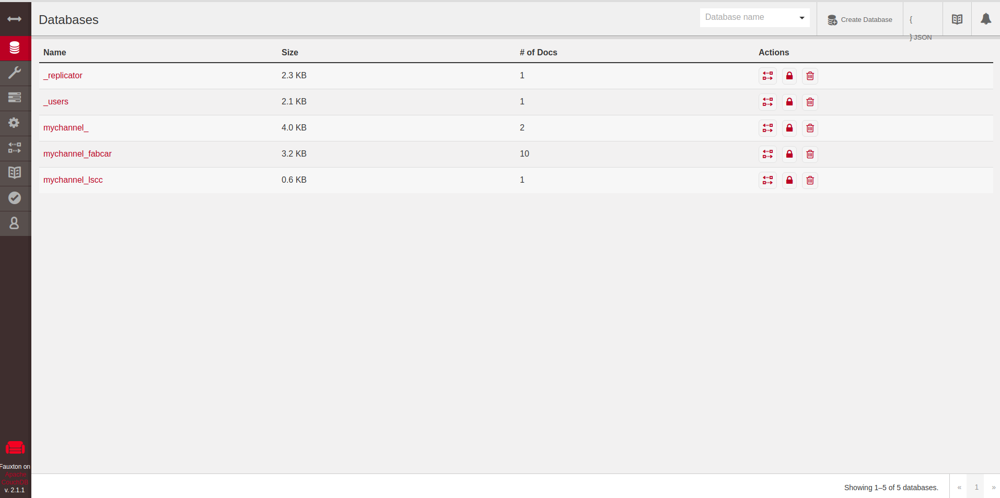
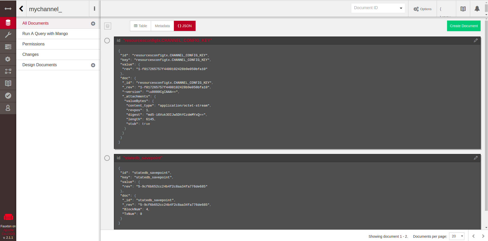
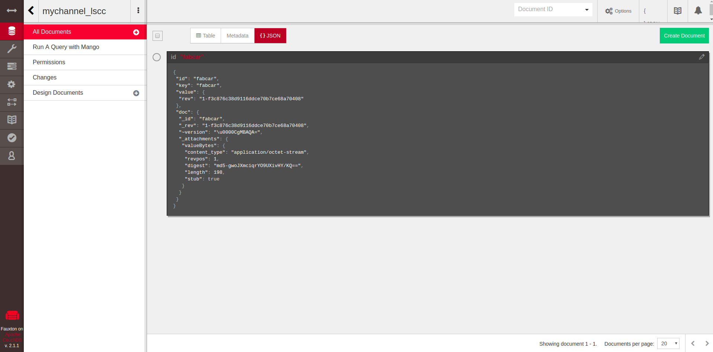
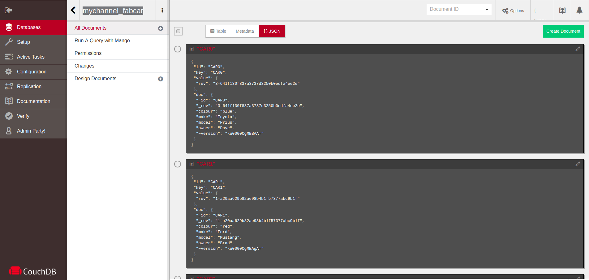

## fabric 下 LevelDB 与 CouchDB
[基于 fabric-samples 模块 chaincode-docker-devmode 的源码调试分析](https://gitee.com/jonluo/blockchain/tree/master/fabric-sourcecode-debugging)

### LevelDB
通过 get_ldb_datas.go 读取数据库打印相应的日志

* orderer 用 LevelBD 存所有channel的区块索引,维持fabric状态
  * 目录结构
    ```
    .
    ├── chains                      //创世块
    │   ├── myc                     //myc channel 创世块 
    │   │   └── blockfile_000000 
    │   └── testchainid             //testchainid 创世块 (初始channel)
    │       └── blockfile_000000
    └── index                       //所有的 channel 的区块信息
        ├── 000002.ldb
        ├── 000005.ldb
        ├── 000026.log
        ├── CURRENT
        ├── LOCK
        ├── LOG
        └── MANIFEST-000027

    ```
  * 读取日志 (orderer-index.log)
    ```
    key: myc blkMgrInfo
    keyBytes: [109 121 99 0 98 108 107 77 103 114 73 110 102 111]
    value:  ��
    valueBytes: [0 250 175 7 22 0]
    ===========================================
    key: myc indexCheckpointKey
    keyBytes: [109 121 99 0 105 110 100 101 120 67 104 101 99 107 112 111 105 110 116 75 101 121]
    value: 
    valueBytes: [22]
    ===========================================
    key: myc n
    keyBytes: [109 121 99 0 110 0]
    value:
    valueBytes: [0 0 0]
    ===========================================
    key: myc n
    keyBytes: [109 121 99 0 110 1 1]
    value:  �T
    valueBytes: [0 245 84 0]
    ===========================================
    key: myc n
    keyBytes: [109 121 99 0 110 1 2]
    value:  �
    valueBytes: [0 144 127 0]
    ===========================================
    key: myc n
    keyBytes: [109 121 99 0 110 1 3]
    value:  ��
    valueBytes: [0 133 166 1 0]
    ===========================================
    key: myc n
    keyBytes: [109 121 99 0 110 1 4]
    value:  ��
    valueBytes: [0 247 204 1 0]
    ===========================================
    key: myc n
    keyBytes: [109 121 99 0 110 1 5]
    value:  ��
    valueBytes: [0 233 243 1 0]
    ===========================================
    key: myc n
    keyBytes: [109 121 99 0 110 1 6]
    value:  ܚ
    valueBytes: [0 220 154 2 0]
    ===========================================
    key: myc n
    keyBytes: [109 121 99 0 110 1 7]
    value:  ��
    valueBytes: [0 206 193 2 0]
    ===========================================
    key: myc n
    keyBytes: [109 121 99 0 110 1 8]
    value:  ��
    valueBytes: [0 193 232 2 0]
    ===========================================
    key: myc n
    keyBytes: [109 121 99 0 110 1 9]
    value:  ��
    valueBytes: [0 178 143 3 0]
    ===========================================
    key: myc n
    
    keyBytes: [109 121 99 0 110 1 10]
    value:  ��
    valueBytes: [0 165 182 3 0]
    ===========================================
    key: myc n
    keyBytes: [109 121 99 0 110 1 11]
    value:  ��
    valueBytes: [0 152 221 3 0]
    ===========================================
    key: myc n
    keyBytes: [109 121 99 0 110 1 12]
    value:  ��
    valueBytes: [0 137 132 4 0]
    ===========================================
    key: myc n
    keyBytes: [109 121 99 0 110 1 13]
    value:  ��
    valueBytes: [0 253 170 4 0]
    ===========================================
    key: myc n
    keyBytes: [109 121 99 0 110 1 14]
    value:  ��
    valueBytes: [0 241 209 4 0]
    ===========================================
    key: myc n
    keyBytes: [109 121 99 0 110 1 15]
    value:  ��
    valueBytes: [0 227 248 4 0]
    ===========================================
    key: myc n
    keyBytes: [109 121 99 0 110 1 16]
    value:  ՟
    valueBytes: [0 213 159 5 0]
    ===========================================
    key: myc n
    keyBytes: [109 121 99 0 110 1 17]
    value:  ��
    valueBytes: [0 199 198 5 0]
    ===========================================
    key: myc n
    keyBytes: [109 121 99 0 110 1 18]
    value:  ��
    valueBytes: [0 186 237 5 0]
    ===========================================
    key: myc n
    keyBytes: [109 121 99 0 110 1 19]
    value:  ��
    valueBytes: [0 173 148 6 0]
    ===========================================
    key: myc n
    keyBytes: [109 121 99 0 110 1 20]
    value:  ��
    valueBytes: [0 159 187 6 0]
    ===========================================
    key: myc n
    keyBytes: [109 121 99 0 110 1 21]
    value:  ��
    valueBytes: [0 146 226 6 0]
    ===========================================
    key: myc n
    keyBytes: [109 121 99 0 110 1 22]
    value:  ��
    valueBytes: [0 136 137 7 0]
    ===========================================
    key: testchainid blkMgrInfo
    keyBytes: [116 101 115 116 99 104 97 105 110 105 100 0 98 108 107 77 103 114 73 110 102 111]
    value:  ��
    valueBytes: [0 161 169 1 1 0]
    ===========================================
    key: testchainid indexCheckpointKey
    keyBytes: [116 101 115 116 99 104 97 105 110 105 100 0 105 110 100 101 120 67 104 101 99 107 112 111 105 110 116 75 101 121]
    value: 
    valueBytes: [1]
    ===========================================
    key: testchainid n
    keyBytes: [116 101 115 116 99 104 97 105 110 105 100 0 110 0]
    value:
    valueBytes: [0 0 0]
    ===========================================
    key: testchainid n
    keyBytes: [116 101 115 116 99 104 97 105 110 105 100 0 110 1 1]
    value:  �=
    valueBytes: [0 215 61 0]
    ===========================================
    ```
    分析: 看出 key 是有channel名+具体意思组成, 例如blkMgrInfo 获取存储在index库中最新检查点信息, indexCheckpointKey 最新的区块编号 , n 区块信息    

* peer 用 LevelBD 存储区块数据和账本数据,存放在 ledgersData 文件夹里
  * 目录结构
    ```
    .
    ├── chains                                     //peer加入channel的区块数据
    │   ├── chains
    │   │   └── myc
    │   │       └── blockfile_000000
    │   └── index
    │       ├── 000002.ldb
    │       ├── 000005.ldb
    │       ├── 000012.log
    │       ├── CURRENT
    │       ├── LOCK
    │       ├── LOG
    │       └── MANIFEST-000013
    ├── historyLeveldb                            //chaincode中历史数据
    │   ├── 000002.ldb
    │   ├── 000019.log
    │   ├── CURRENT
    │   ├── LOCK
    │   ├── LOG
    │   └── MANIFEST-000020
    ├── ledgerProvider                            //账本提供者
    │   ├── 000002.ldb
    │   ├── 000015.log
    │   ├── CURRENT
    │   ├── LOCK
    │   ├── LOG
    │   └── MANIFEST-000016
    ├── pvtdataStore                              //最新区块
    │   ├── 000002.ldb
    │   ├── 000011.log
    │   ├── CURRENT
    │   ├── LOCK
    │   ├── LOG
    │   └── MANIFEST-000012
    └── stateLeveldb                              //chaincode 里数据状态信息也就是账本数据
        ├── 000002.ldb
        ├── 000025.log
        ├── CURRENT
        ├── LOCK
        ├── LOG
        └── MANIFEST-000026

    ```
  * 读取 ledgersData-chains-index 日志 (peer-ledgersData-chains-index.log)
    ```
    key: myc a
    keyBytes: [109 121 99 0 97 0 0]
    value:  &�T
    valueBytes: [0 38 202 84]
    ===========================================
    key: myc a
    keyBytes: [109 121 99 0 97 1 1 0]
    value:  �U�
    valueBytes: [0 188 85 235 26]
    ===========================================
    key: myc a
    keyBytes: [109 121 99 0 97 1 2 0]
    value:  ��
    valueBytes: [0 216 127 196 23]
    ===========================================
    key: myc a
    keyBytes: [109 121 99 0 97 1 3 0]
    value:  Φ�
    valueBytes: [0 206 166 1 195 23]
    ===========================================
    key: myc a
    keyBytes: [109 121 99 0 97 1 4 0]
    value:  ���
    valueBytes: [0 193 205 1 194 23]
    ===========================================
    key: myc a
    keyBytes: [109 121 99 0 97 1 5 0]
    value:  ���
    valueBytes: [0 180 244 1 195 23]
    ===========================================
    key: myc a
    keyBytes: [109 121 99 0 97 1 6 0]
    value:  ���
    valueBytes: [0 168 155 2 194 23]
    ===========================================
    key: myc a
    keyBytes: [109 121 99 0 97 1 7 0]
    value:  ���
    valueBytes: [0 155 194 2 194 23]
    ===========================================
    key: myc a
    keyBytes: [109 121 99 0 97 1 8 0]
    value:  ���
    valueBytes: [0 143 233 2 193 23]
    ===========================================
    key: myc a
    keyBytes: [109 121 99 0 97 1 9 0]
    value:  ���
    valueBytes: [0 129 144 3 194 23]
    ===========================================
    key: myc a
    
    keyBytes: [109 121 99 0 97 1 10 0]
    value:  ���
    valueBytes: [0 245 182 3 194 23]
    ===========================================
    key: myc a
    keyBytes: [109 121 99 0 97 1 11 0]
    value:  ���
    valueBytes: [0 233 221 3 194 23]
    ===========================================
    key: myc a
    keyBytes: [109 121 99 0 97 1 12 0]
    value:  ۄ�
    valueBytes: [0 219 132 4 195 23]
    ===========================================
    
    keyBytes: [109 121 99 0 97 1 13 0]
    value:  Ы�
    valueBytes: [0 208 171 4 196 23]
    ===========================================
    key: myc a
    keyBytes: [109 121 99 0 97 1 14 0]
    value:  ���
    valueBytes: [0 197 210 4 194 23]
    ===========================================
    key: myc a
    keyBytes: [109 121 99 0 97 1 15 0]
    value:  ���
    valueBytes: [0 184 249 4 194 23]
    ===========================================
    key: myc a
    keyBytes: [109 121 99 0 97 1 16 0]
    value:  ���
    valueBytes: [0 171 160 5 195 23]
    ===========================================
    key: myc a
    keyBytes: [109 121 99 0 97 1 17 0]
    value:  ���
    valueBytes: [0 158 199 5 195 23]
    ===========================================
    key: myc a
    keyBytes: [109 121 99 0 97 1 18 0]
    value:  ���
    valueBytes: [0 146 238 5 194 23]
    ===========================================
    key: myc a
    keyBytes: [109 121 99 0 97 1 19 0]
    value:  ���
    valueBytes: [0 134 149 6 195 23]
    ===========================================
    key: myc a
    keyBytes: [109 121 99 0 97 1 20 0]
    value:  ���
    valueBytes: [0 249 187 6 196 23]
    ===========================================
    key: myc a
    keyBytes: [109 121 99 0 97 1 21 0]
    value:  ���
    valueBytes: [0 237 226 6 197 23]
    ===========================================
    key: myc a
    keyBytes: [109 121 99 0 97 1 22 0]
    value:  ��
    valueBytes: [0 228 137 7 195 23]
    ===========================================
    key: myc b
    keyBytes: [109 121 99 0 98]
    value:
    valueBytes: [0 0 0]
    ===========================================
    key: myc b0426c999b1071c71e7161a68d210246dd6e5c9f6bb7a3c0d7ccd9e93ac88969a
    keyBytes: [109 121 99 0 98 48 52 50 54 99 57 57 57 98 49 48 55 49 99 55 49 101 55 49 54 49 97 54 56 100 50 49 48 50 52 54 100 100 54 101 53 99 57 102 54 98 98 55 97 51 99 48 100 55 99 99 100 57 101 57 51 97 99 56 56 57 54 57 97]
    value:  ��
    valueBytes: [0 138 171 4 0]
    ===========================================
    key: myc b1074983201310e81ce25ef7dab6239e43a0026cb4a24b1fa50c89db1d1beebdc
    keyBytes: [109 121 99 0 98 49 48 55 52 57 56 51 50 48 49 51 49 48 101 56 49 99 101 50 53 101 102 55 100 97 98 54 50 51 57 101 52 51 97 48 48 50 54 99 98 52 97 50 52 98 49 102 97 53 48 99 56 57 100 98 49 100 49 98 101 101 98 100 99]
    value:  ��
    valueBytes: [0 204 237 5 0]
    ===========================================
    key: myc b22dcc03185a24111797383cc0f7703efbf035347e186fe4713db59413ce59132
    keyBytes: [109 121 99 0 98 50 50 100 99 99 48 51 49 56 53 97 50 52 49 49 49 55 57 55 51 56 51 99 99 48 102 55 55 48 51 101 102 98 102 48 51 53 51 52 55 101 49 56 54 102 101 52 55 49 51 100 98 53 57 52 49 51 99 101 53 57 49 51 50]
    value:  ��
    valueBytes: [0 175 182 3 0]
    ===========================================
    key: myc b3365979bab49ca4e4333a39ba6e5f0b1f48a8938a9fc752a0b7425567d92f54b
    keyBytes: [109 121 99 0 98 51 51 54 53 57 55 57 98 97 98 52 57 99 97 52 101 52 51 51 51 97 51 57 98 97 54 101 53 102 48 98 49 102 52 56 97 56 57 51 56 97 57 102 99 55 53 50 97 48 98 55 52 50 53 53 54 55 100 57 50 102 53 52 98]
    value:  ��
    valueBytes: [0 255 209 4 0]
    ===========================================
    key: myc b37e92c33b22681fe759ba388c5321cb2de33c743edfab568ebaebcdc56b245f5
    keyBytes: [109 121 99 0 98 51 55 101 57 50 99 51 51 98 50 50 54 56 49 102 101 55 53 57 98 97 51 56 56 99 53 51 50 49 99 98 50 100 101 51 51 99 55 52 51 101 100 102 97 98 53 54 56 101 98 97 101 98 99 100 99 53 54 98 50 52 53 102 53]
    value:  ��
    valueBytes: [0 213 193 2 0]
    ===========================================
    key: myc b3f018c093e543535115996aca92f723fcadb8e4827d9d2233d5793a765472c31
    keyBytes: [109 121 99 0 98 51 102 48 49 56 99 48 57 51 101 53 52 51 53 51 53 49 49 53 57 57 54 97 99 97 57 50 102 55 50 51 102 99 97 100 98 56 101 52 56 50 55 100 57 100 50 50 51 51 100 53 55 57 51 97 55 54 53 52 55 50 99 51 49]
    value:  ��
    valueBytes: [0 179 187 6 0]
    ===========================================
    key: myc b4f55d905419735c1d893d173da8d61b2142ac60d190ef7ae6d08788ebdb139d8
    keyBytes: [109 121 99 0 98 52 102 53 53 100 57 48 53 52 49 57 55 51 53 99 49 100 56 57 51 100 49 55 51 100 97 56 100 54 49 98 50 49 52 50 97 99 54 48 100 49 57 48 101 102 55 97 101 54 100 48 56 55 56 56 101 98 100 98 49 51 57 100 56]
    value:  �
    valueBytes: [0 229 159 5 0]
    ===========================================
    key: myc b55de9f61ce3340cdd551fe12f2b933023965da55da0127fb7a450e6e98878afa
    keyBytes: [109 121 99 0 98 53 53 100 101 57 102 54 49 99 101 51 51 52 48 99 100 100 53 53 49 102 101 49 50 102 50 98 57 51 51 48 50 51 57 54 53 100 97 53 53 100 97 48 49 50 55 102 98 55 97 52 53 48 101 54 101 57 56 56 55 56 97 102 97]
    value:  ��
    valueBytes: [0 167 226 6 0]
    ===========================================
    key: myc b6075ecbb404d0b6010bbb26909d14e9c84c763576c908e9657085d8b004a1c0f
    keyBytes: [109 121 99 0 98 54 48 55 53 101 99 98 98 52 48 52 100 48 98 54 48 49 48 98 98 98 50 54 57 48 57 100 49 52 101 57 99 56 52 99 55 54 51 53 55 54 99 57 48 56 101 57 54 53 55 48 56 53 100 56 98 48 48 52 97 49 99 48 102]
    value:  ��
    valueBytes: [0 136 166 1 0]
    ===========================================
    key: myc b64db3e45193b7965f559d162a3660f7ca98c3dd6eb6674af224abc512d22f400
    keyBytes: [109 121 99 0 98 54 52 100 98 51 101 52 53 49 57 51 98 55 57 54 53 102 53 53 57 100 49 54 50 97 51 54 54 48 102 55 99 97 57 56 99 51 100 100 54 101 98 54 54 55 52 97 102 50 50 52 97 98 99 53 49 50 100 50 50 102 52 48 48]
    value:  �
    valueBytes: [0 146 127 0]
    ===========================================
    key: myc b673ceec75c42c841a81d654503ec5b1a868c072f17608eb4a29e24e08859bd7d
    keyBytes: [109 121 99 0 98 54 55 51 99 101 101 99 55 53 99 52 50 99 56 52 49 97 56 49 100 54 53 52 53 48 51 101 99 53 98 49 97 56 54 56 99 48 55 50 102 49 55 54 48 56 101 98 52 97 50 57 101 50 52 101 48 56 56 53 57 98 100 55 100]
    value:  ��
    valueBytes: [0 201 232 2 0]
    ===========================================
    key: myc b8e05a892a2c56df2256d486f52c20fde2e9798d1571e05e9af175aba3af82b70
    keyBytes: [109 121 99 0 98 56 101 48 53 97 56 57 50 97 50 99 53 54 100 102 50 50 53 54 100 52 56 54 102 53 50 99 50 48 102 100 101 50 101 57 55 57 56 100 49 53 55 49 101 48 53 101 57 97 102 49 55 53 97 98 97 51 97 102 56 50 98 55 48]
    value:  �T
    valueBytes: [0 246 84 0]
    ===========================================
    key: myc b9089039c72261fa2ecc5b1046f25868b0710162e455b7d97b38cbe78992fc118
    keyBytes: [109 121 99 0 98 57 48 56 57 48 51 57 99 55 50 50 54 49 102 97 50 101 99 99 53 98 49 48 52 54 102 50 53 56 54 56 98 48 55 49 48 49 54 50 101 52 53 53 98 55 100 57 55 98 51 56 99 98 101 55 56 57 57 50 102 99 49 49 56]
    value:  ��
    valueBytes: [0 149 132 4 0]
    ===========================================
    key: myc b9e91199d6af22e666ff626f535d6643e055ab12bde55548cfc26d4945c1a2263
    keyBytes: [109 121 99 0 98 57 101 57 49 49 57 57 100 54 97 102 50 50 101 54 54 54 102 102 54 50 54 102 53 51 53 100 54 54 52 51 101 48 53 53 97 98 49 50 98 100 101 53 53 53 52 56 99 102 99 50 54 100 52 57 52 53 99 49 97 50 50 54 51]
    value:  ��
    valueBytes: [0 238 243 1 0]
    ===========================================
    key: myc ba5516b50cb1d7b610b2675ff48448867e0f2fc60455fe3dda0380afdfd680c9c
    keyBytes: [109 121 99 0 98 97 53 53 49 54 98 53 48 99 98 49 100 55 98 54 49 48 98 50 54 55 53 102 102 52 56 52 52 56 56 54 55 101 48 102 50 102 99 54 48 52 53 53 102 101 51 100 100 97 48 51 56 48 97 102 100 102 100 54 56 48 99 57 99]
    value:  ��
    valueBytes: [0 187 143 3 0]
    ===========================================
    key: myc bb888644117bb3451d2f6432ed9c5f0446e0cfab97a9ca92515999381d3d9629e
    keyBytes: [109 121 99 0 98 98 56 56 56 54 52 52 49 49 55 98 98 51 52 53 49 100 50 102 54 52 51 50 101 100 57 99 53 102 48 52 52 54 101 48 99 102 97 98 57 55 97 57 99 97 57 50 53 49 53 57 57 57 51 56 49 100 51 100 57 54 50 57 101]
    value:  ��
    valueBytes: [0 216 198 5 0]
    ===========================================
    key: myc bb96c55120543f8d6a97720c29abaac036674b8a1cb8701365fe65fb71540d1bb
    keyBytes: [109 121 99 0 98 98 57 54 99 53 53 49 50 48 53 52 51 102 56 100 54 97 57 55 55 50 48 99 50 57 97 98 97 97 99 48 51 54 54 55 52 98 56 97 49 99 98 56 55 48 49 51 54 53 102 101 54 53 102 98 55 49 53 52 48 100 49 98 98]
    value:  �
    valueBytes: [0 226 154 2 0]
    ===========================================
    key: myc bc7100c5747027d6c05ba0e87a672ff95859a6182578ee63ad5750dbb22d8e1fd
    keyBytes: [109 121 99 0 98 99 55 49 48 48 99 53 55 52 55 48 50 55 100 54 99 48 53 98 97 48 101 56 55 97 54 55 50 102 102 57 53 56 53 57 97 54 49 56 50 53 55 56 101 101 54 51 97 100 53 55 53 48 100 98 98 50 50 100 56 101 49 102 100]
    value:  ��
    valueBytes: [0 251 204 1 0]
    ===========================================
    key: myc bd67ed0a256e2db82684485a32f0a0d65d9f34194a8bd8b91888fe7a40816e7da
    keyBytes: [109 121 99 0 98 100 54 55 101 100 48 97 50 53 54 101 50 100 98 56 50 54 56 52 52 56 53 97 51 50 102 48 97 48 100 54 53 100 57 102 51 52 49 57 52 97 56 98 100 56 98 57 49 56 56 56 102 101 55 97 52 48 56 49 54 101 55 100 97]
    value:  ��
    valueBytes: [0 192 148 6 0]
    ===========================================
    key: myc bdb80a1cc2eeb880ae52bbe5bb740d45e44448087c72b74c72cf69bd336366faf
    keyBytes: [109 121 99 0 98 100 98 56 48 97 49 99 99 50 101 101 98 56 56 48 97 101 53 50 98 98 101 53 98 98 55 52 48 100 52 53 101 52 52 52 52 56 48 56 55 99 55 50 98 55 52 99 55 50 99 102 54 57 98 100 51 51 54 51 54 54 102 97 102]
    value:  ��
    valueBytes: [0 242 248 4 0]
    ===========================================
    key: myc bdd9baae540754141dfc17152045ca94f6207538c11948d39aec163edd234d59b
    keyBytes: [109 121 99 0 98 100 100 57 98 97 97 101 53 52 48 55 53 52 49 52 49 100 102 99 49 55 49 53 50 48 52 53 99 97 57 52 102 54 50 48 55 53 51 56 99 49 49 57 52 56 100 51 57 97 101 99 49 54 51 101 100 100 50 51 52 100 53 57 98]
    value:  ��
    valueBytes: [0 158 137 7 0]
    ===========================================
    key: myc bfe9d746c00fa939ff31f7c7c8d3ef8f58b014833c365e2de685926891324f366
    keyBytes: [109 121 99 0 98 102 101 57 100 55 52 54 99 48 48 102 97 57 51 57 102 102 51 49 102 55 99 55 99 56 100 51 101 102 56 102 53 56 98 48 49 52 56 51 51 99 51 54 53 101 50 100 101 54 56 53 57 50 54 56 57 49 51 50 52 102 51 54 54]
    value:  ��
    valueBytes: [0 163 221 3 0]
    ===========================================
    key: myc blkMgrInfo
    keyBytes: [109 121 99 0 98 108 107 77 103 114 73 110 102 111]
    value:  ��
    valueBytes: [0 145 176 7 22 0]
    ===========================================
    key: myc h����j=�<��U o)
    ��-H�.�:�
    keyBytes: [109 121 99 0 104 4 191 230 151 19 210 7 172 106 18 61 150 60 194 195 85 32 111 41 10 149 162 45 72 152 127 46 236 58 1 1 230]
    value:  ��
    valueBytes: [0 251 204 1 0]
    ===========================================
    �ES�ɻT퇵}l�����s� '��:q3�
    keyBytes: [109 121 99 0 104 13 248 69 83 214 1 201 187 84 237 135 181 125 108 142 190 226 28 148 203 115 168 218 8 0 39 172 248 58 113 51 162]
    value:  ��
    valueBytes: [0 187 143 3 0]
    ===========================================
    key: myc hr�:w$�ȡ���
    ����U��pI7���r
    keyBytes: [109 121 99 0 104 17 114 218 8 157 58 119 17 36 15 245 200 161 169 184 173 10 153 175 183 218 85 140 158 112 73 55 21 217 231 234 114]
    value:  ��
    valueBytes: [0 158 137 7 0]
    ===========================================
    key: myc h$�*`��&��;*w��k��CG�[�n"p,1
    keyBytes: [109 121 99 0 104 36 178 42 96 179 28 194 38 22 198 220 59 42 119 234 196 19 107 176 242 67 71 154 91 233 172 110 34 26 112 44 49]
    value:
    valueBytes: [0 0 0]
    ===========================================
    key: myc h7�+�H"�/o��40ތ!�A�)�ǔz��˷_
    keyBytes: [109 121 99 0 104 55 215 43 165 72 30 34 14 233 47 111 143 174 52 48 222 140 33 140 65 185 41 231 135 199 148 122 243 235 203 183 95]
    value:  ��
    valueBytes: [0 213 193 2 0]
    ===========================================
    key: myc h?�JE4¼�ï�Iaj��a\�H+DpbP��y���
    keyBytes: [109 121 99 0 104 63 147 11 74 69 52 194 188 226 195 175 243 73 97 106 167 163 97 92 159 72 43 68 112 98 80 185 206 121 163 171 236]
    value:  ��
    valueBytes: [0 204 237 5 0]
    ===========================================
    key: myc hK5 %���ȉ�Q!&P����Gi�����Z
    keyBytes: [109 121 99 0 104 75 53 32 37 231 226 137 3 3 214 200 137 247 81 33 38 80 12 247 250 146 184 71 105 19 253 152 30 211 249 226 90]
    value:  ��
    valueBytes: [0 179 187 6 0]
    ===========================================
    key: myc hL��e9�''�!����q�M���B���K�=
    keyBytes: [109 121 99 0 104 76 255 175 101 57 15 139 39 39 192 33 206 222 227 231 113 20 149 77 227 12 29 155 188 66 1 145 180 197 75 254 61]
    value:  ��
    valueBytes: [0 201 232 2 0]
    ===========================================
    key: myc h^\/㍽<�<��=�]b)A��*/�7�gN�K�Z�
    keyBytes: [109 121 99 0 104 94 92 47 227 141 189 60 163 60 175 255 61 218 93 98 41 65 230 204 42 47 238 55 163 103 17 78 168 75 208 90 189]
    value:  ��
    valueBytes: [0 163 221 3 0]
    ===========================================
    key: myc h_8:���3]��I��QMv���l�����
    keyBytes: [109 121 99 0 104 95 56 58 176 163 20 187 51 93 231 211 73 159 15 205 81 77 118 179 252 8 3 166 199 108 162 215 214 16 128 216 7]
    value:  ��
    valueBytes: [0 238 243 1 0]
    ===========================================
    key: myc hn�zʸw�� ��
    ?v�s{ �Gg�e�lg� �
    keyBytes: [109 121 99 0 104 110 149 21 7 122 202 184 119 214 224 32 134 201 10 63 118 157 115 123 32 203 71 103 249 101 151 108 103 3 192 0 179]
    value:  ��
    valueBytes: [0 167 226 6 0]
    ===========================================
    key: myc ht�lҺ[� U(k�d�N1�>����E�M�2η
    keyBytes: [109 121 99 0 104 116 232 140 108 210 186 91 178 0 85 40 107 129 100 158 78 49 140 62 196 244 170 208 69 215 14 77 134 11 50 206 183]
    value:  ��
    valueBytes: [0 255 209 4 0]
    ===========================================
    key: myc h�/�ј!�8ć�Ƽ\FAp>�E����>�
    keyBytes: [109 121 99 0 104 133 39 8 47 185 209 152 33 19 28 226 56 196 135 144 198 188 92 7 70 65 112 62 184 69 175 177 31 148 155 62 162]
    value:  ��
    valueBytes: [0 175 182 3 0]
    ===========================================
    ,	��� D�t4:81���Nct�n
    keyBytes: [109 121 99 0 104 143 228 15 157 201 167 196 13 44 9 139 252 201 0 68 221 116 52 58 3 56 49 130 242 161 227 187 78 99 116 128 110]
    value:  ��
    valueBytes: [0 216 198 5 0]
    ===========================================
    key: myc h�I��+ҕ����K��Sf�O�C�i ��e%oQ
    keyBytes: [109 121 99 0 104 153 73 128 133 43 210 149 181 132 181 2 150 75 4 166 183 83 102 3 213 79 165 67 207 105 32 187 218 101 37 111 81]
    value:  ��
    valueBytes: [0 138 171 4 0]
    ===========================================
    key: myc h�2��߲?�E��������N�A���q
    keyBytes: [109 121 99 0 104 156 50 236 24 220 15 223 178 63 191 69 237 136 14 185 169 193 229 143 202 11 165 175 78 219 127 65 139 152 239 113 22]
    value:  ��
    valueBytes: [0 242 248 4 0]
    ===========================================
    key: myc h�|�R�����˄�rl�R0�ᤎE�0l
    keyBytes: [109 121 99 0 104 161 124 144 82 140 135 133 228 19 222 203 132 217 31 24 114 108 5 177 82 14 127 31 48 172 225 164 142 69 190 48 108]
    value:  �
    valueBytes: [0 146 127 0]
    ===========================================
    key: myc h���YC>,�=�/0����I'��
    keyBytes: [109 121 99 0 104 180 130 240 151 168 89 67 62 44 25 203 61 185 30 11 47 48 241 26 194 194 31 246 5 106 8 73 7 2 39 152 158]
    value:  �
    valueBytes: [0 229 159 5 0]
    ===========================================
    key: myc hôh'��r��#ߵH-K_�*��﷿��ɍAG
    keyBytes: [109 121 99 0 104 195 180 104 3 39 171 193 114 179 214 35 223 181 72 45 75 95 149 42 228 238 239 183 191 187 247 201 141 21 65 28 71]
    value:  ��
    valueBytes: [0 149 132 4 0]
    ===========================================
    key: myc h�6M�~��4�6ٷ|��{�m�wiD22
    ��OS
    keyBytes: [109 121 99 0 104 218 54 77 167 27 126 129 5 249 52 27 140 54 217 183 124 136 193 123 181 109 131 119 105 68 50 50 10 173 134 79 83]
    value:  �
    valueBytes: [0 226 154 2 0]
    ===========================================
    key: myc h䑅Zihj�KcUd��K1�g
    �8��p j�
    keyBytes: [109 121 99 0 104 228 145 133 29 90 105 14 104 106 131 75 99 6 15 85 100 182 148 75 49 230 103 10 210 56 234 235 112 32 106 206 25]
    value:  ��
    valueBytes: [0 136 166 1 0]
    ===========================================
    key: myc h�Ǫ��@uu��kuec>?�����$�MG� l
    keyBytes: [109 121 99 0 104 228 199 170 30 179 198 64 117 117 170 200 107 117 101 99 62 63 160 163 143 12 253 240 160 36 142 77 71 31 253 0 108]
    value:  ��
    valueBytes: [0 192 148 6 0]
    ===========================================
    key: myc h�j���A�VQ
    љ�m�f9��67���
    keyBytes: [109 121 99 0 104 231 174 106 188 231 27 150 65 186 86 81 238 130 138 10 26 209 153 229 109 241 102 57 154 127 145 54 55 14 185 144 210]
    value:  �T
    valueBytes: [0 246 84 0]
    ===========================================
    key: myc indexCheckpointKey
    keyBytes: [109 121 99 0 105 110 100 101 120 67 104 101 99 107 112 111 105 110 116 75 101 121]
    value: 
    valueBytes: [22]
    ===========================================
    key: myc n
    keyBytes: [109 121 99 0 110 0]
    value:
    valueBytes: [0 0 0]
    ===========================================
    key: myc n
    keyBytes: [109 121 99 0 110 1 1]
    value:  �T
    valueBytes: [0 246 84 0]
    ===========================================
    key: myc n
    keyBytes: [109 121 99 0 110 1 2]
    value:  �
    valueBytes: [0 146 127 0]
    ===========================================
    key: myc n
    keyBytes: [109 121 99 0 110 1 3]
    value:  ��
    valueBytes: [0 136 166 1 0]
    ===========================================
    key: myc n
    keyBytes: [109 121 99 0 110 1 4]
    value:  ��
    valueBytes: [0 251 204 1 0]
    ===========================================
    key: myc n
    keyBytes: [109 121 99 0 110 1 5]
    value:  ��
    valueBytes: [0 238 243 1 0]
    ===========================================
    key: myc n
    keyBytes: [109 121 99 0 110 1 6]
    value:  �
    valueBytes: [0 226 154 2 0]
    ===========================================
    key: myc n
    keyBytes: [109 121 99 0 110 1 7]
    value:  ��
    valueBytes: [0 213 193 2 0]
    ===========================================
    key: myc n
    keyBytes: [109 121 99 0 110 1 8]
    value:  ��
    valueBytes: [0 201 232 2 0]
    ===========================================
    key: myc n
    keyBytes: [109 121 99 0 110 1 9]
    value:  ��
    valueBytes: [0 187 143 3 0]
    ===========================================
    key: myc n
    
    keyBytes: [109 121 99 0 110 1 10]
    value:  ��
    valueBytes: [0 175 182 3 0]
    ===========================================
    key: myc n
    keyBytes: [109 121 99 0 110 1 11]
    value:  ��
    valueBytes: [0 163 221 3 0]
    ===========================================
    key: myc n
    keyBytes: [109 121 99 0 110 1 12]
    value:  ��
    valueBytes: [0 149 132 4 0]
    ===========================================
    key: myc n
    keyBytes: [109 121 99 0 110 1 13]
    value:  ��
    valueBytes: [0 138 171 4 0]
    ===========================================
    key: myc n
    keyBytes: [109 121 99 0 110 1 14]
    value:  ��
    valueBytes: [0 255 209 4 0]
    ===========================================
    key: myc n
    keyBytes: [109 121 99 0 110 1 15]
    value:  ��
    valueBytes: [0 242 248 4 0]
    ===========================================
    key: myc n
    keyBytes: [109 121 99 0 110 1 16]
    value:  �
    valueBytes: [0 229 159 5 0]
    ===========================================
    key: myc n
    keyBytes: [109 121 99 0 110 1 17]
    value:  ��
    valueBytes: [0 216 198 5 0]
    ===========================================
    key: myc n
    keyBytes: [109 121 99 0 110 1 18]
    value:  ��
    valueBytes: [0 204 237 5 0]
    ===========================================
    key: myc n
    keyBytes: [109 121 99 0 110 1 19]
    value:  ��
    valueBytes: [0 192 148 6 0]
    ===========================================
    key: myc n
    keyBytes: [109 121 99 0 110 1 20]
    value:  ��
    valueBytes: [0 179 187 6 0]
    ===========================================
    key: myc n
    keyBytes: [109 121 99 0 110 1 21]
    value:  ��
    valueBytes: [0 167 226 6 0]
    ===========================================
    key: myc n
    keyBytes: [109 121 99 0 110 1 22]
    value:  ��
    valueBytes: [0 158 137 7 0]
    ===========================================
    key: myc t
    keyBytes: [109 121 99 0 116]
    value:  &�T
    valueBytes: [0 38 202 84]
    ===========================================
    key: myc t0426c999b1071c71e7161a68d210246dd6e5c9f6bb7a3c0d7ccd9e93ac88969a
    keyBytes: [109 121 99 0 116 48 52 50 54 99 57 57 57 98 49 48 55 49 99 55 49 101 55 49 54 49 97 54 56 100 50 49 48 50 52 54 100 100 54 101 53 99 57 102 54 98 98 55 97 51 99 48 100 55 99 99 100 57 101 57 51 97 99 56 56 57 54 57 97]
    value:  Ы�
    valueBytes: [0 208 171 4 196 23]
    ===========================================
    key: myc t1074983201310e81ce25ef7dab6239e43a0026cb4a24b1fa50c89db1d1beebdc
    keyBytes: [109 121 99 0 116 49 48 55 52 57 56 51 50 48 49 51 49 48 101 56 49 99 101 50 53 101 102 55 100 97 98 54 50 51 57 101 52 51 97 48 48 50 54 99 98 52 97 50 52 98 49 102 97 53 48 99 56 57 100 98 49 100 49 98 101 101 98 100 99]
    value:  ���
    valueBytes: [0 146 238 5 194 23]
    ===========================================
    key: myc t22dcc03185a24111797383cc0f7703efbf035347e186fe4713db59413ce59132
    keyBytes: [109 121 99 0 116 50 50 100 99 99 48 51 49 56 53 97 50 52 49 49 49 55 57 55 51 56 51 99 99 48 102 55 55 48 51 101 102 98 102 48 51 53 51 52 55 101 49 56 54 102 101 52 55 49 51 100 98 53 57 52 49 51 99 101 53 57 49 51 50]
    value:  ���
    valueBytes: [0 245 182 3 194 23]
    ===========================================
    key: myc t3365979bab49ca4e4333a39ba6e5f0b1f48a8938a9fc752a0b7425567d92f54b
    keyBytes: [109 121 99 0 116 51 51 54 53 57 55 57 98 97 98 52 57 99 97 52 101 52 51 51 51 97 51 57 98 97 54 101 53 102 48 98 49 102 52 56 97 56 57 51 56 97 57 102 99 55 53 50 97 48 98 55 52 50 53 53 54 55 100 57 50 102 53 52 98]
    value:  ���
    valueBytes: [0 197 210 4 194 23]
    ===========================================
    key: myc t37e92c33b22681fe759ba388c5321cb2de33c743edfab568ebaebcdc56b245f5
    keyBytes: [109 121 99 0 116 51 55 101 57 50 99 51 51 98 50 50 54 56 49 102 101 55 53 57 98 97 51 56 56 99 53 51 50 49 99 98 50 100 101 51 51 99 55 52 51 101 100 102 97 98 53 54 56 101 98 97 101 98 99 100 99 53 54 98 50 52 53 102 53]
    value:  ���
    valueBytes: [0 155 194 2 194 23]
    ===========================================
    key: myc t3f018c093e543535115996aca92f723fcadb8e4827d9d2233d5793a765472c31
    keyBytes: [109 121 99 0 116 51 102 48 49 56 99 48 57 51 101 53 52 51 53 51 53 49 49 53 57 57 54 97 99 97 57 50 102 55 50 51 102 99 97 100 98 56 101 52 56 50 55 100 57 100 50 50 51 51 100 53 55 57 51 97 55 54 53 52 55 50 99 51 49]
    value:  ���
    valueBytes: [0 249 187 6 196 23]
    ===========================================
    key: myc t4f55d905419735c1d893d173da8d61b2142ac60d190ef7ae6d08788ebdb139d8
    keyBytes: [109 121 99 0 116 52 102 53 53 100 57 48 53 52 49 57 55 51 53 99 49 100 56 57 51 100 49 55 51 100 97 56 100 54 49 98 50 49 52 50 97 99 54 48 100 49 57 48 101 102 55 97 101 54 100 48 56 55 56 56 101 98 100 98 49 51 57 100 56]
    value:  ���
    valueBytes: [0 171 160 5 195 23]
    ===========================================
    key: myc t55de9f61ce3340cdd551fe12f2b933023965da55da0127fb7a450e6e98878afa
    keyBytes: [109 121 99 0 116 53 53 100 101 57 102 54 49 99 101 51 51 52 48 99 100 100 53 53 49 102 101 49 50 102 50 98 57 51 51 48 50 51 57 54 53 100 97 53 53 100 97 48 49 50 55 102 98 55 97 52 53 48 101 54 101 57 56 56 55 56 97 102 97]
    value:  ���
    valueBytes: [0 237 226 6 197 23]
    ===========================================
    key: myc t6075ecbb404d0b6010bbb26909d14e9c84c763576c908e9657085d8b004a1c0f
    keyBytes: [109 121 99 0 116 54 48 55 53 101 99 98 98 52 48 52 100 48 98 54 48 49 48 98 98 98 50 54 57 48 57 100 49 52 101 57 99 56 52 99 55 54 51 53 55 54 99 57 48 56 101 57 54 53 55 48 56 53 100 56 98 48 48 52 97 49 99 48 102]
    value:  Φ�
    valueBytes: [0 206 166 1 195 23]
    ===========================================
    key: myc t64db3e45193b7965f559d162a3660f7ca98c3dd6eb6674af224abc512d22f400
    keyBytes: [109 121 99 0 116 54 52 100 98 51 101 52 53 49 57 51 98 55 57 54 53 102 53 53 57 100 49 54 50 97 51 54 54 48 102 55 99 97 57 56 99 51 100 100 54 101 98 54 54 55 52 97 102 50 50 52 97 98 99 53 49 50 100 50 50 102 52 48 48]
    value:  ��
    valueBytes: [0 216 127 196 23]
    ===========================================
    key: myc t673ceec75c42c841a81d654503ec5b1a868c072f17608eb4a29e24e08859bd7d
    keyBytes: [109 121 99 0 116 54 55 51 99 101 101 99 55 53 99 52 50 99 56 52 49 97 56 49 100 54 53 52 53 48 51 101 99 53 98 49 97 56 54 56 99 48 55 50 102 49 55 54 48 56 101 98 52 97 50 57 101 50 52 101 48 56 56 53 57 98 100 55 100]
    value:  ���
    valueBytes: [0 143 233 2 193 23]
    ===========================================
    key: myc t8e05a892a2c56df2256d486f52c20fde2e9798d1571e05e9af175aba3af82b70
    keyBytes: [109 121 99 0 116 56 101 48 53 97 56 57 50 97 50 99 53 54 100 102 50 50 53 54 100 52 56 54 102 53 50 99 50 48 102 100 101 50 101 57 55 57 56 100 49 53 55 49 101 48 53 101 57 97 102 49 55 53 97 98 97 51 97 102 56 50 98 55 48]
    value:  �U�
    valueBytes: [0 188 85 235 26]
    ===========================================
    key: myc t9089039c72261fa2ecc5b1046f25868b0710162e455b7d97b38cbe78992fc118
    keyBytes: [109 121 99 0 116 57 48 56 57 48 51 57 99 55 50 50 54 49 102 97 50 101 99 99 53 98 49 48 52 54 102 50 53 56 54 56 98 48 55 49 48 49 54 50 101 52 53 53 98 55 100 57 55 98 51 56 99 98 101 55 56 57 57 50 102 99 49 49 56]
    value:  ۄ�
    valueBytes: [0 219 132 4 195 23]
    ===========================================
    key: myc t9e91199d6af22e666ff626f535d6643e055ab12bde55548cfc26d4945c1a2263
    keyBytes: [109 121 99 0 116 57 101 57 49 49 57 57 100 54 97 102 50 50 101 54 54 54 102 102 54 50 54 102 53 51 53 100 54 54 52 51 101 48 53 53 97 98 49 50 98 100 101 53 53 53 52 56 99 102 99 50 54 100 52 57 52 53 99 49 97 50 50 54 51]
    value:  ���
    valueBytes: [0 180 244 1 195 23]
    ===========================================
    key: myc ta5516b50cb1d7b610b2675ff48448867e0f2fc60455fe3dda0380afdfd680c9c
    keyBytes: [109 121 99 0 116 97 53 53 49 54 98 53 48 99 98 49 100 55 98 54 49 48 98 50 54 55 53 102 102 52 56 52 52 56 56 54 55 101 48 102 50 102 99 54 48 52 53 53 102 101 51 100 100 97 48 51 56 48 97 102 100 102 100 54 56 48 99 57 99]
    value:  ���
    valueBytes: [0 129 144 3 194 23]
    ===========================================
    key: myc tb888644117bb3451d2f6432ed9c5f0446e0cfab97a9ca92515999381d3d9629e
    keyBytes: [109 121 99 0 116 98 56 56 56 54 52 52 49 49 55 98 98 51 52 53 49 100 50 102 54 52 51 50 101 100 57 99 53 102 48 52 52 54 101 48 99 102 97 98 57 55 97 57 99 97 57 50 53 49 53 57 57 57 51 56 49 100 51 100 57 54 50 57 101]
    value:  ���
    valueBytes: [0 158 199 5 195 23]
    ===========================================
    key: myc tb96c55120543f8d6a97720c29abaac036674b8a1cb8701365fe65fb71540d1bb
    keyBytes: [109 121 99 0 116 98 57 54 99 53 53 49 50 48 53 52 51 102 56 100 54 97 57 55 55 50 48 99 50 57 97 98 97 97 99 48 51 54 54 55 52 98 56 97 49 99 98 56 55 48 49 51 54 53 102 101 54 53 102 98 55 49 53 52 48 100 49 98 98]
    value:  ���
    valueBytes: [0 168 155 2 194 23]
    ===========================================
    key: myc tc7100c5747027d6c05ba0e87a672ff95859a6182578ee63ad5750dbb22d8e1fd
    keyBytes: [109 121 99 0 116 99 55 49 48 48 99 53 55 52 55 48 50 55 100 54 99 48 53 98 97 48 101 56 55 97 54 55 50 102 102 57 53 56 53 57 97 54 49 56 50 53 55 56 101 101 54 51 97 100 53 55 53 48 100 98 98 50 50 100 56 101 49 102 100]
    value:  ���
    valueBytes: [0 193 205 1 194 23]
    ===========================================
    key: myc td67ed0a256e2db82684485a32f0a0d65d9f34194a8bd8b91888fe7a40816e7da
    keyBytes: [109 121 99 0 116 100 54 55 101 100 48 97 50 53 54 101 50 100 98 56 50 54 56 52 52 56 53 97 51 50 102 48 97 48 100 54 53 100 57 102 51 52 49 57 52 97 56 98 100 56 98 57 49 56 56 56 102 101 55 97 52 48 56 49 54 101 55 100 97]
    value:  ���
    valueBytes: [0 134 149 6 195 23]
    ===========================================
    key: myc tdb80a1cc2eeb880ae52bbe5bb740d45e44448087c72b74c72cf69bd336366faf
    keyBytes: [109 121 99 0 116 100 98 56 48 97 49 99 99 50 101 101 98 56 56 48 97 101 53 50 98 98 101 53 98 98 55 52 48 100 52 53 101 52 52 52 52 56 48 56 55 99 55 50 98 55 52 99 55 50 99 102 54 57 98 100 51 51 54 51 54 54 102 97 102]
    value:  ���
    valueBytes: [0 184 249 4 194 23]
    ===========================================
    key: myc tdd9baae540754141dfc17152045ca94f6207538c11948d39aec163edd234d59b
    keyBytes: [109 121 99 0 116 100 100 57 98 97 97 101 53 52 48 55 53 52 49 52 49 100 102 99 49 55 49 53 50 48 52 53 99 97 57 52 102 54 50 48 55 53 51 56 99 49 49 57 52 56 100 51 57 97 101 99 49 54 51 101 100 100 50 51 52 100 53 57 98]
    value:  ��
    valueBytes: [0 228 137 7 195 23]
    ===========================================
    key: myc tfe9d746c00fa939ff31f7c7c8d3ef8f58b014833c365e2de685926891324f366
    keyBytes: [109 121 99 0 116 102 101 57 100 55 52 54 99 48 48 102 97 57 51 57 102 102 51 49 102 55 99 55 99 56 100 51 101 102 56 102 53 56 98 48 49 52 56 51 51 99 51 54 53 101 50 100 101 54 56 53 57 50 54 56 57 49 51 50 52 102 51 54 54]
    value:  ���
    valueBytes: [0 233 221 3 194 23]
    ===========================================
    key: myc v
    keyBytes: [109 121 99 0 118]
    value:
    valueBytes: [0]
    ===========================================
    key: myc v0426c999b1071c71e7161a68d210246dd6e5c9f6bb7a3c0d7ccd9e93ac88969a
    keyBytes: [109 121 99 0 118 48 52 50 54 99 57 57 57 98 49 48 55 49 99 55 49 101 55 49 54 49 97 54 56 100 50 49 48 50 52 54 100 100 54 101 53 99 57 102 54 98 98 55 97 51 99 48 100 55 99 99 100 57 101 57 51 97 99 56 56 57 54 57 97]
    value:
    valueBytes: [0]
    ===========================================
    key: myc v1074983201310e81ce25ef7dab6239e43a0026cb4a24b1fa50c89db1d1beebdc
    keyBytes: [109 121 99 0 118 49 48 55 52 57 56 51 50 48 49 51 49 48 101 56 49 99 101 50 53 101 102 55 100 97 98 54 50 51 57 101 52 51 97 48 48 50 54 99 98 52 97 50 52 98 49 102 97 53 48 99 56 57 100 98 49 100 49 98 101 101 98 100 99]
    value:
    valueBytes: [0]
    ===========================================
    key: myc v22dcc03185a24111797383cc0f7703efbf035347e186fe4713db59413ce59132
    keyBytes: [109 121 99 0 118 50 50 100 99 99 48 51 49 56 53 97 50 52 49 49 49 55 57 55 51 56 51 99 99 48 102 55 55 48 51 101 102 98 102 48 51 53 51 52 55 101 49 56 54 102 101 52 55 49 51 100 98 53 57 52 49 51 99 101 53 57 49 51 50]
    value:
    valueBytes: [0]
    ===========================================
    key: myc v3365979bab49ca4e4333a39ba6e5f0b1f48a8938a9fc752a0b7425567d92f54b
    keyBytes: [109 121 99 0 118 51 51 54 53 57 55 57 98 97 98 52 57 99 97 52 101 52 51 51 51 97 51 57 98 97 54 101 53 102 48 98 49 102 52 56 97 56 57 51 56 97 57 102 99 55 53 50 97 48 98 55 52 50 53 53 54 55 100 57 50 102 53 52 98]
    value:
    valueBytes: [0]
    ===========================================
    key: myc v37e92c33b22681fe759ba388c5321cb2de33c743edfab568ebaebcdc56b245f5
    keyBytes: [109 121 99 0 118 51 55 101 57 50 99 51 51 98 50 50 54 56 49 102 101 55 53 57 98 97 51 56 56 99 53 51 50 49 99 98 50 100 101 51 51 99 55 52 51 101 100 102 97 98 53 54 56 101 98 97 101 98 99 100 99 53 54 98 50 52 53 102 53]
    value:
    valueBytes: [0]
    ===========================================
    key: myc v3f018c093e543535115996aca92f723fcadb8e4827d9d2233d5793a765472c31
    keyBytes: [109 121 99 0 118 51 102 48 49 56 99 48 57 51 101 53 52 51 53 51 53 49 49 53 57 57 54 97 99 97 57 50 102 55 50 51 102 99 97 100 98 56 101 52 56 50 55 100 57 100 50 50 51 51 100 53 55 57 51 97 55 54 53 52 55 50 99 51 49]
    value:
    valueBytes: [0]
    ===========================================
    key: myc v4f55d905419735c1d893d173da8d61b2142ac60d190ef7ae6d08788ebdb139d8
    keyBytes: [109 121 99 0 118 52 102 53 53 100 57 48 53 52 49 57 55 51 53 99 49 100 56 57 51 100 49 55 51 100 97 56 100 54 49 98 50 49 52 50 97 99 54 48 100 49 57 48 101 102 55 97 101 54 100 48 56 55 56 56 101 98 100 98 49 51 57 100 56]
    value:
    valueBytes: [0]
    ===========================================
    key: myc v55de9f61ce3340cdd551fe12f2b933023965da55da0127fb7a450e6e98878afa
    keyBytes: [109 121 99 0 118 53 53 100 101 57 102 54 49 99 101 51 51 52 48 99 100 100 53 53 49 102 101 49 50 102 50 98 57 51 51 48 50 51 57 54 53 100 97 53 53 100 97 48 49 50 55 102 98 55 97 52 53 48 101 54 101 57 56 56 55 56 97 102 97]
    value:
    valueBytes: [0]
    ===========================================
    key: myc v6075ecbb404d0b6010bbb26909d14e9c84c763576c908e9657085d8b004a1c0f
    keyBytes: [109 121 99 0 118 54 48 55 53 101 99 98 98 52 48 52 100 48 98 54 48 49 48 98 98 98 50 54 57 48 57 100 49 52 101 57 99 56 52 99 55 54 51 53 55 54 99 57 48 56 101 57 54 53 55 48 56 53 100 56 98 48 48 52 97 49 99 48 102]
    value:
    valueBytes: [0]
    ===========================================
    key: myc v64db3e45193b7965f559d162a3660f7ca98c3dd6eb6674af224abc512d22f400
    keyBytes: [109 121 99 0 118 54 52 100 98 51 101 52 53 49 57 51 98 55 57 54 53 102 53 53 57 100 49 54 50 97 51 54 54 48 102 55 99 97 57 56 99 51 100 100 54 101 98 54 54 55 52 97 102 50 50 52 97 98 99 53 49 50 100 50 50 102 52 48 48]
    value:
    valueBytes: [0]
    ===========================================
    key: myc v673ceec75c42c841a81d654503ec5b1a868c072f17608eb4a29e24e08859bd7d
    keyBytes: [109 121 99 0 118 54 55 51 99 101 101 99 55 53 99 52 50 99 56 52 49 97 56 49 100 54 53 52 53 48 51 101 99 53 98 49 97 56 54 56 99 48 55 50 102 49 55 54 48 56 101 98 52 97 50 57 101 50 52 101 48 56 56 53 57 98 100 55 100]
    value:
    valueBytes: [0]
    ===========================================
    key: myc v8e05a892a2c56df2256d486f52c20fde2e9798d1571e05e9af175aba3af82b70
    keyBytes: [109 121 99 0 118 56 101 48 53 97 56 57 50 97 50 99 53 54 100 102 50 50 53 54 100 52 56 54 102 53 50 99 50 48 102 100 101 50 101 57 55 57 56 100 49 53 55 49 101 48 53 101 57 97 102 49 55 53 97 98 97 51 97 102 56 50 98 55 48]
    value:
    valueBytes: [0]
    ===========================================
    key: myc v9089039c72261fa2ecc5b1046f25868b0710162e455b7d97b38cbe78992fc118
    keyBytes: [109 121 99 0 118 57 48 56 57 48 51 57 99 55 50 50 54 49 102 97 50 101 99 99 53 98 49 48 52 54 102 50 53 56 54 56 98 48 55 49 48 49 54 50 101 52 53 53 98 55 100 57 55 98 51 56 99 98 101 55 56 57 57 50 102 99 49 49 56]
    value:
    valueBytes: [0]
    ===========================================
    key: myc v9e91199d6af22e666ff626f535d6643e055ab12bde55548cfc26d4945c1a2263
    keyBytes: [109 121 99 0 118 57 101 57 49 49 57 57 100 54 97 102 50 50 101 54 54 54 102 102 54 50 54 102 53 51 53 100 54 54 52 51 101 48 53 53 97 98 49 50 98 100 101 53 53 53 52 56 99 102 99 50 54 100 52 57 52 53 99 49 97 50 50 54 51]
    value:
    valueBytes: [0]
    ===========================================
    key: myc va5516b50cb1d7b610b2675ff48448867e0f2fc60455fe3dda0380afdfd680c9c
    keyBytes: [109 121 99 0 118 97 53 53 49 54 98 53 48 99 98 49 100 55 98 54 49 48 98 50 54 55 53 102 102 52 56 52 52 56 56 54 55 101 48 102 50 102 99 54 48 52 53 53 102 101 51 100 100 97 48 51 56 48 97 102 100 102 100 54 56 48 99 57 99]
    value:
    valueBytes: [0]
    ===========================================
    key: myc vb888644117bb3451d2f6432ed9c5f0446e0cfab97a9ca92515999381d3d9629e
    keyBytes: [109 121 99 0 118 98 56 56 56 54 52 52 49 49 55 98 98 51 52 53 49 100 50 102 54 52 51 50 101 100 57 99 53 102 48 52 52 54 101 48 99 102 97 98 57 55 97 57 99 97 57 50 53 49 53 57 57 57 51 56 49 100 51 100 57 54 50 57 101]
    value:
    valueBytes: [0]
    ===========================================
    key: myc vb96c55120543f8d6a97720c29abaac036674b8a1cb8701365fe65fb71540d1bb
    keyBytes: [109 121 99 0 118 98 57 54 99 53 53 49 50 48 53 52 51 102 56 100 54 97 57 55 55 50 48 99 50 57 97 98 97 97 99 48 51 54 54 55 52 98 56 97 49 99 98 56 55 48 49 51 54 53 102 101 54 53 102 98 55 49 53 52 48 100 49 98 98]
    value:
    valueBytes: [0]
    ===========================================
    key: myc vc7100c5747027d6c05ba0e87a672ff95859a6182578ee63ad5750dbb22d8e1fd
    keyBytes: [109 121 99 0 118 99 55 49 48 48 99 53 55 52 55 48 50 55 100 54 99 48 53 98 97 48 101 56 55 97 54 55 50 102 102 57 53 56 53 57 97 54 49 56 50 53 55 56 101 101 54 51 97 100 53 55 53 48 100 98 98 50 50 100 56 101 49 102 100]
    value:
    valueBytes: [0]
    ===========================================
    key: myc vd67ed0a256e2db82684485a32f0a0d65d9f34194a8bd8b91888fe7a40816e7da
    keyBytes: [109 121 99 0 118 100 54 55 101 100 48 97 50 53 54 101 50 100 98 56 50 54 56 52 52 56 53 97 51 50 102 48 97 48 100 54 53 100 57 102 51 52 49 57 52 97 56 98 100 56 98 57 49 56 56 56 102 101 55 97 52 48 56 49 54 101 55 100 97]
    value:
    valueBytes: [0]
    ===========================================
    key: myc vdb80a1cc2eeb880ae52bbe5bb740d45e44448087c72b74c72cf69bd336366faf
    keyBytes: [109 121 99 0 118 100 98 56 48 97 49 99 99 50 101 101 98 56 56 48 97 101 53 50 98 98 101 53 98 98 55 52 48 100 52 53 101 52 52 52 52 56 48 56 55 99 55 50 98 55 52 99 55 50 99 102 54 57 98 100 51 51 54 51 54 54 102 97 102]
    value:
    valueBytes: [0]
    ===========================================
    key: myc vdd9baae540754141dfc17152045ca94f6207538c11948d39aec163edd234d59b
    keyBytes: [109 121 99 0 118 100 100 57 98 97 97 101 53 52 48 55 53 52 49 52 49 100 102 99 49 55 49 53 50 48 52 53 99 97 57 52 102 54 50 48 55 53 51 56 99 49 49 57 52 56 100 51 57 97 101 99 49 54 51 101 100 100 50 51 52 100 53 57 98]
    value:
    valueBytes: [0]
    ===========================================
    key: myc vfe9d746c00fa939ff31f7c7c8d3ef8f58b014833c365e2de685926891324f366
    keyBytes: [109 121 99 0 118 102 101 57 100 55 52 54 99 48 48 102 97 57 51 57 102 102 51 49 102 55 99 55 99 56 100 51 101 102 56 102 53 56 98 48 49 52 56 51 51 99 51 54 53 101 50 100 101 54 56 53 57 50 54 56 57 49 51 50 52 102 51 54 54]
    value:
    valueBytes: [0]
    ===========================================
   

    ```
    分析: 看出 key 是有channel名+具体意思组成, 有区块,交易,chaincode 状态等
  
  * 读取 ledgersData-historyLeveldb 日志 (peer-ledgersData-historyLeveldb.log)
    ```
    key: myc
    keyBytes: [109 121 99 0 0]
    value: 
    valueBytes: [1 22 1 1]
    ===========================================
    key: myc lscc mycc 
    keyBytes: [109 121 99 0 108 115 99 99 0 109 121 99 99 0 1 1 0]
    value:
    valueBytes: []
    ===========================================
    key: myc mycc a 
    keyBytes: [109 121 99 0 109 121 99 99 0 97 0 1 1 0]
    value:
    valueBytes: []
    ===========================================
    key: myc mycc a 
    keyBytes: [109 121 99 0 109 121 99 99 0 97 0 1 2 0]
    value:
    valueBytes: []
    ===========================================
    key: myc mycc a 
    keyBytes: [109 121 99 0 109 121 99 99 0 97 0 1 3 0]
    value:
    valueBytes: []
    ===========================================
    key: myc mycc a 
    keyBytes: [109 121 99 0 109 121 99 99 0 97 0 1 4 0]
    value:
    valueBytes: []
    ===========================================
    key: myc mycc a 
    keyBytes: [109 121 99 0 109 121 99 99 0 97 0 1 5 0]
    value:
    valueBytes: []
    ===========================================
    key: myc mycc a 
    keyBytes: [109 121 99 0 109 121 99 99 0 97 0 1 6 0]
    value:
    valueBytes: []
    ===========================================
    key: myc mycc a 
    keyBytes: [109 121 99 0 109 121 99 99 0 97 0 1 7 0]
    value:
    valueBytes: []
    ===========================================
    key: myc mycc a
    keyBytes: [109 121 99 0 109 121 99 99 0 97 0 1 8 0]
    value:
    valueBytes: []
    ===========================================
    key: myc mycc a 
    keyBytes: [109 121 99 0 109 121 99 99 0 97 0 1 9 0]
    value:
    valueBytes: []
    ===========================================
    key: myc mycc a 
    
    keyBytes: [109 121 99 0 109 121 99 99 0 97 0 1 10 0]
    value:
    valueBytes: []
    ===========================================
    key: myc mycc a 
    keyBytes: [109 121 99 0 109 121 99 99 0 97 0 1 11 0]
    value:
    valueBytes: []
    ===========================================
    key: myc mycc a 
    keyBytes: [109 121 99 0 109 121 99 99 0 97 0 1 12 0]
    value:
    valueBytes: []
    ===========================================
    
    keyBytes: [109 121 99 0 109 121 99 99 0 97 0 1 13 0]
    value:
    valueBytes: []
    ===========================================
    key: myc mycc a 
    keyBytes: [109 121 99 0 109 121 99 99 0 97 0 1 14 0]
    value:
    valueBytes: []
    ===========================================
    key: myc mycc a 
    keyBytes: [109 121 99 0 109 121 99 99 0 97 0 1 15 0]
    value:
    valueBytes: []
    ===========================================
    key: myc mycc a 
    keyBytes: [109 121 99 0 109 121 99 99 0 97 0 1 16 0]
    value:
    valueBytes: []
    ===========================================
    key: myc mycc a 
    keyBytes: [109 121 99 0 109 121 99 99 0 97 0 1 17 0]
    value:
    valueBytes: []
    ===========================================
    key: myc mycc a 
    keyBytes: [109 121 99 0 109 121 99 99 0 97 0 1 18 0]
    value:
    valueBytes: []
    ===========================================
    key: myc mycc a 
    keyBytes: [109 121 99 0 109 121 99 99 0 97 0 1 19 0]
    value:
    valueBytes: []
    ===========================================
    key: myc mycc a 
    keyBytes: [109 121 99 0 109 121 99 99 0 97 0 1 20 0]
    value:
    valueBytes: []
    ===========================================
    key: myc mycc a 
    keyBytes: [109 121 99 0 109 121 99 99 0 97 0 1 21 0]
    value:
    valueBytes: []
    ===========================================
    key: myc mycc a 
    keyBytes: [109 121 99 0 109 121 99 99 0 97 0 1 22 0]
    value:
    valueBytes: []
    ===========================================
    key: myc mycc b 
    keyBytes: [109 121 99 0 109 121 99 99 0 98 0 1 1 0]
    value:
    valueBytes: []
    ===========================================
    key: myc mycc b 
    keyBytes: [109 121 99 0 109 121 99 99 0 98 0 1 2 0]
    value:
    valueBytes: []
    ===========================================
    key: myc mycc b 
    keyBytes: [109 121 99 0 109 121 99 99 0 98 0 1 3 0]
    value:
    valueBytes: []
    ===========================================
    key: myc mycc b 
    keyBytes: [109 121 99 0 109 121 99 99 0 98 0 1 4 0]
    value:
    valueBytes: []
    ===========================================
    key: myc mycc b 
    keyBytes: [109 121 99 0 109 121 99 99 0 98 0 1 5 0]
    value:
    valueBytes: []
    ===========================================
    key: myc mycc b 
    keyBytes: [109 121 99 0 109 121 99 99 0 98 0 1 6 0]
    value:
    valueBytes: []
    ===========================================
    key: myc mycc b 
    keyBytes: [109 121 99 0 109 121 99 99 0 98 0 1 7 0]
    value:
    valueBytes: []
    ===========================================
    key: myc mycc b
    keyBytes: [109 121 99 0 109 121 99 99 0 98 0 1 8 0]
    value:
    valueBytes: []
    ===========================================
    key: myc mycc b 
    keyBytes: [109 121 99 0 109 121 99 99 0 98 0 1 9 0]
    value:
    valueBytes: []
    ===========================================
    key: myc mycc b 
    
    keyBytes: [109 121 99 0 109 121 99 99 0 98 0 1 10 0]
    value:
    valueBytes: []
    ===========================================
    key: myc mycc b 
    keyBytes: [109 121 99 0 109 121 99 99 0 98 0 1 11 0]
    value:
    valueBytes: []
    ===========================================
    key: myc mycc b 
    keyBytes: [109 121 99 0 109 121 99 99 0 98 0 1 12 0]
    value:
    valueBytes: []
    ===========================================
    
    keyBytes: [109 121 99 0 109 121 99 99 0 98 0 1 13 0]
    value:
    valueBytes: []
    ===========================================
    key: myc mycc b 
    keyBytes: [109 121 99 0 109 121 99 99 0 98 0 1 14 0]
    value:
    valueBytes: []
    ===========================================
    key: myc mycc b 
    keyBytes: [109 121 99 0 109 121 99 99 0 98 0 1 15 0]
    value:
    valueBytes: []
    ===========================================
    key: myc mycc b 
    keyBytes: [109 121 99 0 109 121 99 99 0 98 0 1 16 0]
    value:
    valueBytes: []
    ===========================================
    key: myc mycc b 
    keyBytes: [109 121 99 0 109 121 99 99 0 98 0 1 17 0]
    value:
    valueBytes: []
    ===========================================
    key: myc mycc b 
    keyBytes: [109 121 99 0 109 121 99 99 0 98 0 1 18 0]
    value:
    valueBytes: []
    ===========================================
    key: myc mycc b 
    keyBytes: [109 121 99 0 109 121 99 99 0 98 0 1 19 0]
    value:
    valueBytes: []
    ===========================================
    key: myc mycc b 
    keyBytes: [109 121 99 0 109 121 99 99 0 98 0 1 20 0]
    value:
    valueBytes: []
    ===========================================
    key: myc mycc b 
    keyBytes: [109 121 99 0 109 121 99 99 0 98 0 1 21 0]
    value:
    valueBytes: []
    ===========================================
    key: myc mycc b 
    keyBytes: [109 121 99 0 109 121 99 99 0 98 0 1 22 0]
    value:
    valueBytes: []
    ===========================================

    ```
    分析: 看出 key 是就是历史版本的信息所在的区块,value没值 
    
  * 读取 ledgersData-ledgerProvider 日志 (peer-ledgersData-ledgerProvider.log)
    ```
    key: lmyc
    keyBytes: [108 109 121 99]
    value:
    valueBytes: []
    ===========================================

    ```
    分析: 就是lmyc
    
  * 读取 ledgersData-pvtdataStore 日志 (peer-ledgersData-pvtdataStore.log)
    ```
    key: myc 
    keyBytes: [109 121 99 0 1]
    value: 
    valueBytes: [22]
    ===========================================
    ```
    分析: 就是 myc的最新区块
    
  * 读取 ledgersData-stateLeveldb 日志 (peer-ledgersData-stateLeveldb.log)
    ```
    key: myc
    keyBytes: [109 121 99 0 0]
    value: 
    valueBytes: [1 22 0]
    ===========================================
    key: myc  resourcesconfigtx.CHANNEL_CONFIG_KEY
    keyBytes: [109 121 99 0 0 114 101 115 111 117 114 99 101 115 99 111 110 102 105 103 116 120 46 67 72 65 78 78 69 76 95 67 79 78 70 73 71 95 75 69 89]
    value:  �<�
    Orderer��
    	SampleOrg��
    MSP���
    DEFAULT�-----BEGIN CERTIFICATE-----
    MIICYjCCAgigAwIBAgIRAL1fEAnz5zp4moJ8MdSb/lYwCgYIKoZIzj0EAwIwgYEx
    CzAJBgNVBAYTAlVTMRMwEQYDVQQIEwpDYWxpZm9ybmlhMRYwFAYDVQQHEw1TYW4g
    RnJhbmNpc2NvMRkwFwYDVQQKExBvcmcxLmV4YW1wbGUuY29tMQwwCgYDVQQLEwND
    T1AxHDAaBgNVBAMTE2NhLm9yZzEuZXhhbXBsZS5jb20wHhcNMTcxMTEyMTM0MTEx
    WhcNMjcxMTEwMTM0MTExWjCBgTELMAkGA1UEBhMCVVMxEzARBgNVBAgTCkNhbGlm
    b3JuaWExFjAUBgNVBAcTDVNhbiBGcmFuY2lzY28xGTAXBgNVBAoTEG9yZzEuZXhh
    bXBsZS5jb20xDDAKBgNVBAsTA0NPUDEcMBoGA1UEAxMTY2Eub3JnMS5leGFtcGxl
    LmNvbTBZMBMGByqGSM49AgEGCCqGSM49AwEHA0IABGrsQ6oJpk6hDWf63HU3OSNd
    bou9KNw/VIee1IngPDI4YJU7O+Xa/XLJuwnFv7BpR8Ytl3f+njC8i/RZP2/svO+j
    XzBdMA4GA1UdDwEB/wQEAwIBpjAPBgNVHSUECDAGBgRVHSUAMA8GA1UdEwEB/wQF
    MAMBAf8wKQYDVR0OBCIEIIpzkSIZzxBWVIV5unlgZJuyu2XPEeP8+y1uB6LLA5Qr
    MAoGCCqGSM49BAMCA0gAMEUCIQDUh/+CC2dAICnYtACXspwUaaEbiyZxYIx+XDvW
    o8VVcgIgGz5S4iC5+xkxgeaISPfxKTTVy6yzTdYGzCw1vPppjzo=
    -----END CERTIFICATE-----
    "�-----BEGIN CERTIFICATE-----
    MIICNjCCAd2gAwIBAgIRAMnf9/dmV9RvCCVw9pZQUfUwCgYIKoZIzj0EAwIwgYEx
    CzAJBgNVBAYTAlVTMRMwEQYDVQQIEwpDYWxpZm9ybmlhMRYwFAYDVQQHEw1TYW4g
    RnJhbmNpc2NvMRkwFwYDVQQKExBvcmcxLmV4YW1wbGUuY29tMQwwCgYDVQQLEwND
    T1AxHDAaBgNVBAMTE2NhLm9yZzEuZXhhbXBsZS5jb20wHhcNMTcxMTEyMTM0MTEx
    WhcNMjcxMTEwMTM0MTExWjBpMQswCQYDVQQGEwJVUzETMBEGA1UECBMKQ2FsaWZv
    cm5pYTEWMBQGA1UEBxMNU2FuIEZyYW5jaXNjbzEMMAoGA1UECxMDQ09QMR8wHQYD
    VQQDExZwZWVyMC5vcmcxLmV4YW1wbGUuY29tMFkwEwYHKoZIzj0CAQYIKoZIzj0D
    AQcDQgAEZ8S4V71OBJpyMIVZdwYdFXAckItrpvSrCf0HQg40WW9XSoOOO76I+Umf
    EkmTlIJXP7/AyRRSRU38oI8Ivtu4M6NNMEswDgYDVR0PAQH/BAQDAgeAMAwGA1Ud
    EwEB/wQCMAAwKwYDVR0jBCQwIoAginORIhnPEFZUhXm6eWBkm7K7Zc8R4/z7LW4H
    ossDlCswCgYIKoZIzj0EAwIDRwAwRAIgVikIUZzgfuFsGLQHWJUVJCU7pDaETkaz
    PzFgsCiLxUACICgzJYlW7nvZxP7b6tbeu3t8mrhMXQs956mD4+BoKuNI
    -----END CERTIFICATE-----
    B
    SHA2SHA256J�-----BEGIN CERTIFICATE-----
    MIIB8jCCAZigAwIBAgIRANxd4D3sY0656NqOh8Rha0AwCgYIKoZIzj0EAwIwWDEL
    MAkGA1UEBhMCVVMxEzARBgNVBAgTCkNhbGlmb3JuaWExFjAUBgNVBAcTDVNhbiBG
    cmFuY2lzY28xDTALBgNVBAoTBE9yZzIxDTALBgNVBAMTBE9yZzIwHhcNMTcwNTA4
    MDkzMDM0WhcNMjcwNTA2MDkzMDM0WjBYMQswCQYDVQQGEwJVUzETMBEGA1UECBMK
    Q2FsaWZvcm5pYTEWMBQGA1UEBxMNU2FuIEZyYW5jaXNjbzENMAsGA1UEChMET3Jn
    MjENMAsGA1UEAxMET3JnMjBZMBMGByqGSM49AgEGCCqGSM49AwEHA0IABDYy+qzS
    J/8CMfhpBFhUhhz+7up4+lwjBWDSS01koszNh8camHTA8vS4ZsN+DZ2DRsSmRZgs
    tG2oogLLIdh6Z1CjQzBBMA4GA1UdDwEB/wQEAwIBpjAPBgNVHSUECDAGBgRVHSUA
    MA8GA1UdEwEB/wQFMAMBAf8wDQYDVR0OBAYEBAECAwQwCgYIKoZIzj0EAwIDSAAw
    RQIgWnMmH0yxAjub3qfzxQioHKQ8+WvUjAXm0ejId9Q+rDICIQDr30UCPj+SXzOb
    Cu4psMMBfLujKoiBNdLE1KEpt8lN1g==
    -----END CERTIFICATE-----
    R�-----BEGIN CERTIFICATE-----
    MIICETCCAbagAwIBAgIQNpgoASE9fi0ooZVKcnwnZzAKBggqhkjOPQQDAjBYMQsw
    CQYDVQQGEwJVUzETMBEGA1UECBMKQ2FsaWZvcm5pYTEWMBQGA1UEBxMNU2FuIEZy
    YW5jaXNjbzENMAsGA1UEChMET3JnMjENMAsGA1UEAxMET3JnMjAeFw0xNzA1MDgw
    OTMwMzRaFw0yNzA1MDYwOTMwMzRaMGYxCzAJBgNVBAYTAlVTMRMwEQYDVQQIEwpD
    YWxpZm9ybmlhMRYwFAYDVQQHEw1TYW4gRnJhbmNpc2NvMRQwEgYDVQQKEwtPcmcy
    LWNoaWxkMTEUMBIGA1UEAxMLT3JnMi1jaGlsZDEwWTATBgcqhkjOPQIBBggqhkjO
    PQMBBwNCAARTBJ8/o1tpHPwuixYDgRwcrzAru0cWJJhE6KWHAa0vBCG4nl0zjjRS
    og+iAuUcY4Z/gJoHol6dKSHk9h5jrqtEo1QwUjAOBgNVHQ8BAf8EBAMCAaYwDwYD
    VR0lBAgwBgYEVR0lADAPBgNVHRMBAf8EBTADAQH/MA0GA1UdDgQGBAQBAgMEMA8G
    A1UdIwQIMAaABAECAwQwCgYIKoZIzj0EAwIDSQAwRgIhAIkPzk7ORV/WhfG7QY/6
    /OJg4++ftz2SZc44NIuogMArAiEAqbnpnmmHnzo2Qc6gnliCegpGnJ18RUT/jZlj
    1qXHcvg=
    -----END CERTIFICATE-----
    Admins"0
    Writers% 
    DEFAULTAdmins"1
    
    DEFAULTAdmins"0
    Readers% 
    DEFAULTAdmins*Admins
    BatchTimeout
    2sAdmins
    ChannelRestrictionsAdmins!
    ConsensusType
    soloAdmins"
    	BatchSize
    ����� Admins""
    
    WritersAdmins"*
    
    WritersAdmins""
    Admins
    
    AdminsAdmins""
    
    ReadersAdmins*Admins�
    Application��
    	SampleOrg��
    MSP���
    DEFAULT�-----BEGIN CERTIFICATE-----
    MIICYjCCAgigAwIBAgIRAL1fEAnz5zp4moJ8MdSb/lYwCgYIKoZIzj0EAwIwgYEx
    CzAJBgNVBAYTAlVTMRMwEQYDVQQIEwpDYWxpZm9ybmlhMRYwFAYDVQQHEw1TYW4g
    RnJhbmNpc2NvMRkwFwYDVQQKExBvcmcxLmV4YW1wbGUuY29tMQwwCgYDVQQLEwND
    T1AxHDAaBgNVBAMTE2NhLm9yZzEuZXhhbXBsZS5jb20wHhcNMTcxMTEyMTM0MTEx
    WhcNMjcxMTEwMTM0MTExWjCBgTELMAkGA1UEBhMCVVMxEzARBgNVBAgTCkNhbGlm
    b3JuaWExFjAUBgNVBAcTDVNhbiBGcmFuY2lzY28xGTAXBgNVBAoTEG9yZzEuZXhh
    bXBsZS5jb20xDDAKBgNVBAsTA0NPUDEcMBoGA1UEAxMTY2Eub3JnMS5leGFtcGxl
    LmNvbTBZMBMGByqGSM49AgEGCCqGSM49AwEHA0IABGrsQ6oJpk6hDWf63HU3OSNd
    bou9KNw/VIee1IngPDI4YJU7O+Xa/XLJuwnFv7BpR8Ytl3f+njC8i/RZP2/svO+j
    XzBdMA4GA1UdDwEB/wQEAwIBpjAPBgNVHSUECDAGBgRVHSUAMA8GA1UdEwEB/wQF
    MAMBAf8wKQYDVR0OBCIEIIpzkSIZzxBWVIV5unlgZJuyu2XPEeP8+y1uB6LLA5Qr
    MAoGCCqGSM49BAMCA0gAMEUCIQDUh/+CC2dAICnYtACXspwUaaEbiyZxYIx+XDvW
    o8VVcgIgGz5S4iC5+xkxgeaISPfxKTTVy6yzTdYGzCw1vPppjzo=
    -----END CERTIFICATE-----
    "�-----BEGIN CERTIFICATE-----
    MIICNjCCAd2gAwIBAgIRAMnf9/dmV9RvCCVw9pZQUfUwCgYIKoZIzj0EAwIwgYEx
    CzAJBgNVBAYTAlVTMRMwEQYDVQQIEwpDYWxpZm9ybmlhMRYwFAYDVQQHEw1TYW4g
    RnJhbmNpc2NvMRkwFwYDVQQKExBvcmcxLmV4YW1wbGUuY29tMQwwCgYDVQQLEwND
    T1AxHDAaBgNVBAMTE2NhLm9yZzEuZXhhbXBsZS5jb20wHhcNMTcxMTEyMTM0MTEx
    WhcNMjcxMTEwMTM0MTExWjBpMQswCQYDVQQGEwJVUzETMBEGA1UECBMKQ2FsaWZv
    cm5pYTEWMBQGA1UEBxMNU2FuIEZyYW5jaXNjbzEMMAoGA1UECxMDQ09QMR8wHQYD
    VQQDExZwZWVyMC5vcmcxLmV4YW1wbGUuY29tMFkwEwYHKoZIzj0CAQYIKoZIzj0D
    AQcDQgAEZ8S4V71OBJpyMIVZdwYdFXAckItrpvSrCf0HQg40WW9XSoOOO76I+Umf
    EkmTlIJXP7/AyRRSRU38oI8Ivtu4M6NNMEswDgYDVR0PAQH/BAQDAgeAMAwGA1Ud
    EwEB/wQCMAAwKwYDVR0jBCQwIoAginORIhnPEFZUhXm6eWBkm7K7Zc8R4/z7LW4H
    ossDlCswCgYIKoZIzj0EAwIDRwAwRAIgVikIUZzgfuFsGLQHWJUVJCU7pDaETkaz
    PzFgsCiLxUACICgzJYlW7nvZxP7b6tbeu3t8mrhMXQs956mD4+BoKuNI
    -----END CERTIFICATE-----
    B
    SHA2SHA256J�-----BEGIN CERTIFICATE-----
    MIIB8jCCAZigAwIBAgIRANxd4D3sY0656NqOh8Rha0AwCgYIKoZIzj0EAwIwWDEL
    MAkGA1UEBhMCVVMxEzARBgNVBAgTCkNhbGlmb3JuaWExFjAUBgNVBAcTDVNhbiBG
    cmFuY2lzY28xDTALBgNVBAoTBE9yZzIxDTALBgNVBAMTBE9yZzIwHhcNMTcwNTA4
    MDkzMDM0WhcNMjcwNTA2MDkzMDM0WjBYMQswCQYDVQQGEwJVUzETMBEGA1UECBMK
    Q2FsaWZvcm5pYTEWMBQGA1UEBxMNU2FuIEZyYW5jaXNjbzENMAsGA1UEChMET3Jn
    MjENMAsGA1UEAxMET3JnMjBZMBMGByqGSM49AgEGCCqGSM49AwEHA0IABDYy+qzS
    J/8CMfhpBFhUhhz+7up4+lwjBWDSS01koszNh8camHTA8vS4ZsN+DZ2DRsSmRZgs
    tG2oogLLIdh6Z1CjQzBBMA4GA1UdDwEB/wQEAwIBpjAPBgNVHSUECDAGBgRVHSUA
    MA8GA1UdEwEB/wQFMAMBAf8wDQYDVR0OBAYEBAECAwQwCgYIKoZIzj0EAwIDSAAw
    RQIgWnMmH0yxAjub3qfzxQioHKQ8+WvUjAXm0ejId9Q+rDICIQDr30UCPj+SXzOb
    Cu4psMMBfLujKoiBNdLE1KEpt8lN1g==
    -----END CERTIFICATE-----
    R�-----BEGIN CERTIFICATE-----
    MIICETCCAbagAwIBAgIQNpgoASE9fi0ooZVKcnwnZzAKBggqhkjOPQQDAjBYMQsw
    CQYDVQQGEwJVUzETMBEGA1UECBMKQ2FsaWZvcm5pYTEWMBQGA1UEBxMNU2FuIEZy
    YW5jaXNjbzENMAsGA1UEChMET3JnMjENMAsGA1UEAxMET3JnMjAeFw0xNzA1MDgw
    OTMwMzRaFw0yNzA1MDYwOTMwMzRaMGYxCzAJBgNVBAYTAlVTMRMwEQYDVQQIEwpD
    YWxpZm9ybmlhMRYwFAYDVQQHEw1TYW4gRnJhbmNpc2NvMRQwEgYDVQQKEwtPcmcy
    LWNoaWxkMTEUMBIGA1UEAxMLT3JnMi1jaGlsZDEwWTATBgcqhkjOPQIBBggqhkjO
    PQMBBwNCAARTBJ8/o1tpHPwuixYDgRwcrzAru0cWJJhE6KWHAa0vBCG4nl0zjjRS
    og+iAuUcY4Z/gJoHol6dKSHk9h5jrqtEo1QwUjAOBgNVHQ8BAf8EBAMCAaYwDwYD
    VR0lBAgwBgYEVR0lADAPBgNVHRMBAf8EBTADAQH/MA0GA1UdDgQGBAQBAgMEMA8G
    A1UdIwQIMAaABAECAwQwCgYIKoZIzj0EAwIDSQAwRgIhAIkPzk7ORV/WhfG7QY/6
    /OJg4++ftz2SZc44NIuogMArAiEAqbnpnmmHnzo2Qc6gnliCegpGnJ18RUT/jZlj
    1qXHcvg=
    -----END CERTIFICATE-----
    Admins"0
    Readers% 
    DEFAULTAdmins"0
    Writers% 
    DEFAULTAdmins"1
    
    DEFAULTAdmins*Admins""
    
    ReadersAdmins""
    
    WritersAdmins""
    Admins
    
    AdminsAdmins*Admins-
    BlockDataHashingStructure����Admins=
    OrdererAddresses)
    orderer:7050/Channel/Orderer/Admins&
    HashingAlgorithm
    SHA256Admins*
    
    Consortium
    SampleConsortiumAdmins""
    
    WritersAdmins""
    Admins
    
    AdminsAdmins""
    
    ReadersAdmins
    valueBytes: [0 0 8 1 18 130 60 18 190 29 10 7 79 114 100 101 114 101 114 18 178 29 18 135 27 10 9 83 97 109 112 108 101 79 114 103 18 249 26 26 215 25 10 3 77 83 80 18 207 25 18 196 25 18 193 25 10 7 68 69 70 65 85 76 84 18 247 6 45 45 45 45 45 66 69 71 73 78 32 67 69 82 84 73 70 73 67 65 84 69 45 45 45 45 45 10 77 73 73 67 89 106 67 67 65 103 105 103 65 119 73 66 65 103 73 82 65 76 49 102 69 65 110 122 53 122 112 52 109 111 74 56 77 100 83 98 47 108 89 119 67 103 89 73 75 111 90 73 122 106 48 69 65 119 73 119 103 89 69 120 10 67 122 65 74 66 103 78 86 66 65 89 84 65 108 86 84 77 82 77 119 69 81 89 68 86 81 81 73 69 119 112 68 89 87 120 112 90 109 57 121 98 109 108 104 77 82 89 119 70 65 89 68 86 81 81 72 69 119 49 84 89 87 52 103 10 82 110 74 104 98 109 78 112 99 50 78 118 77 82 107 119 70 119 89 68 86 81 81 75 69 120 66 118 99 109 99 120 76 109 86 52 89 87 49 119 98 71 85 117 89 50 57 116 77 81 119 119 67 103 89 68 86 81 81 76 69 119 78 68 10 84 49 65 120 72 68 65 97 66 103 78 86 66 65 77 84 69 50 78 104 76 109 57 121 90 122 69 117 90 88 104 104 98 88 66 115 90 83 53 106 98 50 48 119 72 104 99 78 77 84 99 120 77 84 69 121 77 84 77 48 77 84 69 120 10 87 104 99 78 77 106 99 120 77 84 69 119 77 84 77 48 77 84 69 120 87 106 67 66 103 84 69 76 77 65 107 71 65 49 85 69 66 104 77 67 86 86 77 120 69 122 65 82 66 103 78 86 66 65 103 84 67 107 78 104 98 71 108 109 10 98 51 74 117 97 87 69 120 70 106 65 85 66 103 78 86 66 65 99 84 68 86 78 104 98 105 66 71 99 109 70 117 89 50 108 122 89 50 56 120 71 84 65 88 66 103 78 86 66 65 111 84 69 71 57 121 90 122 69 117 90 88 104 104 10 98 88 66 115 90 83 53 106 98 50 48 120 68 68 65 75 66 103 78 86 66 65 115 84 65 48 78 80 85 68 69 99 77 66 111 71 65 49 85 69 65 120 77 84 89 50 69 117 98 51 74 110 77 83 53 108 101 71 70 116 99 71 120 108 10 76 109 78 118 98 84 66 90 77 66 77 71 66 121 113 71 83 77 52 57 65 103 69 71 67 67 113 71 83 77 52 57 65 119 69 72 65 48 73 65 66 71 114 115 81 54 111 74 112 107 54 104 68 87 102 54 51 72 85 51 79 83 78 100 10 98 111 117 57 75 78 119 47 86 73 101 101 49 73 110 103 80 68 73 52 89 74 85 55 79 43 88 97 47 88 76 74 117 119 110 70 118 55 66 112 82 56 89 116 108 51 102 43 110 106 67 56 105 47 82 90 80 50 47 115 118 79 43 106 10 88 122 66 100 77 65 52 71 65 49 85 100 68 119 69 66 47 119 81 69 65 119 73 66 112 106 65 80 66 103 78 86 72 83 85 69 67 68 65 71 66 103 82 86 72 83 85 65 77 65 56 71 65 49 85 100 69 119 69 66 47 119 81 70 10 77 65 77 66 65 102 56 119 75 81 89 68 86 82 48 79 66 67 73 69 73 73 112 122 107 83 73 90 122 120 66 87 86 73 86 53 117 110 108 103 90 74 117 121 117 50 88 80 69 101 80 56 43 121 49 117 66 54 76 76 65 53 81 114 10 77 65 111 71 67 67 113 71 83 77 52 57 66 65 77 67 65 48 103 65 77 69 85 67 73 81 68 85 104 47 43 67 67 50 100 65 73 67 110 89 116 65 67 88 115 112 119 85 97 97 69 98 105 121 90 120 89 73 120 43 88 68 118 87 10 111 56 86 86 99 103 73 103 71 122 53 83 52 105 67 53 43 120 107 120 103 101 97 73 83 80 102 120 75 84 84 86 121 54 121 122 84 100 89 71 122 67 119 49 118 80 112 112 106 122 111 61 10 45 45 45 45 45 69 78 68 32 67 69 82 84 73 70 73 67 65 84 69 45 45 45 45 45 10 34 186 6 45 45 45 45 45 66 69 71 73 78 32 67 69 82 84 73 70 73 67 65 84 69 45 45 45 45 45 10 77 73 73 67 78 106 67 67 65 100 50 103 65 119 73 66 65 103 73 82 65 77 110 102 57 47 100 109 86 57 82 118 67 67 86 119 57 112 90 81 85 102 85 119 67 103 89 73 75 111 90 73 122 106 48 69 65 119 73 119 103 89 69 120 10 67 122 65 74 66 103 78 86 66 65 89 84 65 108 86 84 77 82 77 119 69 81 89 68 86 81 81 73 69 119 112 68 89 87 120 112 90 109 57 121 98 109 108 104 77 82 89 119 70 65 89 68 86 81 81 72 69 119 49 84 89 87 52 103 10 82 110 74 104 98 109 78 112 99 50 78 118 77 82 107 119 70 119 89 68 86 81 81 75 69 120 66 118 99 109 99 120 76 109 86 52 89 87 49 119 98 71 85 117 89 50 57 116 77 81 119 119 67 103 89 68 86 81 81 76 69 119 78 68 10 84 49 65 120 72 68 65 97 66 103 78 86 66 65 77 84 69 50 78 104 76 109 57 121 90 122 69 117 90 88 104 104 98 88 66 115 90 83 53 106 98 50 48 119 72 104 99 78 77 84 99 120 77 84 69 121 77 84 77 48 77 84 69 120 10 87 104 99 78 77 106 99 120 77 84 69 119 77 84 77 48 77 84 69 120 87 106 66 112 77 81 115 119 67 81 89 68 86 81 81 71 69 119 74 86 85 122 69 84 77 66 69 71 65 49 85 69 67 66 77 75 81 50 70 115 97 87 90 118 10 99 109 53 112 89 84 69 87 77 66 81 71 65 49 85 69 66 120 77 78 85 50 70 117 73 69 90 121 89 87 53 106 97 88 78 106 98 122 69 77 77 65 111 71 65 49 85 69 67 120 77 68 81 48 57 81 77 82 56 119 72 81 89 68 10 86 81 81 68 69 120 90 119 90 87 86 121 77 67 53 118 99 109 99 120 76 109 86 52 89 87 49 119 98 71 85 117 89 50 57 116 77 70 107 119 69 119 89 72 75 111 90 73 122 106 48 67 65 81 89 73 75 111 90 73 122 106 48 68 10 65 81 99 68 81 103 65 69 90 56 83 52 86 55 49 79 66 74 112 121 77 73 86 90 100 119 89 100 70 88 65 99 107 73 116 114 112 118 83 114 67 102 48 72 81 103 52 48 87 87 57 88 83 111 79 79 79 55 54 73 43 85 109 102 10 69 107 109 84 108 73 74 88 80 55 47 65 121 82 82 83 82 85 51 56 111 73 56 73 118 116 117 52 77 54 78 78 77 69 115 119 68 103 89 68 86 82 48 80 65 81 72 47 66 65 81 68 65 103 101 65 77 65 119 71 65 49 85 100 10 69 119 69 66 47 119 81 67 77 65 65 119 75 119 89 68 86 82 48 106 66 67 81 119 73 111 65 103 105 110 79 82 73 104 110 80 69 70 90 85 104 88 109 54 101 87 66 107 109 55 75 55 90 99 56 82 52 47 122 55 76 87 52 72 10 111 115 115 68 108 67 115 119 67 103 89 73 75 111 90 73 122 106 48 69 65 119 73 68 82 119 65 119 82 65 73 103 86 105 107 73 85 90 122 103 102 117 70 115 71 76 81 72 87 74 85 86 74 67 85 55 112 68 97 69 84 107 97 122 10 80 122 70 103 115 67 105 76 120 85 65 67 73 67 103 122 74 89 108 87 55 110 118 90 120 80 55 98 54 116 98 101 117 51 116 56 109 114 104 77 88 81 115 57 53 54 109 68 52 43 66 111 75 117 78 73 10 45 45 45 45 45 69 78 68 32 67 69 82 84 73 70 73 67 65 84 69 45 45 45 45 45 10 66 14 10 4 83 72 65 50 18 6 83 72 65 50 53 54 74 225 5 45 45 45 45 45 66 69 71 73 78 32 67 69 82 84 73 70 73 67 65 84 69 45 45 45 45 45 10 77 73 73 66 56 106 67 67 65 90 105 103 65 119 73 66 65 103 73 82 65 78 120 100 52 68 51 115 89 48 54 53 54 78 113 79 104 56 82 104 97 48 65 119 67 103 89 73 75 111 90 73 122 106 48 69 65 119 73 119 87 68 69 76 10 77 65 107 71 65 49 85 69 66 104 77 67 86 86 77 120 69 122 65 82 66 103 78 86 66 65 103 84 67 107 78 104 98 71 108 109 98 51 74 117 97 87 69 120 70 106 65 85 66 103 78 86 66 65 99 84 68 86 78 104 98 105 66 71 10 99 109 70 117 89 50 108 122 89 50 56 120 68 84 65 76 66 103 78 86 66 65 111 84 66 69 57 121 90 122 73 120 68 84 65 76 66 103 78 86 66 65 77 84 66 69 57 121 90 122 73 119 72 104 99 78 77 84 99 119 78 84 65 52 10 77 68 107 122 77 68 77 48 87 104 99 78 77 106 99 119 78 84 65 50 77 68 107 122 77 68 77 48 87 106 66 89 77 81 115 119 67 81 89 68 86 81 81 71 69 119 74 86 85 122 69 84 77 66 69 71 65 49 85 69 67 66 77 75 10 81 50 70 115 97 87 90 118 99 109 53 112 89 84 69 87 77 66 81 71 65 49 85 69 66 120 77 78 85 50 70 117 73 69 90 121 89 87 53 106 97 88 78 106 98 122 69 78 77 65 115 71 65 49 85 69 67 104 77 69 84 51 74 110 10 77 106 69 78 77 65 115 71 65 49 85 69 65 120 77 69 84 51 74 110 77 106 66 90 77 66 77 71 66 121 113 71 83 77 52 57 65 103 69 71 67 67 113 71 83 77 52 57 65 119 69 72 65 48 73 65 66 68 89 121 43 113 122 83 10 74 47 56 67 77 102 104 112 66 70 104 85 104 104 122 43 55 117 112 52 43 108 119 106 66 87 68 83 83 48 49 107 111 115 122 78 104 56 99 97 109 72 84 65 56 118 83 52 90 115 78 43 68 90 50 68 82 115 83 109 82 90 103 115 10 116 71 50 111 111 103 76 76 73 100 104 54 90 49 67 106 81 122 66 66 77 65 52 71 65 49 85 100 68 119 69 66 47 119 81 69 65 119 73 66 112 106 65 80 66 103 78 86 72 83 85 69 67 68 65 71 66 103 82 86 72 83 85 65 10 77 65 56 71 65 49 85 100 69 119 69 66 47 119 81 70 77 65 77 66 65 102 56 119 68 81 89 68 86 82 48 79 66 65 89 69 66 65 69 67 65 119 81 119 67 103 89 73 75 111 90 73 122 106 48 69 65 119 73 68 83 65 65 119 10 82 81 73 103 87 110 77 109 72 48 121 120 65 106 117 98 51 113 102 122 120 81 105 111 72 75 81 56 43 87 118 85 106 65 88 109 48 101 106 73 100 57 81 43 114 68 73 67 73 81 68 114 51 48 85 67 80 106 43 83 88 122 79 98 10 67 117 52 112 115 77 77 66 102 76 117 106 75 111 105 66 78 100 76 69 49 75 69 112 116 56 108 78 49 103 61 61 10 45 45 45 45 45 69 78 68 32 67 69 82 84 73 70 73 67 65 84 69 45 45 45 45 45 10 82 138 6 45 45 45 45 45 66 69 71 73 78 32 67 69 82 84 73 70 73 67 65 84 69 45 45 45 45 45 10 77 73 73 67 69 84 67 67 65 98 97 103 65 119 73 66 65 103 73 81 78 112 103 111 65 83 69 57 102 105 48 111 111 90 86 75 99 110 119 110 90 122 65 75 66 103 103 113 104 107 106 79 80 81 81 68 65 106 66 89 77 81 115 119 10 67 81 89 68 86 81 81 71 69 119 74 86 85 122 69 84 77 66 69 71 65 49 85 69 67 66 77 75 81 50 70 115 97 87 90 118 99 109 53 112 89 84 69 87 77 66 81 71 65 49 85 69 66 120 77 78 85 50 70 117 73 69 90 121 10 89 87 53 106 97 88 78 106 98 122 69 78 77 65 115 71 65 49 85 69 67 104 77 69 84 51 74 110 77 106 69 78 77 65 115 71 65 49 85 69 65 120 77 69 84 51 74 110 77 106 65 101 70 119 48 120 78 122 65 49 77 68 103 119 10 79 84 77 119 77 122 82 97 70 119 48 121 78 122 65 49 77 68 89 119 79 84 77 119 77 122 82 97 77 71 89 120 67 122 65 74 66 103 78 86 66 65 89 84 65 108 86 84 77 82 77 119 69 81 89 68 86 81 81 73 69 119 112 68 10 89 87 120 112 90 109 57 121 98 109 108 104 77 82 89 119 70 65 89 68 86 81 81 72 69 119 49 84 89 87 52 103 82 110 74 104 98 109 78 112 99 50 78 118 77 82 81 119 69 103 89 68 86 81 81 75 69 119 116 80 99 109 99 121 10 76 87 78 111 97 87 120 107 77 84 69 85 77 66 73 71 65 49 85 69 65 120 77 76 84 51 74 110 77 105 49 106 97 71 108 115 90 68 69 119 87 84 65 84 66 103 99 113 104 107 106 79 80 81 73 66 66 103 103 113 104 107 106 79 10 80 81 77 66 66 119 78 67 65 65 82 84 66 74 56 47 111 49 116 112 72 80 119 117 105 120 89 68 103 82 119 99 114 122 65 114 117 48 99 87 74 74 104 69 54 75 87 72 65 97 48 118 66 67 71 52 110 108 48 122 106 106 82 83 10 111 103 43 105 65 117 85 99 89 52 90 47 103 74 111 72 111 108 54 100 75 83 72 107 57 104 53 106 114 113 116 69 111 49 81 119 85 106 65 79 66 103 78 86 72 81 56 66 65 102 56 69 66 65 77 67 65 97 89 119 68 119 89 68 10 86 82 48 108 66 65 103 119 66 103 89 69 86 82 48 108 65 68 65 80 66 103 78 86 72 82 77 66 65 102 56 69 66 84 65 68 65 81 72 47 77 65 48 71 65 49 85 100 68 103 81 71 66 65 81 66 65 103 77 69 77 65 56 71 10 65 49 85 100 73 119 81 73 77 65 97 65 66 65 69 67 65 119 81 119 67 103 89 73 75 111 90 73 122 106 48 69 65 119 73 68 83 81 65 119 82 103 73 104 65 73 107 80 122 107 55 79 82 86 47 87 104 102 71 55 81 89 47 54 10 47 79 74 103 52 43 43 102 116 122 50 83 90 99 52 52 78 73 117 111 103 77 65 114 65 105 69 65 113 98 110 112 110 109 109 72 110 122 111 50 81 99 54 103 110 108 105 67 101 103 112 71 110 74 49 56 82 85 84 47 106 90 108 106 10 49 113 88 72 99 118 103 61 10 45 45 45 45 45 69 78 68 32 67 69 82 84 73 70 73 67 65 84 69 45 45 45 45 45 10 26 6 65 100 109 105 110 115 34 48 10 7 87 114 105 116 101 114 115 18 37 18 27 8 1 18 23 18 8 18 6 8 1 18 2 8 0 26 11 18 9 10 7 68 69 70 65 85 76 84 26 6 65 100 109 105 110 115 34 49 10 6 65 100 109 105 110 115 18 39 18 29 8 1 18 25 18 8 18 6 8 1 18 2 8 0 26 13 18 11 10 7 68 69 70 65 85 76 84 16 1 26 6 65 100 109 105 110 115 34 48 10 7 82 101 97 100 101 114 115 18 37 18 27 8 1 18 23 18 8 18 6 8 1 18 2 8 0 26 11 18 9 10 7 68 69 70 65 85 76 84 26 6 65 100 109 105 110 115 42 6 65 100 109 105 110 115 26 30 10 12 66 97 116 99 104 84 105 109 101 111 117 116 18 14 18 4 10 2 50 115 26 6 65 100 109 105 110 115 26 31 10 19 67 104 97 110 110 101 108 82 101 115 116 114 105 99 116 105 111 110 115 18 8 26 6 65 100 109 105 110 115 26 33 10 13 67 111 110 115 101 110 115 117 115 84 121 112 101 18 16 18 6 10 4 115 111 108 111 26 6 65 100 109 105 110 115 26 34 10 9 66 97 116 99 104 83 105 122 101 18 21 18 11 8 10 16 128 128 128 5 24 128 128 32 26 6 65 100 109 105 110 115 34 34 10 7 87 114 105 116 101 114 115 18 23 18 13 8 3 18 9 10 7 87 114 105 116 101 114 115 26 6 65 100 109 105 110 115 34 42 10 15 66 108 111 99 107 86 97 108 105 100 97 116 105 111 110 18 23 18 13 8 3 18 9 10 7 87 114 105 116 101 114 115 26 6 65 100 109 105 110 115 34 34 10 6 65 100 109 105 110 115 18 24 18 14 8 3 18 10 10 6 65 100 109 105 110 115 16 2 26 6 65 100 109 105 110 115 34 34 10 7 82 101 97 100 101 114 115 18 23 18 13 8 3 18 9 10 7 82 101 97 100 101 114 115 26 6 65 100 109 105 110 115 42 6 65 100 109 105 110 115 18 144 28 10 11 65 112 112 108 105 99 97 116 105 111 110 18 128 28 8 1 18 135 27 10 9 83 97 109 112 108 101 79 114 103 18 249 26 26 215 25 10 3 77 83 80 18 207 25 18 196 25 18 193 25 10 7 68 69 70 65 85 76 84 18 247 6 45 45 45 45 45 66 69 71 73 78 32 67 69 82 84 73 70 73 67 65 84 69 45 45 45 45 45 10 77 73 73 67 89 106 67 67 65 103 105 103 65 119 73 66 65 103 73 82 65 76 49 102 69 65 110 122 53 122 112 52 109 111 74 56 77 100 83 98 47 108 89 119 67 103 89 73 75 111 90 73 122 106 48 69 65 119 73 119 103 89 69 120 10 67 122 65 74 66 103 78 86 66 65 89 84 65 108 86 84 77 82 77 119 69 81 89 68 86 81 81 73 69 119 112 68 89 87 120 112 90 109 57 121 98 109 108 104 77 82 89 119 70 65 89 68 86 81 81 72 69 119 49 84 89 87 52 103 10 82 110 74 104 98 109 78 112 99 50 78 118 77 82 107 119 70 119 89 68 86 81 81 75 69 120 66 118 99 109 99 120 76 109 86 52 89 87 49 119 98 71 85 117 89 50 57 116 77 81 119 119 67 103 89 68 86 81 81 76 69 119 78 68 10 84 49 65 120 72 68 65 97 66 103 78 86 66 65 77 84 69 50 78 104 76 109 57 121 90 122 69 117 90 88 104 104 98 88 66 115 90 83 53 106 98 50 48 119 72 104 99 78 77 84 99 120 77 84 69 121 77 84 77 48 77 84 69 120 10 87 104 99 78 77 106 99 120 77 84 69 119 77 84 77 48 77 84 69 120 87 106 67 66 103 84 69 76 77 65 107 71 65 49 85 69 66 104 77 67 86 86 77 120 69 122 65 82 66 103 78 86 66 65 103 84 67 107 78 104 98 71 108 109 10 98 51 74 117 97 87 69 120 70 106 65 85 66 103 78 86 66 65 99 84 68 86 78 104 98 105 66 71 99 109 70 117 89 50 108 122 89 50 56 120 71 84 65 88 66 103 78 86 66 65 111 84 69 71 57 121 90 122 69 117 90 88 104 104 10 98 88 66 115 90 83 53 106 98 50 48 120 68 68 65 75 66 103 78 86 66 65 115 84 65 48 78 80 85 68 69 99 77 66 111 71 65 49 85 69 65 120 77 84 89 50 69 117 98 51 74 110 77 83 53 108 101 71 70 116 99 71 120 108 10 76 109 78 118 98 84 66 90 77 66 77 71 66 121 113 71 83 77 52 57 65 103 69 71 67 67 113 71 83 77 52 57 65 119 69 72 65 48 73 65 66 71 114 115 81 54 111 74 112 107 54 104 68 87 102 54 51 72 85 51 79 83 78 100 10 98 111 117 57 75 78 119 47 86 73 101 101 49 73 110 103 80 68 73 52 89 74 85 55 79 43 88 97 47 88 76 74 117 119 110 70 118 55 66 112 82 56 89 116 108 51 102 43 110 106 67 56 105 47 82 90 80 50 47 115 118 79 43 106 10 88 122 66 100 77 65 52 71 65 49 85 100 68 119 69 66 47 119 81 69 65 119 73 66 112 106 65 80 66 103 78 86 72 83 85 69 67 68 65 71 66 103 82 86 72 83 85 65 77 65 56 71 65 49 85 100 69 119 69 66 47 119 81 70 10 77 65 77 66 65 102 56 119 75 81 89 68 86 82 48 79 66 67 73 69 73 73 112 122 107 83 73 90 122 120 66 87 86 73 86 53 117 110 108 103 90 74 117 121 117 50 88 80 69 101 80 56 43 121 49 117 66 54 76 76 65 53 81 114 10 77 65 111 71 67 67 113 71 83 77 52 57 66 65 77 67 65 48 103 65 77 69 85 67 73 81 68 85 104 47 43 67 67 50 100 65 73 67 110 89 116 65 67 88 115 112 119 85 97 97 69 98 105 121 90 120 89 73 120 43 88 68 118 87 10 111 56 86 86 99 103 73 103 71 122 53 83 52 105 67 53 43 120 107 120 103 101 97 73 83 80 102 120 75 84 84 86 121 54 121 122 84 100 89 71 122 67 119 49 118 80 112 112 106 122 111 61 10 45 45 45 45 45 69 78 68 32 67 69 82 84 73 70 73 67 65 84 69 45 45 45 45 45 10 34 186 6 45 45 45 45 45 66 69 71 73 78 32 67 69 82 84 73 70 73 67 65 84 69 45 45 45 45 45 10 77 73 73 67 78 106 67 67 65 100 50 103 65 119 73 66 65 103 73 82 65 77 110 102 57 47 100 109 86 57 82 118 67 67 86 119 57 112 90 81 85 102 85 119 67 103 89 73 75 111 90 73 122 106 48 69 65 119 73 119 103 89 69 120 10 67 122 65 74 66 103 78 86 66 65 89 84 65 108 86 84 77 82 77 119 69 81 89 68 86 81 81 73 69 119 112 68 89 87 120 112 90 109 57 121 98 109 108 104 77 82 89 119 70 65 89 68 86 81 81 72 69 119 49 84 89 87 52 103 10 82 110 74 104 98 109 78 112 99 50 78 118 77 82 107 119 70 119 89 68 86 81 81 75 69 120 66 118 99 109 99 120 76 109 86 52 89 87 49 119 98 71 85 117 89 50 57 116 77 81 119 119 67 103 89 68 86 81 81 76 69 119 78 68 10 84 49 65 120 72 68 65 97 66 103 78 86 66 65 77 84 69 50 78 104 76 109 57 121 90 122 69 117 90 88 104 104 98 88 66 115 90 83 53 106 98 50 48 119 72 104 99 78 77 84 99 120 77 84 69 121 77 84 77 48 77 84 69 120 10 87 104 99 78 77 106 99 120 77 84 69 119 77 84 77 48 77 84 69 120 87 106 66 112 77 81 115 119 67 81 89 68 86 81 81 71 69 119 74 86 85 122 69 84 77 66 69 71 65 49 85 69 67 66 77 75 81 50 70 115 97 87 90 118 10 99 109 53 112 89 84 69 87 77 66 81 71 65 49 85 69 66 120 77 78 85 50 70 117 73 69 90 121 89 87 53 106 97 88 78 106 98 122 69 77 77 65 111 71 65 49 85 69 67 120 77 68 81 48 57 81 77 82 56 119 72 81 89 68 10 86 81 81 68 69 120 90 119 90 87 86 121 77 67 53 118 99 109 99 120 76 109 86 52 89 87 49 119 98 71 85 117 89 50 57 116 77 70 107 119 69 119 89 72 75 111 90 73 122 106 48 67 65 81 89 73 75 111 90 73 122 106 48 68 10 65 81 99 68 81 103 65 69 90 56 83 52 86 55 49 79 66 74 112 121 77 73 86 90 100 119 89 100 70 88 65 99 107 73 116 114 112 118 83 114 67 102 48 72 81 103 52 48 87 87 57 88 83 111 79 79 79 55 54 73 43 85 109 102 10 69 107 109 84 108 73 74 88 80 55 47 65 121 82 82 83 82 85 51 56 111 73 56 73 118 116 117 52 77 54 78 78 77 69 115 119 68 103 89 68 86 82 48 80 65 81 72 47 66 65 81 68 65 103 101 65 77 65 119 71 65 49 85 100 10 69 119 69 66 47 119 81 67 77 65 65 119 75 119 89 68 86 82 48 106 66 67 81 119 73 111 65 103 105 110 79 82 73 104 110 80 69 70 90 85 104 88 109 54 101 87 66 107 109 55 75 55 90 99 56 82 52 47 122 55 76 87 52 72 10 111 115 115 68 108 67 115 119 67 103 89 73 75 111 90 73 122 106 48 69 65 119 73 68 82 119 65 119 82 65 73 103 86 105 107 73 85 90 122 103 102 117 70 115 71 76 81 72 87 74 85 86 74 67 85 55 112 68 97 69 84 107 97 122 10 80 122 70 103 115 67 105 76 120 85 65 67 73 67 103 122 74 89 108 87 55 110 118 90 120 80 55 98 54 116 98 101 117 51 116 56 109 114 104 77 88 81 115 57 53 54 109 68 52 43 66 111 75 117 78 73 10 45 45 45 45 45 69 78 68 32 67 69 82 84 73 70 73 67 65 84 69 45 45 45 45 45 10 66 14 10 4 83 72 65 50 18 6 83 72 65 50 53 54 74 225 5 45 45 45 45 45 66 69 71 73 78 32 67 69 82 84 73 70 73 67 65 84 69 45 45 45 45 45 10 77 73 73 66 56 106 67 67 65 90 105 103 65 119 73 66 65 103 73 82 65 78 120 100 52 68 51 115 89 48 54 53 54 78 113 79 104 56 82 104 97 48 65 119 67 103 89 73 75 111 90 73 122 106 48 69 65 119 73 119 87 68 69 76 10 77 65 107 71 65 49 85 69 66 104 77 67 86 86 77 120 69 122 65 82 66 103 78 86 66 65 103 84 67 107 78 104 98 71 108 109 98 51 74 117 97 87 69 120 70 106 65 85 66 103 78 86 66 65 99 84 68 86 78 104 98 105 66 71 10 99 109 70 117 89 50 108 122 89 50 56 120 68 84 65 76 66 103 78 86 66 65 111 84 66 69 57 121 90 122 73 120 68 84 65 76 66 103 78 86 66 65 77 84 66 69 57 121 90 122 73 119 72 104 99 78 77 84 99 119 78 84 65 52 10 77 68 107 122 77 68 77 48 87 104 99 78 77 106 99 119 78 84 65 50 77 68 107 122 77 68 77 48 87 106 66 89 77 81 115 119 67 81 89 68 86 81 81 71 69 119 74 86 85 122 69 84 77 66 69 71 65 49 85 69 67 66 77 75 10 81 50 70 115 97 87 90 118 99 109 53 112 89 84 69 87 77 66 81 71 65 49 85 69 66 120 77 78 85 50 70 117 73 69 90 121 89 87 53 106 97 88 78 106 98 122 69 78 77 65 115 71 65 49 85 69 67 104 77 69 84 51 74 110 10 77 106 69 78 77 65 115 71 65 49 85 69 65 120 77 69 84 51 74 110 77 106 66 90 77 66 77 71 66 121 113 71 83 77 52 57 65 103 69 71 67 67 113 71 83 77 52 57 65 119 69 72 65 48 73 65 66 68 89 121 43 113 122 83 10 74 47 56 67 77 102 104 112 66 70 104 85 104 104 122 43 55 117 112 52 43 108 119 106 66 87 68 83 83 48 49 107 111 115 122 78 104 56 99 97 109 72 84 65 56 118 83 52 90 115 78 43 68 90 50 68 82 115 83 109 82 90 103 115 10 116 71 50 111 111 103 76 76 73 100 104 54 90 49 67 106 81 122 66 66 77 65 52 71 65 49 85 100 68 119 69 66 47 119 81 69 65 119 73 66 112 106 65 80 66 103 78 86 72 83 85 69 67 68 65 71 66 103 82 86 72 83 85 65 10 77 65 56 71 65 49 85 100 69 119 69 66 47 119 81 70 77 65 77 66 65 102 56 119 68 81 89 68 86 82 48 79 66 65 89 69 66 65 69 67 65 119 81 119 67 103 89 73 75 111 90 73 122 106 48 69 65 119 73 68 83 65 65 119 10 82 81 73 103 87 110 77 109 72 48 121 120 65 106 117 98 51 113 102 122 120 81 105 111 72 75 81 56 43 87 118 85 106 65 88 109 48 101 106 73 100 57 81 43 114 68 73 67 73 81 68 114 51 48 85 67 80 106 43 83 88 122 79 98 10 67 117 52 112 115 77 77 66 102 76 117 106 75 111 105 66 78 100 76 69 49 75 69 112 116 56 108 78 49 103 61 61 10 45 45 45 45 45 69 78 68 32 67 69 82 84 73 70 73 67 65 84 69 45 45 45 45 45 10 82 138 6 45 45 45 45 45 66 69 71 73 78 32 67 69 82 84 73 70 73 67 65 84 69 45 45 45 45 45 10 77 73 73 67 69 84 67 67 65 98 97 103 65 119 73 66 65 103 73 81 78 112 103 111 65 83 69 57 102 105 48 111 111 90 86 75 99 110 119 110 90 122 65 75 66 103 103 113 104 107 106 79 80 81 81 68 65 106 66 89 77 81 115 119 10 67 81 89 68 86 81 81 71 69 119 74 86 85 122 69 84 77 66 69 71 65 49 85 69 67 66 77 75 81 50 70 115 97 87 90 118 99 109 53 112 89 84 69 87 77 66 81 71 65 49 85 69 66 120 77 78 85 50 70 117 73 69 90 121 10 89 87 53 106 97 88 78 106 98 122 69 78 77 65 115 71 65 49 85 69 67 104 77 69 84 51 74 110 77 106 69 78 77 65 115 71 65 49 85 69 65 120 77 69 84 51 74 110 77 106 65 101 70 119 48 120 78 122 65 49 77 68 103 119 10 79 84 77 119 77 122 82 97 70 119 48 121 78 122 65 49 77 68 89 119 79 84 77 119 77 122 82 97 77 71 89 120 67 122 65 74 66 103 78 86 66 65 89 84 65 108 86 84 77 82 77 119 69 81 89 68 86 81 81 73 69 119 112 68 10 89 87 120 112 90 109 57 121 98 109 108 104 77 82 89 119 70 65 89 68 86 81 81 72 69 119 49 84 89 87 52 103 82 110 74 104 98 109 78 112 99 50 78 118 77 82 81 119 69 103 89 68 86 81 81 75 69 119 116 80 99 109 99 121 10 76 87 78 111 97 87 120 107 77 84 69 85 77 66 73 71 65 49 85 69 65 120 77 76 84 51 74 110 77 105 49 106 97 71 108 115 90 68 69 119 87 84 65 84 66 103 99 113 104 107 106 79 80 81 73 66 66 103 103 113 104 107 106 79 10 80 81 77 66 66 119 78 67 65 65 82 84 66 74 56 47 111 49 116 112 72 80 119 117 105 120 89 68 103 82 119 99 114 122 65 114 117 48 99 87 74 74 104 69 54 75 87 72 65 97 48 118 66 67 71 52 110 108 48 122 106 106 82 83 10 111 103 43 105 65 117 85 99 89 52 90 47 103 74 111 72 111 108 54 100 75 83 72 107 57 104 53 106 114 113 116 69 111 49 81 119 85 106 65 79 66 103 78 86 72 81 56 66 65 102 56 69 66 65 77 67 65 97 89 119 68 119 89 68 10 86 82 48 108 66 65 103 119 66 103 89 69 86 82 48 108 65 68 65 80 66 103 78 86 72 82 77 66 65 102 56 69 66 84 65 68 65 81 72 47 77 65 48 71 65 49 85 100 68 103 81 71 66 65 81 66 65 103 77 69 77 65 56 71 10 65 49 85 100 73 119 81 73 77 65 97 65 66 65 69 67 65 119 81 119 67 103 89 73 75 111 90 73 122 106 48 69 65 119 73 68 83 81 65 119 82 103 73 104 65 73 107 80 122 107 55 79 82 86 47 87 104 102 71 55 81 89 47 54 10 47 79 74 103 52 43 43 102 116 122 50 83 90 99 52 52 78 73 117 111 103 77 65 114 65 105 69 65 113 98 110 112 110 109 109 72 110 122 111 50 81 99 54 103 110 108 105 67 101 103 112 71 110 74 49 56 82 85 84 47 106 90 108 106 10 49 113 88 72 99 118 103 61 10 45 45 45 45 45 69 78 68 32 67 69 82 84 73 70 73 67 65 84 69 45 45 45 45 45 10 26 6 65 100 109 105 110 115 34 48 10 7 82 101 97 100 101 114 115 18 37 18 27 8 1 18 23 18 8 18 6 8 1 18 2 8 0 26 11 18 9 10 7 68 69 70 65 85 76 84 26 6 65 100 109 105 110 115 34 48 10 7 87 114 105 116 101 114 115 18 37 18 27 8 1 18 23 18 8 18 6 8 1 18 2 8 0 26 11 18 9 10 7 68 69 70 65 85 76 84 26 6 65 100 109 105 110 115 34 49 10 6 65 100 109 105 110 115 18 39 18 29 8 1 18 25 18 8 18 6 8 1 18 2 8 0 26 13 18 11 10 7 68 69 70 65 85 76 84 16 1 26 6 65 100 109 105 110 115 42 6 65 100 109 105 110 115 34 34 10 7 82 101 97 100 101 114 115 18 23 18 13 8 3 18 9 10 7 82 101 97 100 101 114 115 26 6 65 100 109 105 110 115 34 34 10 7 87 114 105 116 101 114 115 18 23 18 13 8 3 18 9 10 7 87 114 105 116 101 114 115 26 6 65 100 109 105 110 115 34 34 10 6 65 100 109 105 110 115 18 24 18 14 8 3 18 10 10 6 65 100 109 105 110 115 16 2 26 6 65 100 109 105 110 115 42 6 65 100 109 105 110 115 26 45 10 25 66 108 111 99 107 68 97 116 97 72 97 115 104 105 110 103 83 116 114 117 99 116 117 114 101 18 16 18 6 8 255 255 255 255 15 26 6 65 100 109 105 110 115 26 61 10 16 79 114 100 101 114 101 114 65 100 100 114 101 115 115 101 115 18 41 18 14 10 12 111 114 100 101 114 101 114 58 55 48 53 48 26 23 47 67 104 97 110 110 101 108 47 79 114 100 101 114 101 114 47 65 100 109 105 110 115 26 38 10 16 72 97 115 104 105 110 103 65 108 103 111 114 105 116 104 109 18 18 18 8 10 6 83 72 65 50 53 54 26 6 65 100 109 105 110 115 26 42 10 10 67 111 110 115 111 114 116 105 117 109 18 28 18 18 10 16 83 97 109 112 108 101 67 111 110 115 111 114 116 105 117 109 26 6 65 100 109 105 110 115 34 34 10 7 87 114 105 116 101 114 115 18 23 18 13 8 3 18 9 10 7 87 114 105 116 101 114 115 26 6 65 100 109 105 110 115 34 34 10 6 65 100 109 105 110 115 18 24 18 14 8 3 18 10 10 6 65 100 109 105 110 115 16 2 26 6 65 100 109 105 110 115 34 34 10 7 82 101 97 100 101 114 115 18 23 18 13 8 3 18 9 10 7 82 101 97 100 101 114 115 26 6 65 100 109 105 110 115]
    ===========================================
    key: myc lscc mycc
    keyBytes: [109 121 99 0 108 115 99 99 0 109 121 99 99]
    value: 
    mycc1.0escc"vscc* 
    DEFAULT2D
    
    DEFAULT
    valueBytes: [1 1 0 10 4 109 121 99 99 18 3 49 46 48 26 4 101 115 99 99 34 4 118 115 99 99 42 23 18 8 18 6 8 1 18 2 8 0 26 11 18 9 10 7 68 69 70 65 85 76 84 50 68 10 32 213 85 37 254 55 62 42 160 174 17 58 189 187 13 149 208 222 240 27 62 252 191 127 131 171 114 18 233 130 169 213 147 18 32 7 31 20 41 30 21 43 178 174 136 231 253 249 229 167 116 211 19 97 107 163 21 74 132 246 160 212 90 23 95 99 38 58 32 140 194 115 15 218 253 11 40 239 115 78 172 18 178 157 245 252 152 173 152 189 177 183 224 239 150 38 92 61 137 61 97 66 25 18 8 18 6 8 1 18 2 8 0 26 13 18 11 10 7 68 69 70 65 85 76 84 16 1]
    ===========================================
    key: myc mycc a
    keyBytes: [109 121 99 0 109 121 99 99 0 97]
    value:  110
    valueBytes: [1 22 0 49 49 48]
    ===========================================
    key: myc mycc b
    keyBytes: [109 121 99 0 109 121 99 99 0 98]
    value:  190
    valueBytes: [1 22 0 49 57 48]
    ===========================================
    ```
    分析: 存跟chaincode相关的,版本,数据状态,证书配置等信息


#### CouchDB

CouchDB 是一个完全局域 RESTful API 的键值数据库，只需要通过 HTTP 请求就可以操作数据库  
在生产环境中，为每个组织部署节点，为了高可用，一个组织中部署多个 Peer 且每个 Peer 对应一个 CouchDB 和 CouchDB只用在Peer节点账本数据  
本地启动后可以通过:http://127.0.0.1:5984/_utils


通过 fabric-samples/fabcar完成测试
* 首先看看数据目录结构
  ```
  .
  ├── bookkeeper                        //比 LevelDB 多的目录
  │   ├── 000001.log
  │   ├── CURRENT
  │   ├── LOCK
  │   ├── LOG
  │   └── MANIFEST-000000
  ├── chains
  │   ├── chains
  │   │   └── mychannel
  │   │       └── blockfile_000000
  │   └── index
  │       ├── 000001.log
  │       ├── CURRENT
  │       ├── LOCK
  │       ├── LOG
  │       └── MANIFEST-000000
  ├── configHistory                     //比 LevelDB 多的目录
  │   ├── 000001.log
  │   ├── CURRENT
  │   ├── LOCK
  │   ├── LOG
  │   └── MANIFEST-000000
  ├── historyLeveldb
  │   ├── 000001.log
  │   ├── CURRENT
  │   ├── LOCK
  │   ├── LOG
  │   └── MANIFEST-000000
  ├── ledgerProvider
  │   ├── 000001.log
  │   ├── CURRENT
  │   ├── LOCK
  │   ├── LOG
  │   └── MANIFEST-000000
  └── pvtdataStore
      ├── 000001.log
      ├── CURRENT
      ├── LOCK
      ├── LOG
      └── MANIFEST-000000
  ```
  LevelDB数据先写入内存,随区块增加逐步写入磁盘,所以暂时没有.ldb文件,此外比 LevelDB 多了两个目录,少了 stateLeveldb 的账本数据目录,这 stateLeveldb 目录就是存在 CouchDB 的数据库里

* 打开浏览器 http://127.0.0.1:5984/_utils 查看账本数据
  
  看到上图就很清楚了,CouchDB 把 stateLeveldb 分为3个库 mychannel_ ,mychannel_fabcar,mychannel_lscc,其他是系统库
  
  看看mychannel_库
  
  resourcesconfigtx.CHANNEL_CONFIG_KEY	channel配置信息  
  statedb_savepoint statedb最新状态  
  
  看看mychannel_lscc库
  
  fabcar chaincode的配置信息  
  
  看看mychannel_fabcar库
  
  CAR0  chaincode里 key为CAR0 的数据  
  CAR1  chaincode里 key为CAR1 的数据  
  ...
  
  三个库组成整个账本状态数据

* CouchDB 数据库数据文件的目录位置:/opt/couchdb/data, CouchDB 还可以利用couchdb replication 进行主-主复制,或者主-从复制等
