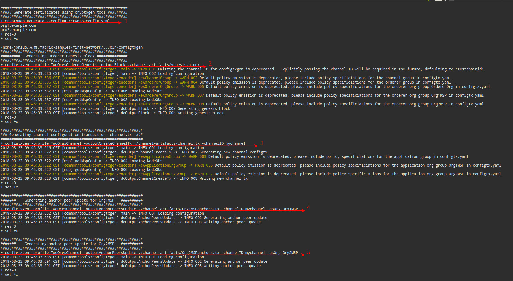

#### Hyperledger Fabric 超级账本
Hyperledger Fabric 称为联盟链，是分布式账本技术（DLT），采用模块化架构来提供高度机密性，伸缩性，灵活性和可扩展性。 它旨在支持不同组件的可插拔实现，并适应整个经济生态系统中存在的复杂性和复杂性。  
#### Hyperledger Fabric 架构
- [Blockchain区块链架构设计之一：成员管理](https://zhuanlan.zhihu.com/p/23356616)
- [Blockchain区块链架构设计之二：分布式账本技术对比](https://zhuanlan.zhihu.com/p/23463699)
- [Blockchain区块链架构设计之三：Hyperledger Fabric介绍](https://zhuanlan.zhihu.com/p/23947372)
- [Blockchain区块链架构设计之四：Fabric多通道和下一代账本设计](https://zhuanlan.zhihu.com/p/24605987)
- [Blockchain区块链架构设计之五：让DLT产生协作，对Corda和GSL的思考](https://zhuanlan.zhihu.com/p/25061575)
- [Blockchain区块链架构设计之六：Fabric 1.0账本设计（1）](https://zhuanlan.zhihu.com/p/25119939)
- [Blockchain区块链架构设计之七：Fabric 1.0 Endorse背书策略](https://zhuanlan.zhihu.com/p/25295608)
- [Blockchain区块链架构设计之八：Fabric 1.0交易流程示例](https://zhuanlan.zhihu.com/p/25991010)
- [Blockchain区块链架构设计之九：Hyperledger Burrow介绍](https://zhuanlan.zhihu.com/p/26548326)
#### Hyperledger开发环境
* 前提安装条件
  * Git
  * Golang
  * Node.js and NPM
  * Docker and Docker Compose (Docker版本17.06.2-ce或更高版本,Docker Compose版本1.14.0或更高版本)
* 克隆 hyperledger/fabric-samples
  * git clone https://github.com/hyperledger/fabric-samples.git
* 切换到fabric-samples文件夹下
  * cd fabric-samples
* 将指定版本的Hyperledger Fabric平台特定二进制文件和配置文件分别安装到fabric-samples存储库的根目录中bin文件夹和config文件夹,和下载指定版本的Hyperledger Fabric docker镜像
  * ./scripts/bootstrap.sh [version] [ca version] [thirdparty_version] (默认版本为 1.2.0, 1.2.0 和 0.4.10 )
* 构建第一个网络
  * cd first-network
  * 生成网络工件： ./byfn.sh generate
  * 启动网络: ./byfn.sh up
  * 终止容器，删除加密材料和四个工件，并从Docker Registry中删除链上代码镜像： ./byfn.sh down (这一步一般在重新启动新的联盟链使用)
  * 到此，第一个联盟链搭建成功，因为是自动化脚本构建的，接下来分析细节，手动构建细节：
    * ./byfn.sh generate 执行后的日志如图：
      
      * 对应日志中的 `1`，以获取生成将用于crypto-config.yaml文件中定义的网络配置的证书，对应手工配置：  
        ```
        ../bin/cryptogen generate --config=./crypto-config.yaml
        ```
        对应输出日志：  
        ```
        org1.example.com
        org2.example.com 
        ```
        证书和密钥（即MSP材料）将输出到 first-network 目录中的 crypto-config 文件夹
      * 对应日志中的 `2`，告诉 configtxgen 工具在哪里查找配置文件 configtx.yaml 并调用 configtxgen 工具来创建 orderer 创世区块，对应手工配置：
        ``` 
        export FABRIC_CFG_PATH=$PWD && ../bin/configtxgen -profile TwoOrgsOrdererGenesis -outputBlock ./channel-artifacts/genesis.block
        ```
        对应输出类似日志：  
        ```
        2018-08-23 10:36:13.825 CST [common/tools/configtxgen] main -> WARN 001 Omitting the channel ID for configtxgen is deprecated.  Explicitly passing the channel ID will be required in the future, defaulting to 'testchainid'.
        2018-08-23 10:36:13.825 CST [common/tools/configtxgen] main -> INFO 002 Loading configuration
        2018-08-23 10:36:13.831 CST [common/tools/configtxgen/encoder] NewChannelGroup -> WARN 003 Default policy emission is deprecated, please include policy specificiations for the channel group in configtx.yaml
        2018-08-23 10:36:13.832 CST [common/tools/configtxgen/encoder] NewOrdererGroup -> WARN 004 Default policy emission is deprecated, please include policy specificiations for the orderer group in configtx.yaml
        2018-08-23 10:36:13.832 CST [common/tools/configtxgen/encoder] NewOrdererOrgGroup -> WARN 005 Default policy emission is deprecated, please include policy specificiations for the orderer org group OrdererOrg in configtx.yaml
        2018-08-23 10:36:13.832 CST [msp] getMspConfig -> INFO 006 Loading NodeOUs
        2018-08-23 10:36:13.832 CST [common/tools/configtxgen/encoder] NewOrdererOrgGroup -> WARN 007 Default policy emission is deprecated, please include policy specificiations for the orderer org group Org1MSP in configtx.yaml
        2018-08-23 10:36:13.832 CST [msp] getMspConfig -> INFO 008 Loading NodeOUs
        2018-08-23 10:36:13.832 CST [common/tools/configtxgen/encoder] NewOrdererOrgGroup -> WARN 009 Default policy emission is deprecated, please include policy specificiations for the orderer org group Org2MSP in configtx.yaml
        2018-08-23 10:36:13.832 CST [common/tools/configtxgen] doOutputBlock -> INFO 00a Generating genesis block
        2018-08-23 10:36:13.833 CST [common/tools/configtxgen] doOutputBlock -> INFO 00b Writing genesis block
        ```
        创世区块 genesis.block 将输出到 first-network 目录中的 channel-artifacts 文件夹
      * 对应日志中的 `3`，创建通道配置文件，对应手工配置：
        ``` 
        export CHANNEL_NAME=mychannel  && ../bin/configtxgen -profile TwoOrgsChannel -outputCreateChannelTx ./channel-artifacts/channel.tx -channelID $CHANNEL_NAME
        ```
        对应输出类似日志：  
        ```
        2018-08-23 10:55:33.393 CST [common/tools/configtxgen] main -> INFO 001 Loading configuration
        2018-08-23 10:55:33.399 CST [common/tools/configtxgen] doOutputChannelCreateTx -> INFO 002 Generating new channel configtx
        2018-08-23 10:55:33.399 CST [common/tools/configtxgen/encoder] NewApplicationGroup -> WARN 003 Default policy emission is deprecated, please include policy specificiations for the application group in configtx.yaml
        2018-08-23 10:55:33.399 CST [msp] getMspConfig -> INFO 004 Loading NodeOUs
        2018-08-23 10:55:33.399 CST [common/tools/configtxgen/encoder] NewApplicationOrgGroup -> WARN 005 Default policy emission is deprecated, please include policy specificiations for the application org group Org1MSP in configtx.yaml
        2018-08-23 10:55:33.400 CST [msp] getMspConfig -> INFO 006 Loading NodeOUs
        2018-08-23 10:55:33.400 CST [common/tools/configtxgen/encoder] NewApplicationOrgGroup -> WARN 007 Default policy emission is deprecated, please include policy specificiations for the application org group Org2MSP in configtx.yaml
        2018-08-23 10:55:33.401 CST [common/tools/configtxgen] doOutputChannelCreateTx -> INFO 008 Writing new channel tx
        ```
        通道配置文件 channel.tx 将输出到 first-network 目录中的 channel-artifacts 文件夹
      * 对应日志中的 `4`，构建的通道上为Org1组织锚节点配置文件，对应手工配置：
        ``` 
        ../bin/configtxgen -profile TwoOrgsChannel -outputAnchorPeersUpdate ./channel-artifacts/Org1MSPanchors.tx -channelID $CHANNEL_NAME -asOrg Org1MSP
        ```
        对应输出类似日志：  
        ```
        2018-08-23 11:07:49.817 CST [common/tools/configtxgen] main -> INFO 001 Loading configuration
        2018-08-23 11:07:49.823 CST [common/tools/configtxgen] doOutputAnchorPeersUpdate -> INFO 002 Generating anchor peer update
        2018-08-23 11:07:49.823 CST [common/tools/configtxgen] doOutputAnchorPeersUpdate -> INFO 003 Writing anchor peer update
        ```
        通道上为Org1定义锚对等节点配置文件 Org1MSPanchors.tx 将输出到 first-network 目录中的 channel-artifacts 文件夹       
      * 对应日志中的 `5`，构建的通道上为Org2组织锚节点配置文件，对应手工配置：
        ``` 
        ../bin/configtxgen -profile TwoOrgsChannel -outputAnchorPeersUpdate ./channel-artifacts/Org2MSPanchors.tx -channelID $CHANNEL_NAME -asOrg Org2MSP
        ```
        对应输出类似日志：  
        ```
        2018-08-23 11:10:02.486 CST [common/tools/configtxgen] main -> INFO 001 Loading configuration
        2018-08-23 11:10:02.493 CST [common/tools/configtxgen] doOutputAnchorPeersUpdate -> INFO 002 Generating anchor peer update
        2018-08-23 11:10:02.493 CST [common/tools/configtxgen] doOutputAnchorPeersUpdate -> INFO 003 Writing anchor peer upda
        ```
        通道上为Org2定义锚对等节点配置文件 Org2MSPanchors.tx 将输出到 first-network 目录中的 channel-artifacts 文件夹
    * ./byfn.sh up 执行后的日志可以分为两部分：
      * 第一部分
        ```
        Creating network "net_byfn" with the default driver
        Creating volume "net_orderer.example.com" with default driver
        Creating volume "net_peer0.org1.example.com" with default driver
        Creating volume "net_peer1.org1.example.com" with default driver
        Creating volume "net_peer0.org2.example.com" with default driver
        Creating volume "net_peer1.org2.example.com" with default driver
        Creating peer0.org2.example.com ... done
        Creating orderer.example.com    ... done
        Creating peer1.org1.example.com ... done
        Creating peer1.org2.example.com ... done
        Creating peer0.org1.example.com ... done
        Creating cli                    ... done
        ```
        这部分其实是利用 docker-compose 启动容器编排，具体命令为：
        ```
        docker-compose -f docker-compose-cli.yaml up -d
        ```
      * 第二部分
        ```
         ____    _____      _      ____    _____ 
        / ___|  |_   _|    / \    |  _ \  |_   _|
        \___ \    | |     / _ \   | |_) |   | |  
         ___) |   | |    / ___ \  |  _ <    | |  
        |____/    |_|   /_/   \_\ |_| \_\   |_|  
        
        Build your first network (BYFN) end-to-end test
        
        Channel name : mychannel
        Creating channel...
        + peer channel create -o orderer.example.com:7050 -c mychannel -f ./channel-artifacts/channel.tx --tls true --cafile /opt/gopath/src/github.com/hyperledger/fabric/peer/crypto/ordererOrganizations/example.com/orderers/orderer.example.com/msp/tlscacerts/tlsca.example.com-cert.pem
        + res=0
        + set +x
        2018-08-23 04:18:50.971 UTC [channelCmd] InitCmdFactory -> INFO 001 Endorser and orderer connections initialized
        2018-08-23 04:18:50.985 UTC [cli/common] readBlock -> INFO 002 Got status: &{NOT_FOUND}
        2018-08-23 04:18:50.987 UTC [channelCmd] InitCmdFactory -> INFO 003 Endorser and orderer connections initialized
        2018-08-23 04:18:51.193 UTC [cli/common] readBlock -> INFO 004 Received block: 0
        ===================== Channel 'mychannel' created ===================== 
        
        Having all peers join the channel...
        + peer channel join -b mychannel.block
        + res=0
        + set +x
        2018-08-23 04:18:51.282 UTC [channelCmd] InitCmdFactory -> INFO 001 Endorser and orderer connections initialized
        2018-08-23 04:18:51.386 UTC [channelCmd] executeJoin -> INFO 002 Successfully submitted proposal to join channel
        ===================== peer0.org1 joined channel 'mychannel' ===================== 
        
        + peer channel join -b mychannel.block
        + res=0
        + set +x
        2018-08-23 04:18:54.468 UTC [channelCmd] InitCmdFactory -> INFO 001 Endorser and orderer connections initialized
        2018-08-23 04:18:54.577 UTC [channelCmd] executeJoin -> INFO 002 Successfully submitted proposal to join channel
        ===================== peer1.org1 joined channel 'mychannel' ===================== 
        
        + peer channel join -b mychannel.block
        + res=0
        + set +x
        2018-08-23 04:18:57.680 UTC [channelCmd] InitCmdFactory -> INFO 001 Endorser and orderer connections initialized
        2018-08-23 04:18:57.790 UTC [channelCmd] executeJoin -> INFO 002 Successfully submitted proposal to join channel
        ===================== peer0.org2 joined channel 'mychannel' ===================== 
        
        + peer channel join -b mychannel.block
        + res=0
        + set +x
        2018-08-23 04:19:00.881 UTC [channelCmd] InitCmdFactory -> INFO 001 Endorser and orderer connections initialized
        2018-08-23 04:19:00.991 UTC [channelCmd] executeJoin -> INFO 002 Successfully submitted proposal to join channel
        ===================== peer1.org2 joined channel 'mychannel' ===================== 
        
        Updating anchor peers for org1...
        + peer channel update -o orderer.example.com:7050 -c mychannel -f ./channel-artifacts/Org1MSPanchors.tx --tls true --cafile /opt/gopath/src/github.com/hyperledger/fabric/peer/crypto/ordererOrganizations/example.com/orderers/orderer.example.com/msp/tlscacerts/tlsca.example.com-cert.pem
        + res=0
        + set +x
        2018-08-23 04:19:04.082 UTC [channelCmd] InitCmdFactory -> INFO 001 Endorser and orderer connections initialized
        2018-08-23 04:19:04.089 UTC [channelCmd] update -> INFO 002 Successfully submitted channel update
        ===================== Anchor peers updated for org 'Org1MSP' on channel 'mychannel' ===================== 
        
        Updating anchor peers for org2...
        + peer channel update -o orderer.example.com:7050 -c mychannel -f ./channel-artifacts/Org2MSPanchors.tx --tls true --cafile /opt/gopath/src/github.com/hyperledger/fabric/peer/crypto/ordererOrganizations/example.com/orderers/orderer.example.com/msp/tlscacerts/tlsca.example.com-cert.pem
        + res=0
        + set +x
        2018-08-23 04:19:07.175 UTC [channelCmd] InitCmdFactory -> INFO 001 Endorser and orderer connections initialized
        2018-08-23 04:19:07.183 UTC [channelCmd] update -> INFO 002 Successfully submitted channel update
        ===================== Anchor peers updated for org 'Org2MSP' on channel 'mychannel' ===================== 
        
        Installing chaincode on peer0.org1...
        + peer chaincode install -n mycc -v 1.0 -l golang -p github.com/chaincode/chaincode_example02/go/
        + res=0
        + set +x
        2018-08-23 04:19:10.273 UTC [chaincodeCmd] checkChaincodeCmdParams -> INFO 001 Using default escc
        2018-08-23 04:19:10.273 UTC [chaincodeCmd] checkChaincodeCmdParams -> INFO 002 Using default vscc
        2018-08-23 04:19:10.401 UTC [chaincodeCmd] install -> INFO 003 Installed remotely response:<status:200 payload:"OK" > 
        ===================== Chaincode is installed on peer0.org1 ===================== 
        
        Install chaincode on peer0.org2...
        + peer chaincode install -n mycc -v 1.0 -l golang -p github.com/chaincode/chaincode_example02/go/
        + res=0
        + set +x
        2018-08-23 04:19:10.461 UTC [chaincodeCmd] checkChaincodeCmdParams -> INFO 001 Using default escc
        2018-08-23 04:19:10.461 UTC [chaincodeCmd] checkChaincodeCmdParams -> INFO 002 Using default vscc
        2018-08-23 04:19:10.573 UTC [chaincodeCmd] install -> INFO 003 Installed remotely response:<status:200 payload:"OK" > 
        ===================== Chaincode is installed on peer0.org2 ===================== 
        
        Instantiating chaincode on peer0.org2...
        + peer chaincode instantiate -o orderer.example.com:7050 --tls true --cafile /opt/gopath/src/github.com/hyperledger/fabric/peer/crypto/ordererOrganizations/example.com/orderers/orderer.example.com/msp/tlscacerts/tlsca.example.com-cert.pem -C mychannel -n mycc -l golang -v 1.0 -c '{"Args":["init","a","100","b","200"]}' -P 'AND ('\''Org1MSP.peer'\'','\''Org2MSP.peer'\'')'
        + res=0
        + set +x
        2018-08-23 04:19:10.634 UTC [chaincodeCmd] checkChaincodeCmdParams -> INFO 001 Using default escc
        2018-08-23 04:19:10.634 UTC [chaincodeCmd] checkChaincodeCmdParams -> INFO 002 Using default vscc
        ===================== Chaincode is instantiated on peer0.org2 on channel 'mychannel' ===================== 
        
        Querying chaincode on peer0.org1...
        ===================== Querying on peer0.org1 on channel 'mychannel'... ===================== 
        Attempting to Query peer0.org1 ...3 secs
        + peer chaincode query -C mychannel -n mycc -c '{"Args":["query","a"]}'
        + res=0
        + set +x
        
        100
        ===================== Query successful on peer0.org1 on channel 'mychannel' ===================== 
        Sending invoke transaction on peer0.org1 peer0.org2...
        + peer chaincode invoke -o orderer.example.com:7050 --tls true --cafile /opt/gopath/src/github.com/hyperledger/fabric/peer/crypto/ordererOrganizations/example.com/orderers/orderer.example.com/msp/tlscacerts/tlsca.example.com-cert.pem -C mychannel -n mycc --peerAddresses peer0.org1.example.com:7051 --tlsRootCertFiles /opt/gopath/src/github.com/hyperledger/fabric/peer/crypto/peerOrganizations/org1.example.com/peers/peer0.org1.example.com/tls/ca.crt --peerAddresses peer0.org2.example.com:7051 --tlsRootCertFiles /opt/gopath/src/github.com/hyperledger/fabric/peer/crypto/peerOrganizations/org2.example.com/peers/peer0.org2.example.com/tls/ca.crt -c '{"Args":["invoke","a","b","10"]}'
        + res=0
        + set +x
        2018-08-23 04:19:31.656 UTC [chaincodeCmd] chaincodeInvokeOrQuery -> INFO 001 Chaincode invoke successful. result: status:200 
        ===================== Invoke transaction successful on peer0.org1 peer0.org2 on channel 'mychannel' ===================== 
        
        Installing chaincode on peer1.org2...
        + peer chaincode install -n mycc -v 1.0 -l golang -p github.com/chaincode/chaincode_example02/go/
        + res=0
        + set +x
        2018-08-23 04:19:31.708 UTC [chaincodeCmd] checkChaincodeCmdParams -> INFO 001 Using default escc
        2018-08-23 04:19:31.708 UTC [chaincodeCmd] checkChaincodeCmdParams -> INFO 002 Using default vscc
        2018-08-23 04:19:31.815 UTC [chaincodeCmd] install -> INFO 003 Installed remotely response:<status:200 payload:"OK" > 
        ===================== Chaincode is installed on peer1.org2 ===================== 
        
        Querying chaincode on peer1.org2...
        ===================== Querying on peer1.org2 on channel 'mychannel'... ===================== 
        + peer chaincode query -C mychannel -n mycc -c '{"Args":["query","a"]}'
        Attempting to Query peer1.org2 ...3 secs
        + res=0
        + set +x
        
        90
        ===================== Query successful on peer1.org2 on channel 'mychannel' ===================== 
        
        ========= All GOOD, BYFN execution completed =========== 
        
        
         _____   _   _   ____   
        | ____| | \ | | |  _ \  
        |  _|   |  \| | | | | | 
        | |___  | |\  | | |_| | 
        |_____| |_| \_| |____/  
        

        ```
        这部分其实是利用 docker exec 命令 进入 cli 容器中执行 scripts/script.sh 脚本，其参数为 mychannel 3 golang 10 false，具体命令为：
        ```
        docker exec cli scripts/script.sh mychannel 3 golang 10 false
        ```
        * 接下来，继续细分 docker exec cli scripts/script.sh mychannel 3 golang 10 false 这个命令等同于以下操作：
          * 首先进入 cli 容器：
            ```
            docker exec -it cli bash
            ```
          * 接下来在容器里操作，配置环境变量:
            ```
            export CORE_PEER_MSPCONFIGPATH=/opt/gopath/src/github.com/hyperledger/fabric/peer/crypto/peerOrganizations/org1.example.com/users/Admin@org1.example.com/msp
            export CORE_PEER_ADDRESS=peer0.org1.example.com:7051
            export CORE_PEER_LOCALMSPID="Org1MSP"
            export CORE_PEER_TLS_ROOTCERT_FILE=/opt/gopath/src/github.com/hyperledger/fabric/peer/crypto/peerOrganizations/org1.example.com/peers/peer0.org1.example.com/tls/ca.crt
            ```
          * 创建 mychannel 通道(相当于通过创世区块创建区块链，每个通道相当于每条独立的区块链)：
            ``` 
            export CHANNEL_NAME=mychannel
            peer channel create -o orderer.example.com:7050 -c $CHANNEL_NAME -f ./channel-artifacts/channel.tx --tls --cafile /opt/gopath/src/github.com/hyperledger/fabric/peer/crypto/ordererOrganizations/example.com/orderers/orderer.example.com/msp/tlscacerts/tlsca.example.com-cert.pem
            ```
            输出日志：
            ```
            2018-08-23 06:56:14.257 UTC [channelCmd] InitCmdFactory -> INFO 001 Endorser and orderer connections initialized
            2018-08-23 06:56:14.273 UTC [cli/common] readBlock -> INFO 002 Got status: &{NOT_FOUND}
            2018-08-23 06:56:14.274 UTC [channelCmd] InitCmdFactory -> INFO 003 Endorser and orderer connections initialized
            2018-08-23 06:56:14.480 UTC [cli/common] readBlock -> INFO 004 Received block: 0
            ```
          * 节点加入 mychannel 通道(相当于节点加入区块链网络)：
            加入通道需要用到环境变量的值，默认为 peer0.org1 节点加入通道
            ```
            peer channel join -b mychannel.block 
            ```
            输出日志：
            ```
            2018-08-23 07:10:09.620 UTC [channelCmd] InitCmdFactory -> INFO 001 Endorser and orderer connections initialized
            2018-08-23 07:10:09.729 UTC [channelCmd] executeJoin -> INFO 002 Successfully submitted proposal to join channel
 
            ```
            要其他节点也加入 mychannel 通道，需要修改环境变量的值，也很简单，举个例子,如果 peer1.org2 节点加入通道，只要把所有环境变量值出现 *org1* 替换成 *org2* ，并把 CORE_PEER_ADDRESS值中的 *peer0* 替换成 *peer1* ，如下：
            ```
            CORE_PEER_MSPCONFIGPATH=/opt/gopath/src/github.com/hyperledger/fabric/peer/crypto/peerOrganizations/org2.example.com/users/Admin@org2.example.com/msp
            CORE_PEER_ADDRESS=peer1.org2.example.com:7051
            CORE_PEER_LOCALMSPID="Org2MSP"
            CORE_PEER_TLS_ROOTCERT_FILE=/opt/gopath/src/github.com/hyperledger/fabric/peer/crypto/peerOrganizations/org2.example.com/peers/peer0.org2.example.com/tls/ca.crt           
            ```     
            修改后继续执行：peer channel join -b mychannel.block，同理完成 peer0.org2，peer1.org1，peer1.org2 加入 mychannel 通道
          * 更新通道的锚节点，实质上是在通道的创世块之上添加了额外的配置信息(所谓锚节点就是某联盟在通道中公开链接的一个或多个节点)
            更新通道中 Org1 组织的锚节点为 peer0.org1.example.com：
            首先确保环境变量是 peer0.org1 的信息：
            ```
            CORE_PEER_MSPCONFIGPATH=/opt/gopath/src/github.com/hyperledger/fabric/peer/crypto/peerOrganizations/org1.example.com/users/Admin@org1.example.com/msp
            CORE_PEER_ADDRESS=peer0.org1.example.com:7051
            CORE_PEER_LOCALMSPID="Org1MSP"
            CORE_PEER_TLS_ROOTCERT_FILE=/opt/gopath/src/github.com/hyperledger/fabric/peer/crypto/peerOrganizations/org1.example.com/peers/peer0.org1.example.com/tls/ca.crt    
            ```
            然后更新
            ```
            peer channel update -o orderer.example.com:7050 -c $CHANNEL_NAME -f ./channel-artifacts/Org1MSPanchors.tx --tls --cafile /opt/gopath/src/github.com/hyperledger/fabric/peer/crypto/ordererOrganizations/example.com/orderers/orderer.example.com/msp/tlscacerts/tlsca.example.com-cert.pem
            ```
            更新通道中 Org2 组织的锚节点为 peer0.org2.example.com：
            首先确保环境变量是 peer0.org2 的信息：
            ```
            CORE_PEER_MSPCONFIGPATH=/opt/gopath/src/github.com/hyperledger/fabric/peer/crypto/peerOrganizations/org2.example.com/users/Admin@org2.example.com/msp
            CORE_PEER_ADDRESS=peer0.org2.example.com:7051
            CORE_PEER_LOCALMSPID="Org2MSP"
            CORE_PEER_TLS_ROOTCERT_FILE=/opt/gopath/src/github.com/hyperledger/fabric/peer/crypto/peerOrganizations/org2.example.com/peers/peer0.org2.example.com/tls/ca.crt    
            ```
            然后更新
            ```
            peer channel update -o orderer.example.com:7050 -c $CHANNEL_NAME -f ./channel-artifacts/Org2MSPanchors.tx --tls --cafile /opt/gopath/src/github.com/hyperledger/fabric/peer/crypto/ordererOrganizations/example.com/orderers/orderer.example.com/msp/tlscacerts/tlsca.example.com-cert.pem
            ```
          * 安装和实例化Chaincode
            安装 golang版 Chaincode ，安装到的节点为环境变量的配置节点:
            ```
            peer chaincode install -n mycc -v 1.0 -p github.com/chaincode/chaincode_example02/go/
            ```
            日志输出：
            ```
            2018-08-23 11:25:20.439 UTC [chaincodeCmd] checkChaincodeCmdParams -> INFO 001 Using default escc
            2018-08-23 11:25:20.439 UTC [chaincodeCmd] checkChaincodeCmdParams -> INFO 002 Using default vscc
            2018-08-23 11:25:20.831 UTC [chaincodeCmd] install -> INFO 003 Installed remotely response:<status:200 payload:"OK" >
            ```
            接下来，在通道上实例化链码。这将初始化通道上的链代码，设置链代码的认可策略，并为目标节点启动链代码容器：
            ```
            peer chaincode instantiate -o orderer.example.com:7050 --tls --cafile /opt/gopath/src/github.com/hyperledger/fabric/peer/crypto/ordererOrganizations/example.com/orderers/orderer.example.com/msp/tlscacerts/tlsca.example.com-cert.pem -C $CHANNEL_NAME -n mycc -v 1.0 -c '{"Args":["init","a", "100", "b","200"]}' -P "AND ('Org1MSP.peer','Org2MSP.peer')"
            ```
            日志输出：
            ```
            2018-08-23 11:31:33.050 UTC [chaincodeCmd] checkChaincodeCmdParams -> INFO 001 Using default escc
            2018-08-23 11:31:33.050 UTC [chaincodeCmd] checkChaincodeCmdParams -> INFO 002 Using default vscc 
            ```
          * 查询以确保链代码已正确实例化并填充状态数据库
            ```
            peer chaincode query -C $CHANNEL_NAME -n mycc -c '{"Args":["query","a"]}' 
            ```
            日志输出：
            ```
            100
            ```
          * 调用，a取10给b
            ```
            peer chaincode invoke -o orderer.example.com:7050 --tls true --cafile /opt/gopath/src/github.com/hyperledger/fabric/peer/crypto/ordererOrganizations/example.com/orderers/orderer.example.com/msp/tlscacerts/tlsca.example.com-cert.pem -C $CHANNEL_NAME -n mycc --peerAddresses peer0.org1.example.com:7051 --tlsRootCertFiles /opt/gopath/src/github.com/hyperledger/fabric/peer/crypto/peerOrganizations/org1.example.com/peers/peer0.org1.example.com/tls/ca.crt --peerAddresses peer0.org2.example.com:7051 --tlsRootCertFiles /opt/gopath/src/github.com/hyperledger/fabric/peer/crypto/peerOrganizations/org2.example.com/peers/peer0.org2.example.com/tls/ca.crt -c '{"Args":["invoke","a","b","10"]}' 
            ```
            输出
            ```
            INFO 001 Chaincode invoke successful. result: status:200  
            ```
            查询结果得到： a：90，b:210，成功结束 
  * 联盟链新增组织 Org3 ：./eyfn.sh up
    * 手动构建脚本细节
    * 切换目录：cd org3-artifacts
    * 为Org3生成加密材料
      ``` 
      ../../bin/cryptogen generate --config=./org3-crypto.yaml
      ```
    * 生成Org3的配置材料
      ``` 
      export FABRIC_CFG_PATH=$PWD && ../../bin/configtxgen -printOrg Org3MSP > ../channel-artifacts/org3.json
      ```
    * 将 Orderer 的MSP材料复制到 Org3 的crypto-config目录
      ```
      cd ../ && cp -r crypto-config/ordererOrganizations org3-artifacts/crypto-config/
      ```  
    * 进入cli容器
      ```
      docker exec -it cli bash
      ```
    * 导出环境变量
      ```
      export ORDERER_CA=/opt/gopath/src/github.com/hyperledger/fabric/peer/crypto/ordererOrganizations/example.com/orderers/orderer.example.com/msp/tlscacerts/tlsca.example.com-cert.pem  && export CHANNEL_NAME=mychannel
      ```
    * 将旧版本通道配置块保存到 config_block.pb 
      ```
      peer channel fetch config config_block.pb -o orderer.example.com:7050 -c $CHANNEL_NAME --tls --cafile $ORDERER_CA
      ```
    * 使用 configtxlator 工具将通道配置块解码为JSON格式（可读取和修改），并必须删除与更改无关的所有标头，元数据，创建者签名
      ```
      configtxlator proto_decode --input config_block.pb --type common.Block | jq .data.data[0].payload.data.config > config.json
      ```
      花一点时间在选择的文本编辑器（或浏览器）中打开此文件。值得研究，因为它揭示了底层配置结构和可以进行的其他类型的通道更新
    * 使用 jq 工具将Org3配置定义 org3.json 附加到通道的应用程序组字段，并命名输出 modified_config.json 
      ```
      jq -s '.[0] * {"channel_group":{"groups":{"Application":{"groups": {"Org3MSP":.[1]}}}}}' config.json ./channel-artifacts/org3.json > modified_config.json
      ```
    * 将 config.json 转回二进制文件 config.pb
      ```
      configtxlator proto_encode --input config.json --type common.Config --output config.pb
      ```
    * 将 modified_config.json 转二进制文件 modified_config.pb
      ```
      configtxlator proto_encode --input modified_config.json --type common.Config --output modified_config.pb
      ```
    * 用 configtxlator 用来计算这两个配置二进制文件之间的增量。输出一个名为的新二进制文件 org3_update.pb
      ```
      configtxlator compute_update --channel_id $CHANNEL_NAME --original config.pb --updated modified_config.pb --output org3_update.pb
      ```
    * 将 org3_update.pb 解码为可编辑的JSON格式 org3_update.json
      ```
      configtxlator proto_decode --input org3_update.pb --type common.ConfigUpdate | jq . > org3_update.json
      ```
    * 包装信封消息为 org3_update_in_envelope.json
      ```
      echo '{"payload":{"header":{"channel_header":{"channel_id":"mychannel", "type":2}},"data":{"config_update":'$(cat org3_update.json)'}}}' | jq . > org3_update_in_envelope.json
      ```
    * 将 org3_update_in_envelope.json 转最终二进制文件 org3_update_in_envelope.pb
      ```
      configtxlator proto_encode --input org3_update_in_envelope.json --type common.Envelope --output org3_update_in_envelope.pb
      ```
    * Org1 签名配置
      ```
      peer channel signconfigtx -f org3_update_in_envelope.pb
      ```
    * 导出 Org2 环境变量: 
      ```     
      export CORE_PEER_LOCALMSPID="Org2MSP"
      export CORE_PEER_TLS_ROOTCERT_FILE=/opt/gopath/src/github.com/hyperledger/fabric/peer/crypto/peerOrganizations/org2.example.com/peers/peer0.org2.example.com/tls/ca.crt
      export CORE_PEER_MSPCONFIGPATH=/opt/gopath/src/github.com/hyperledger/fabric/peer/crypto/peerOrganizations/org2.example.com/users/Admin@org2.example.com/msp
      export CORE_PEER_ADDRESS=peer0.org2.example.com:7051
      ```
    * Org2管理员签名并提交更新 
      ```
      peer channel update -f org3_update_in_envelope.pb -c $CHANNEL_NAME -o orderer.example.com:7050 --tls --cafile $ORDERER_CA
      ```
    * 配置领导者选举，利用动态领导者选举:
      ``` 
      CORE_PEER_GOSSIP_USELEADERELECTION=true
      CORE_PEER_GOSSIP_ORGLEADER=false
      ```
    * 将 Org3 加入通道
      * 打开一个新的终端，从 first-network 启动 Org3 docker compose 
        ```
        docker-compose -f docker-compose-org3.yaml up -d
        ```
      * 进入 Org3cli 容器
        ```
        docker exec -it Org3cli bash
        ```
      * 导出环境变量
        ```
        export ORDERER_CA=/opt/gopath/src/github.com/hyperledger/fabric/peer/crypto/ordererOrganizations/example.com/orderers/orderer.example.com/msp/tlscacerts/tlsca.example.com-cert.pem && export CHANNEL_NAME=mychannel
        ``` 
      * 加入通道
        ```
        peer channel join -b mychannel.block
        ```     
      * 升级和调用Chaincode
        * 到从Org3 CLI中
          ```
          peer chaincode install -n mycc -v 2.0 -p github.com/chaincode/chaincode_example02/go/
          ```
        * 到从CLI中
          安装 
          ```
          peer chaincode install -n mycc -v 2.0 -p github.com/chaincode/chaincode_example02/go/
          ```
          升级
          ```
          peer chaincode upgrade -o orderer.example.com:7050 --tls $CORE_PEER_TLS_ENABLED --cafile $ORDERER_CA -C $CHANNEL_NAME -n mycc -v 2.0 -c '{"Args":["init","a","90","b","210"]}' -P "OR ('Org1MSP.peer','Org2MSP.peer','Org3MSP.peer')"
          ```
        * 到从Org3 CLI中，查询即可
          ```
          peer chaincode query -C $CHANNEL_NAME -n mycc -c '{"Args":["query","a"]}'
          ```
        * 完成    
  * 如果使用过该 eyfn.sh 脚本，则需要关闭网络。这可以通过：./eyfn.sh down
#### 通过 hyperledger fabric-ca 搭建生产环境的联盟链
* 利用 fabric-samples/fabric-ca 进行搭建
* cd fabric-ca 
* 首先下载镜像： ./bootstrap.sh 
* 运行：./start.sh 
* 完成搭建
  * 接下来分析细节，仔细分析start.sh脚本文件
    ```
      #!/bin/bash
      
      set -e
      
      SDIR=$(dirname "$0")
      # 引入环境变量
      source ${SDIR}/scripts/env.sh
      
      cd ${SDIR}
      
      # 删除docker容器
      dockerContainers=$(docker ps -a | awk '$2~/hyperledger/ {print $1}')
      if [ "$dockerContainers" != "" ]; then
         log "Deleting existing docker containers ..."
         docker rm -f $dockerContainers > /dev/null
      fi
      
      # 删除链码docker镜像
      chaincodeImages=`docker images | grep "^dev-peer" | awk '{print $3}'`
      if [ "$chaincodeImages" != "" ]; then
         log "Removing chaincode docker images ..."
         docker rmi -f $chaincodeImages > /dev/null
      fi
      
      # 准备一个空文件夹
      DDIR=${SDIR}/${DATA}
      if [ -d ${DDIR} ]; then
         log "Cleaning up the data directory from previous run at $DDIR"
         rm -rf ${SDIR}/data
      fi
      mkdir -p ${DDIR}/logs
      
      # 创建docker-compose.yml文件
      ${SDIR}/makeDocker.sh
      
      # 根据生成的docker-compose.yml文件启动docker容器编排
      log "Creating docker containers ..."
      docker-compose up -d
      
      # 等待名为 setup 容器完成
      dowait "the 'setup' container to finish registering identities, creating the genesis block and other artifacts" 90 $SDIR/$SETUP_LOGFILE $SDIR/$SETUP_SUCCESS_FILE
      
      # 等待名为 run 容器启动，然后打印它的结束日志
      dowait "the docker 'run' container to start" 60 ${SDIR}/${SETUP_LOGFILE} ${SDIR}/${RUN_SUMFILE}
      tail -f ${SDIR}/${RUN_SUMFILE}&
      TAIL_PID=$!
      
      # 等待名为 run 容器完成，然后结束
      while true; do 
         if [ -f ${SDIR}/${RUN_SUCCESS_FILE} ]; then
            kill -9 $TAIL_PID
            exit 0
         elif [ -f ${SDIR}/${RUN_FAIL_FILE} ]; then
            kill -9 $TAIL_PID
            exit 1
         else
            sleep 1
         fi
      done
    ```
#### 相关资料
- [Hyperledger白皮书](http://www.360doc.com/content/16/0727/09/34350211_578683890.shtml)
- [Hyperledger模块和关键概念](https://studygolang.com/articles/10966)
- [Hyperledger fabric 1.2 文档](https://hyperledger-fabric.readthedocs.io/en/release-1.2/)
- [Fabric Samples](https://github.com/hyperledger/fabric-samples) 有必要深入研究

